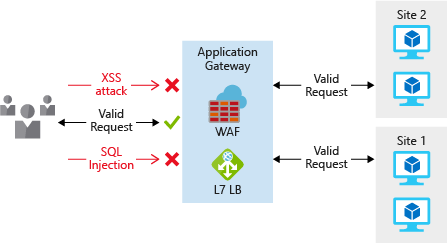
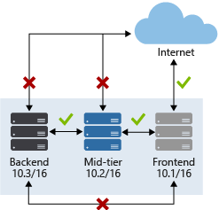
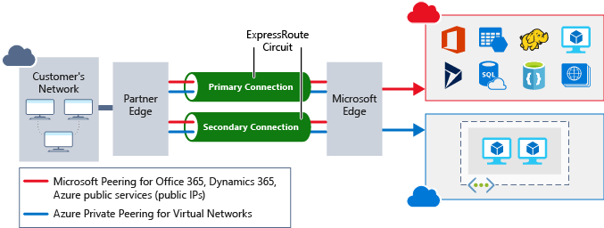

Securing your network from attacks and unauthorized access is an important part of any architecture. As part of preparation for its cloud migration, your company took the time to plan its network infrastructure. The company wanted to ensure that it had network security controls in place to protect the network infrastructure from attack. 

Here, we'll look at what network security is, how to integrate a layered approach into your architecture, and how Azure can help you provide network security for your environment.

## What is network security?

Network security is protecting the communication of resources within and outside your network. The goal is to limit exposure at the network layer across your services and systems. By limiting this exposure, you decrease the likelihood that your resources can be attacked. For network security, an organization can focus its efforts on the following areas:

- *Securing traffic flow between applications and the internet* focuses on limiting exposure outside your network. Network attacks will most often start outside your network, so by limiting the internet exposure and securing the perimeter, you can reduce the risk of being attacked.
- *Securing traffic flow among applications* focuses on data between applications and their tiers, between different environments, and in other services within your network. By limiting exposure between these resources, you reduce the effect that a compromised resource can have. This can help reduce further propagation within the network.
- *Securing traffic flow between users and an application* focuses on securing the network flow for your users. This limits the exposure that your resources have to outside attacks, and it provides a secure mechanism for users to utilize your resources.

## Layered approach to network security

A common thread throughout this module has been taking a layered approach to security, and this approach is no different at the network layer. It's not enough to just focus on securing the network perimeter, or focusing on the network security between services inside a network. A layered approach provides multiple levels of protection so that if an attacker gets through one layer, further protections are in place to limit the attack.

Let's look at how Azure can provide the tools for a layered approach to securing your network footprint.

### Internet protection

If you start on the perimeter of the network, you're focused on limiting and eliminating attacks from the internet. A great place to start is to assess the resources that are internet-facing, and allow inbound and outbound communication only where necessary. Identify all resources that are allowing inbound network traffic of any type. Ensure that they're necessary and restricted to only the required ports and protocols.

You can look for this information in Azure Security Center. Security Center will identify internet-facing resources that don't have network security groups associated with them. It will also identify resources that aren't secured behind a firewall.

There are a couple of ways to provide inbound protection at the perimeter. Azure Application Gateway is a Layer 7 load balancer that also includes a web application firewall (WAF) to provide advanced security for your HTTP-based services. The WAF is based on rules from the OWASP 3.0 or 2.2.9 core rule sets. It provides protection from commonly known vulnerabilities such as cross-site scripting and SQL injection.

In the following diagram, the WAF feature of the application gateway protects the system from malicious attacks. The load balancer distributes the legitimate requests among virtual machines.

For protection of non-HTTP-based services or for increased customization, you can use network virtual appliances (NVAs) to secure your network resources. NVAs are similar to firewall appliances that you might find in on-premises networks, and are available from popular network security vendors. NVAs can provide greater customization of security for those applications that require it. But they increase complexity, so we recommend that you carefully consider your requirements.

Any resource exposed to the internet is at risk for a denial-of-service attack. These types of attacks try to overwhelm a network resource by sending so many requests that the resource becomes slow or unresponsive. 

To mitigate these attacks, Azure DDoS Protection provides basic protection across all Azure services and enhanced protection for further customization for your resources. DDoS Protection blocks attack traffic and forwards legitimate traffic to its intended destination. Within a few minutes of attack detection, you're notified through Azure Monitor metrics.

### Virtual network security

Inside a virtual network, it's important to limit communication between resources to only what's required.

For communication between virtual machines, network security groups are a critical piece to restrict unnecessary communication. Network security groups operate at layers 3 and 4. They provide a list of allowed and denied communication to and from network interfaces and subnets. Network security groups are fully customizable, and they enable you to lock down network communication to and from your virtual machines. By using network security groups, you can isolate applications between environments, tiers, and services.

The following diagram shows how a network security group restricts the back end and middle tier from communicating directly with the internet. The front end receives the internet requests and then passes them to the middle tier. The middle tier communicates with the back end.

To isolate Azure services to allow communication only from virtual networks, use virtual network service endpoints. With service endpoints, you can secure Azure service resources to your virtual network. 

Securing service resources to a virtual network provides improved security by fully removing public internet access to resources and allowing traffic only from your virtual network. This technique:

- Reduces the attack surface for your environment.
- Reduces the administration required to limit communication between your virtual network and Azure services.
- Provides optimal routing for this communication.

### Network integration

It's common to have existing network infrastructure that needs to be integrated to provide communication from on-premises networks, or to provide improved communication between services in Azure. There are a few key ways to handle this integration and improve the security of your network.

Virtual private network (VPN) connections are a common way of establishing secure communication channels between networks. This is no different when you're working with virtual networking on Azure. Connection between Azure virtual networks and an on-premises VPN device is a great way to provide secure communication between your network and your virtual machines on Azure.

To provide a dedicated, private connection between your network and Azure, you can use Azure ExpressRoute. ExpressRoute lets you extend your on-premises networks into the Microsoft cloud over a private connection facilitated by a connectivity provider. 

With ExpressRoute, you can establish connections to Microsoft cloud services, such as Azure, Microsoft 365, and Dynamics 365. This improves the security of your on-premises communication by sending this traffic over the private circuit instead of over the internet. You don't need to allow access to these services for your users over the internet, and you can send this traffic through appliances for further traffic inspection.

To easily integrate multiple virtual networks in Azure, virtual network peering establishes a direct connection between designated virtual networks. After a connection is established, you can use network security groups to provide isolation between resources in the same way that you secure resources within a virtual network. This integration gives you the ability to provide the same fundamental layer of security across any peered virtual networks. Communication is allowed only between directly connected virtual networks.
