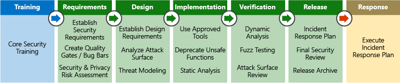

Hosting applications on a cloud platform provides advantages over traditional on-premises deployments. The cloud's shared-responsibility model moves security at the physical network, building, and host levels under the control of the cloud provider. An attacker who tries to compromise the platform at this level would see diminishing returns versus the considerable investment and insight that providers make in securing and monitoring their infrastructure.

It's far more effective for attackers to pursue vulnerabilities introduced at the application level by cloud-platform customers. Furthermore, by adopting platform as a service (PaaS) to host their applications, customers can free resources from managing operating system security and deploy them to harden application code and monitor the identity perimeter around the application.

Here, we'll discuss some of the ways that you can improve application security through design.

## Scenario

Imagine you work for a healthcare organization whose customers require access to their personal medical records through an online web portal. Compliance with the Health Insurance Portability and Accountability Act (HIPAA) is mandatory, and puts the company at significant risk of financial penalties if a breach of personal data occurs. Securing the application and personal data with which it interacts is paramount.

Here are the primary areas that concern customer applications:

- Secure application design
- Data security
- Identity and access management
- Endpoint security

## Security Development Lifecycle

You can use the Microsoft Security Development Lifecycle (SDL) process during the application-design stage to ensure that security concerns are incorporated in the software development lifecycle. Security and compliance issues are far easier to address when you're designing an application, and you can mitigate many common errors that can lead to security flaws in the final product. Fixing issues early in the software development journey is also far less costly. A software project can use this typical sequence of SDL steps:

The SDL is as much a cultural aspect as it is a process or set of tools. Building a culture where security is a primary focus and requirement of any application development can make great strides in evolving an organization's capabilities around security.

## Operational security assessment

After an application has been deployed, it's essential to continually evaluate its security posture, determine how to mitigate any issues that are discovered, and feed the knowledge back into the software-development cycle. The depth to which an organization performs this evaluation is a factor of the maturity level of the software-development and operational teams, as well as the data-privacy requirements.

Software services that scan for security vulnerabilities are available to help automate this process and assess security concerns on a regular cadence. Such services offer these benefits without burdening teams with costly manual processes, such as penetration testing.

Microsoft Defender for Cloud is a service that's now enabled by default for all Azure subscriptions. It's tightly integrated with other Azure application-level services, such as Azure Application Gateway and Azure Web Application Firewall. By analyzing logs from these services, Defender for Cloud can report on known vulnerabilities in real time and recommend responses to mitigate them. You can even configure Defender for Cloud to automatically execute playbooks in response to attacks.

Defender for Cloud has a free tier of protection features enabled for your subscription. You must enable the enhanced security features for advanced security and threat detection capabilities. These enhanced features are free for the first 30 days. For more information, check out [What is Microsoft Defender for Cloud?](/azure/defender-for-cloud/defender-for-cloud-introduction)

## Identity as the perimeter

Identity validation is becoming the first line of defense for applications. Restricting access to a web application by authenticating and authorizing sessions can drastically reduce the attack surface area.

Azure Active Directory (Azure AD) and Azure Active Directory B2C (Azure AD B2C) offer an effective way to offload the responsibility of identity and access to a fully managed service. Azure AD Conditional Access policies, Privileged Identity Management, and identity protection controls further enhance your ability to prevent unauthorized access and audit changes.

## Data protection

Customer data is the target for most, if not all, attacks against web applications. The secure storage and transport of data between an application and its data storage layer is paramount.

Your organization stores and accesses sensitive patient medical record data. HIPAA, enacted by the United States Congress in 1996, among other controls, defines the standards for electronic healthcare transactions by healthcare providers and employers. Healthcare providers and employers must ensure that patients and authorized parties such as physicians have secure access to medical data.

To comply with these requirements, your organization has modified its applications to encrypt all patient data at rest and in transit. For example, the organization uses Transport Layer Security (TLS) to encrypt data exchanged between the web application and back-end SQL databases. Data is also encrypted at rest in SQL Server through transparent data encryption. Encryption at rest ensures that even if the environment is compromised, data is effectively useless to anyone without the correct decryption keys.

To encrypt data stored in Azure Blob Storage, you can use client-side encryption to encrypt the data in memory before it's written to the storage service. Libraries that support this encryption are available for .NET, Java, and Python. These libraries enable the integration of data encryption directly into applications to enhance data integrity.

### Secure key and secret storage

Separating application secrets (like connection strings or passwords) and encryption keys from the application that's used to access data is vital. Encryption keys and application secrets should never be stored in the application code or configuration files.

Instead, use a secure store such as Azure Key Vault. You can then limit access to this sensitive data to application identities through managed identities for Azure resources. You can rotate keys on a regular basis to limit exposure if encryption keys are leaked.

You can also choose to use your own encryption keys generated by on-premises hardware security modules (HSMs). You can even mandate that Azure Key Vault instances are implemented in single-tenant, discrete HSMs.
