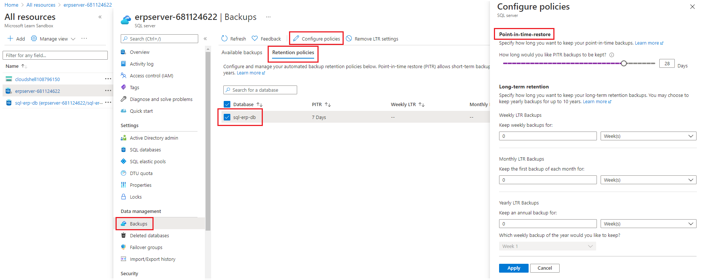

Although the default Azure SQL Database configuration includes automated backups, most organizations will modify the default setup to tailor it to their needs.

Now that you have planned a comprehensive backup strategy for Azure SQL Database and your company's ERP system, it's time to implement it.

Here, you will create a database in Azure and then configure backups. You will also add some content to the database.

[!include[](../../../includes/azure-sandbox-activate.md)]

## Create a server and database

Let's use the Azure CLI to create an Azure SQL Server and database instance in that resource group:

1. In the Cloud Shell, to set up some variables for the SQL Server creation, run these commands:

    ```bash
    SERVER_NAME=ERPServer-$RANDOM
    ADMIN_PASSWORD=P4ssw0rd
    ```

1. To create an Azure SQL server, execute this command:

    ```bash
    az sql server create --resource-group <rgn>[sandbox resource group name]</rgn> --name $SERVER_NAME \
      --location westeurope --admin-user dbadmin --admin-password $ADMIN_PASSWORD
    ```

1. To create a database, run this command:

    ```bash
    az sql db create --resource-group <rgn>[sandbox resource group name]</rgn> --name sql-erp-db \
      --server $SERVER_NAME --edition Standard
    ```

## Configure the database retention policy

In the portal, you can examine the default retention policy and adapt it to your needs:

1. In the [Azure portal](https://portal.azure.com/learn.docs.microsoft.com?azure-portal=true), click **All resources** and then click the **ERPServer** database server.
1. Under **Settings**, click **Manage Backups**.
1. On the **Configure policies** tab, click the **sql-erp-db** database, and then click **Configure retention**.
1. In the **Point In Time Restore Configuration** drop-down list, select **28**.

    

1. Click **Apply**, and then click **Yes**.

## Permit access for your IP address

By default, Azure SQL Database prevents access to the server to execute queries. Enable access for your IP address with these steps:

1. In the [Azure portal](https://portal.azure.com/learn.docs.microsoft.com?azure-portal=true), click **All resources** and then click the **ERPServer** database server.
1. Under **Security**, click **Firewalls and virtual networks**.
1. At the top of the page, click **Add client IP**.
1. Under **Allow access to Azure services**, click **ON**:

    

1.  Click **Save**, and then when the rule has been saved, click **OK**.

## Add data to the database

Now let's add a table and a sample record to the database. It is helpful to have some data in the database to to prove that our backups and restores work later in the module.

1. In the [Azure portal](https://portal.azure.com/learn.docs.microsoft.com?azure-portal=true), click **All resources** and then click the **sql-erp-db** database.
1. Click **Query editor**, and then sign in with the credentials **dbadmin** and **P4ssw0rd**.
1. To create a table, in the **Query 1** window, type this SQL command, and then click **Run**:

    ```sql
    CREATE TABLE Person
    (
        PersonId INT IDENTITY PRIMARY KEY,
        FirstName NVARCHAR(50) NOT NULL,
        LastName NVARCHAR(50) NOT NULL,
        DateOfBirth DATE NOT NULL
    )
    ```

    

1. To add a record, click **+ New Query** and then, in the **Query 2** window, type this SQL command, and then click **Run**:

    ```sql
    INSERT INTO PERSON (FirstName, LastName, DateOfBirth)
    VALUES ('Lucas', 'Ball', '1987-11-03');
    ```

    

1. To query the database, click **+ New Query** and then, in the **Query 3** window, type this SQL command, and then click **Run**:

    ```sql
    SELECT * FROM dbo.Person
    ```

    The **Results** window displays the record for Lucas Ball.

    