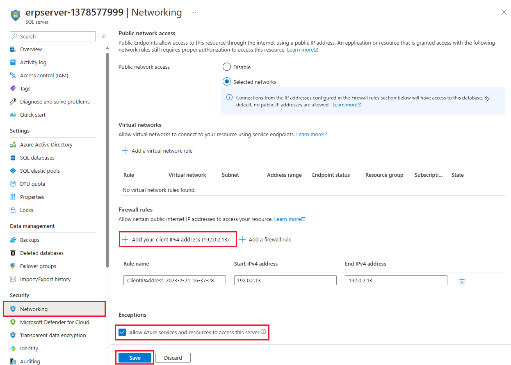
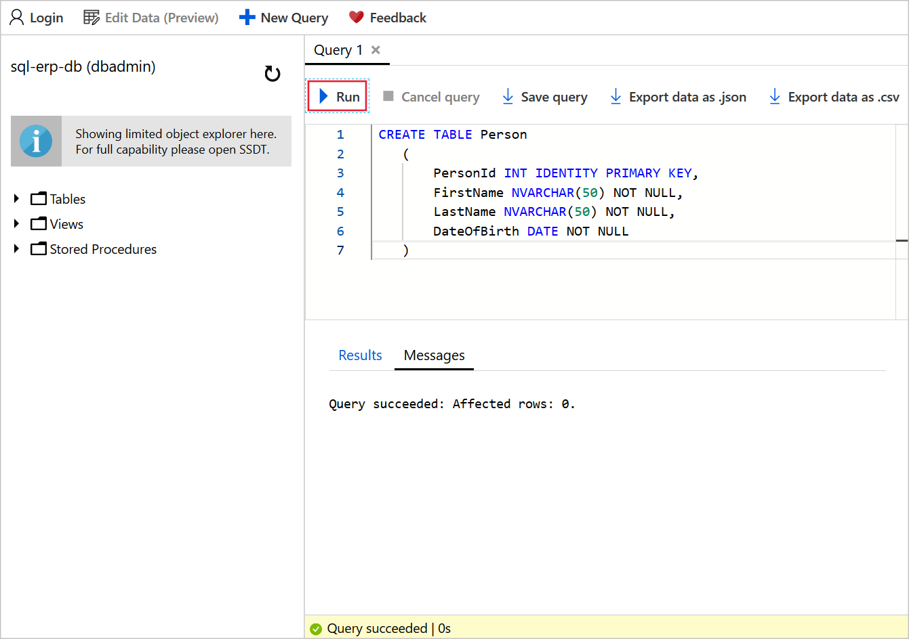
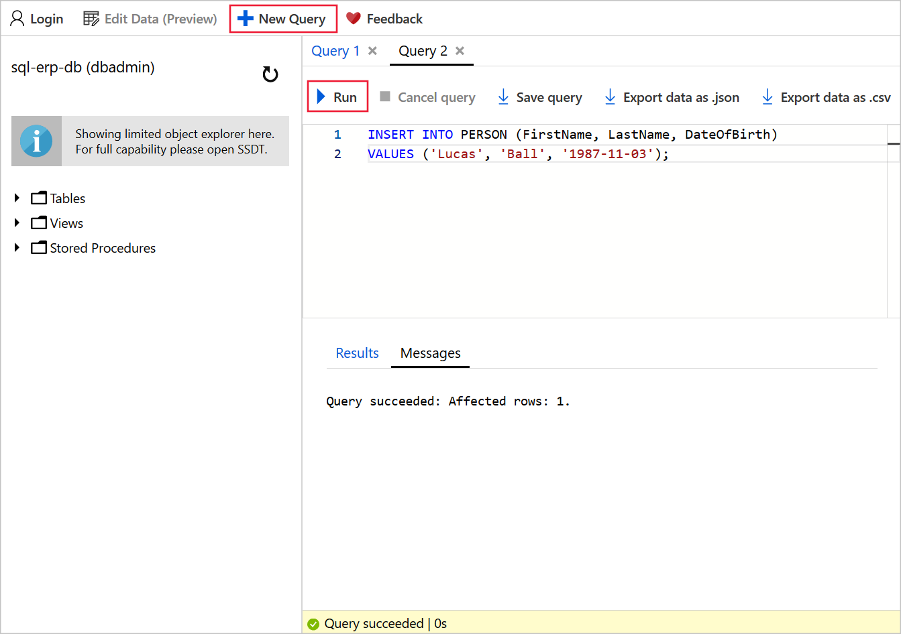
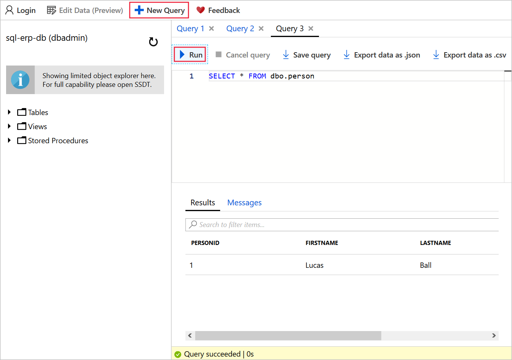

Although the default Azure SQL Database configuration includes automated backups, most organizations will modify the default setup to tailor it to their needs.

Now that you have planned a comprehensive backup strategy for Azure SQL Database and your company's ERP system, it's time to implement it.

Here, you'll create a database in Azure and then configure backups. You'll set the retention to 28 days, to ensure that you have 4 weeks of backups retained in accordance with your policy. You'll also add some content to the database.

## Create a SQL Database server and database

Let's use the Azure CLI to create a SQL Database server and a database.

1. Run the following commands in Azure Cloud Shell to set up some variables for creation of the SQL Database server.

    ```powershell
    $serverName = "erpserver-$(Get-Random)"
    $location = $(Get-AzResourceGroup -ResourceGroupName <rgn>[sandbox resource group name]</rgn>).location
    $sqlAdmin = Get-Credential -credential dbadmin

    ```

   This step creates a server name with a random number at the end to ensure that it's globally unique. We'll refer to the server name as `erpserver-NNNN` through the exercises, but replace this with the name of your server that's generated here.

   This step also sets the location for your server to the location of the resource group. Finally, it sets the credentials that you'll use to access the database server. When you're prompted, enter a complex password of your choice. 

1. Run the `New-AzSqlServer` command to create a SQL Database server to store the database.

    ```powershell
    New-AzSqlServer `
        -ResourceGroupName <rgn>[sandbox resource group name]</rgn> `
        -Location $location `
        -ServerName $serverName `
        -SqlAdministratorCredentials $sqlAdmin
    ```

1. Run the `New-AzSqlDatabase` command to create a database.

    ```powershell
    New-AzSqlDatabase `
        -ResourceGroupName <rgn>[sandbox resource group name]</rgn> `
        -ServerName $serverName `
        -DatabaseName sql-erp-db
    ```

## Configure the database retention policy

In the portal, you can examine the default retention policy and adapt it to your needs.

1. On the [Azure portal](https://portal.azure.com/learn.docs.microsoft.com?azure-portal=true) menu or from the **Home** page, select **All resources**, and then select the **erpserver-NNNN** database server that you created.

1. On the left in the **Settings** section, select **Backups**.

1. On the **Retention policies** tab, select the **sql-erp-db** database, and then select **Configure policies**.

1. In the **Point In Time Restore** slider bar, select **28**.

    :::image type="content" source="../media/3-configure-backup-pitr-retention.png" alt-text="Screenshot of the Azure portal, showing the database restore options for point-in-time restore.":::

1. Select **Apply**, and then select **Yes**.

## Allow network access to the database server

By default, Azure SQL Database blocks network access to the server. Let's enable both your IP address and Azure services to access the server so that we can run queries from Cloud Shell and the Azure portal. By adding your IP address, you can also connect directly from your local device.

1. On the left in the **Security** section, select **Firewalls and virtual networks**.

1. At the top of the page, select **Add client IP**.

1. Under **Allow Azure services and resources to access this server**, select **Yes**.

    

1. Select **Save**. When the rule is saved, select **OK**.

## Add data to the database

Now let's add a table and a sample record to the database. It's helpful to have some data in the database to validate that our backups and restores work later in the module.

1. In the **Settings** section, select **SQL databases**, and then select **sql-erp-db**.

1. In the left nav bar, select **Query editor (preview)**, and then sign in with the **dbadmin** credentials and the password that you specified for this account.

1. To create a table, in the **Query 1** window, enter this SQL command, and then select **Run**.

    ```sql
    CREATE TABLE Person
    (
        PersonId INT IDENTITY PRIMARY KEY,
        FirstName NVARCHAR(50) NOT NULL,
        LastName NVARCHAR(50) NOT NULL,
        DateOfBirth DATE NOT NULL
    )
    ```

    

1. To add a record, select **+ New Query**. In the **Query 2** window, enter this SQL command, and then select **Run**.

    ```sql
    INSERT INTO PERSON (FirstName, LastName, DateOfBirth)
    VALUES ('Lucas', 'Ball', '1987-11-03');
    ```

    

1. To query the database, select **+ New Query**. In the **Query 3** window, enter this SQL command, and then select **Run**.

    ```sql
    SELECT * FROM dbo.Person
    ```

    The **Results** window displays the record for Lucas Ball.

    

You now have an Azure SQL database that's populated with data. And you've set up a retention policy to ensure that you have 4 weeks of backups immediately available for restore.
