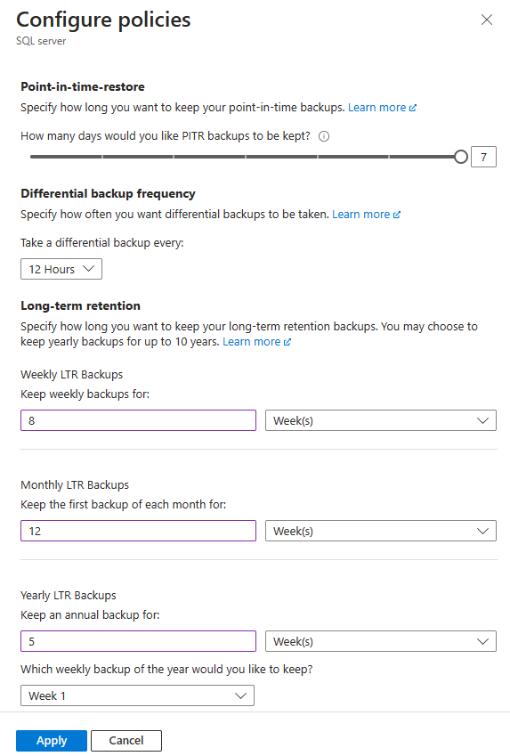
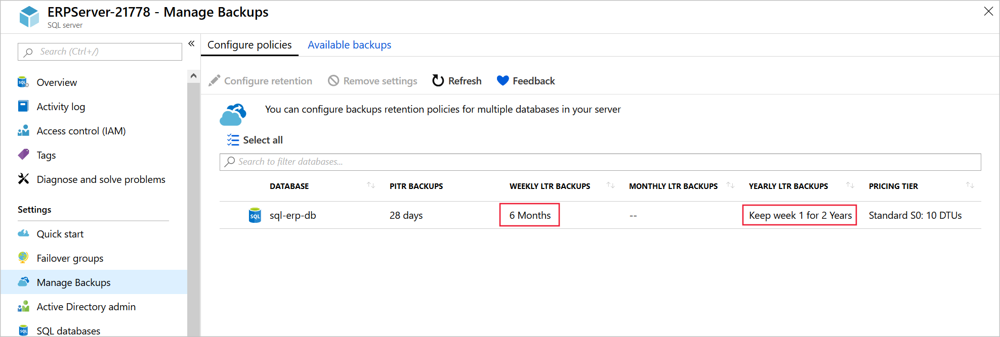

Your retail organization must comply with data protection regulations in your jurisdiction. You've been asked to configure a long-term retention policy in Azure SQL Database to meet these requirements.

Here, you'll use the Azure portal to set up a policy and then check it in PowerShell. You need to set up the following retention policy to meet your regulatory requirements:

|  |  |
|---------|---------|
| Weekly     | 8 weeks   |
| Monthly     |  12 months       |
| Yearly     |  5 years       |

## Use the Azure portal to configure long-term retention

Let's start by configuring the 5-year retention by using the portal.

1. On the [Azure portal](https://portal.azure.com/learn.docs.microsoft.com?azure-portal=true) menu or from the **Home** page, select **All resources**, and then select **erpserver-NNNN**.

1. Under **Settings**, select **Manage Backups**.

1. In the list of databases, select **sql-erp-db**, and then select **Configure retention**.

1. Select **Yearly LTR Backups**.

1. In the **How long would you like this annual backup to be kept?** controls, enter the value **5** and select **Year(s)**.

    

1. Select **Apply**, and then select **Yes**.

## Use PowerShell to configure long-term retention

You can also configure long-term retention policies by using PowerShell. Let's configure the remainder of the policy this way.

1. In Azure Cloud Shell, run this command to set a variable to the value of your SQL Server instance.

    ```powershell
    $sqlserver=Get-AzSqlServer
    ```

1. To view long-term retention policies for the database server, run this command.

    ``` powershell
    Get-AzSqlDatabase `
        -ResourceGroupName <rgn>[sandbox resource group name]</rgn> `
        -ServerName $sqlserver.ServerName `
        | Get-AzSqlDatabaseLongTermRetentionPolicy
    ```

    This step will output the retention policies for all databases on the server.

1. Run this command to view the long-term retention policy for the **sql-erp-db** database.

    ``` powershell
    Get-AzSqlDatabaseBackupLongTermRetentionPolicy `
        -ServerName $sqlserver.ServerName `
        -DatabaseName sql-erp-db `
        -ResourceGroupName <rgn>[sandbox resource group name]</rgn>
    ```

1. Now let's configure the rest of the policy to meet the requirements specified earlier. To configure a long-term retention policy via PowerShell, run this command.

    ``` powershell
    Set-AzSqlDatabaseBackupLongTermRetentionPolicy `
        -ServerName $sqlserver.ServerName `
        -DatabaseName sql-erp-db `
        -ResourceGroupName <rgn>[sandbox resource group name]</rgn> `
        -WeeklyRetention P8W `
        -MonthlyRetention P12M `
        -YearlyRetention P5Y `
        -WeekOfYear 1
    ```

1. To check that the new policy has been applied, run this command again.

    ```powerShell
    Get-AzSqlDatabaseBackupLongTermRetentionPolicy `
        -ServerName $sqlserver.ServerName `
        -DatabaseName sql-erp-db `
        -ResourceGroupName <rgn>[sandbox resource group name]</rgn>
    ```

    You should see the following policy configured. It enables a weekly retention of 8 weeks, a monthly retention of 12 months, and a yearly retention of 5 years for the first backup of the year.

    ```output
    ResourceGroupName : <rgn>[sandbox resource group name]</rgn>
    ServerName        : erpserver-25078
    DatabaseName      : sql-erp-db
    WeeklyRetention   : P8W
    MonthlyRetention  : P12M
    YearlyRetention   : P5Y
    WeekOfYear        : 1
    Location          :
    ```

1. You can also confirm this in the portal. Open the [Azure portal](https://portal.azure.com/learn.docs.microsoft.com?azure-portal=true) menu or from the **Home** page, select **All resources**, and then select **ERPServer**.

1. Under **Settings**, select **Manage Backups**. In the list of databases, check the **sql-erp-db** long-term retention properties.

   

You've now configured a retention policy and validated that the policy meets your organizational and regulatory requirements.
