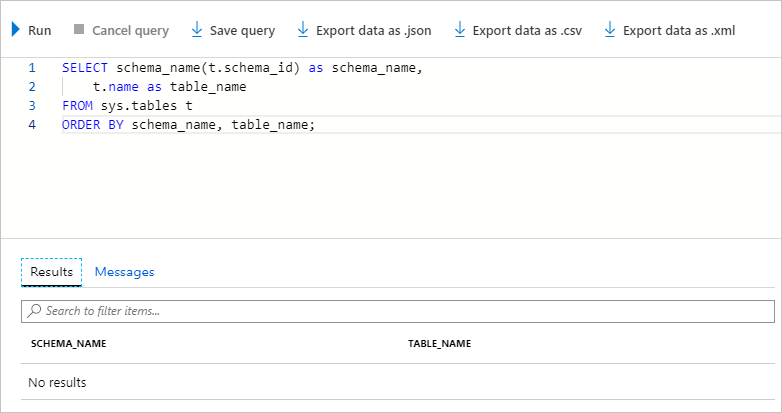
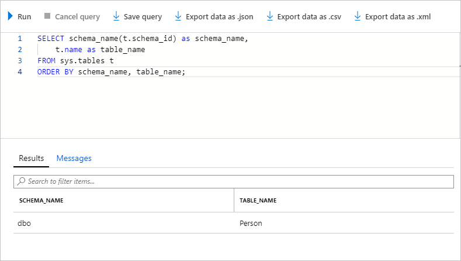

Trial restores are a key component of any disaster recovery strategy.

You want to familiarize yourself with the steps to restore a backed-up database to a specific point in time, in case it becomes necessary. You also want to investigate how long a restore operation takes. That way, you can plan for this time in your guidance for your organization.

Let's perform a restore from automated Azure SQL Database backups.

## Confirm that backups are active

It can take up to 15 minutes for the first successful backup to finish. We need to make sure that backups are running before we continue the exercise.

1. Run the following PowerShell command in Azure Cloud Shell to validate that continuous backups are running:

    ```powershell
    Get-AzSqlDatabaseRestorePoint `
        -ResourceGroupName <rgn>[sandbox resource group name]</rgn> `
        -DatabaseName sql-erp-db `
        -ServerName $sqlserver.ServerName
    ```

    You should get an output similar to the following code if your backups are running. If the command returns no value, a backup hasn't started yet. Rerun this command in a couple of minutes.

    ```output
    ResourceGroupName        : <rgn>[sandbox resource group name]</rgn>
    ServerName               : erpserver-53903
    DatabaseName             : sql-erp-db
    Location                 : East US
    RestorePointType         : CONTINUOUS
    RestorePointCreationDate :
    EarliestRestoreDate      : 9/24/19 4:21:21 PM
    RestorePointLabel        :
    ```

    `RestorePointType` is `CONTINUOUS`, indicating that backups are automatically happening. `EarliestRestoreDate` indicates the timestamp of the first backup. With backups in place, let's continue the exercise.

## Drop a table from the database

Let's start by simulating a mistaken database modification.

1. On the [Azure portal](https://portal.azure.com/learn.docs.microsoft.com?azure-portal=true) menu or from the **Home** page, select **All resources**, select **erpserver-NNNN**, select **SQL databases**, and then select the **sql-erp-db** database.

1. Select **Query editor (preview)**, then sign in with the **dbadmin** user and the password that you specified for this account.

1. Let's drop the **Person** table that we created earlier. In a new query window, run this command.

    ```sql
    DROP TABLE Person
    ```

1. To check the tables in the database, select **New Query**. Then, in the **Query 2** window, run this command to list all tables in the database:

    ```sql
    SELECT schema_name(t.schema_id) as schema_name,
        t.name as table_name
    FROM sys.tables t
    ORDER BY schema_name, table_name;
    ```

    You should see **No results** returned, because we deleted the **Person** table.

    

## Run a point-in-time restore

The **Person** table was mistakenly deleted. Now, let's restore the database to its previous state.

1. On the [Azure portal](https://portal.azure.com/learn.docs.microsoft.com?azure-portal=true) menu or from the **Home** page, select **All resources**, and then select the **sql-erp-db** database.

1. At the top of the **Overview** page, select **Restore**.

1. Complete the **Basic** tab on the **Restore database** page with these values, and then select **Review + create**.

    | Setting | Value |
    | --- | --- |
    | Select source | Point-in-time |
    | Database name | sql-erp-db-restored |
    | Restore point | Select a time 10 minutes ago, before you dropped the **Person** table |
    | Server | erpserver-xxxxx |
    | Want to use SQL elastic pool? | No |
    | Compute + storage | Default value |
    | Backup storage redundancy | Geo-redundant backup storage |

    :::image type="content" source="../media/7-restore-sql-database-pitr-2022.png" alt-text="Screenshot that shows the restore database page with the Review + create button selected.":::

1. Select **Create**. The database restore takes several minutes to complete.

## View the restored database

The restored database should contain the **Person** table. You can check that in the portal.

1. In the [Azure portal](https://portal.azure.com/learn.docs.microsoft.com?azure-portal=true) menu or from the **Home** page, select **All resources**, and then select the **sql-erp-db-restored** database.

1. Select **Query editor (preview)**, and then sign in with the **dbadmin** user and the password that you specified for this account.

1. To check the tables in the database, in the **Query 1** window, run this command:

    ```sql
    SELECT schema_name(t.schema_id) as schema_name,
        t.name as table_name
    FROM sys.tables t
    ORDER BY schema_name, table_name;
    ```

    The **Person** table should now be present.

    

1. Confirm that the data is in the table by running this command:

    ```sql
    SELECT * FROM Person
    ```

    You should see the data that you entered previously.

    

You've now learned how you can restore a database if something unintended happens to the data. You've familiarized yourself with the restore process. You can now assure your organization that you've properly defined the backup and restore procedures.
