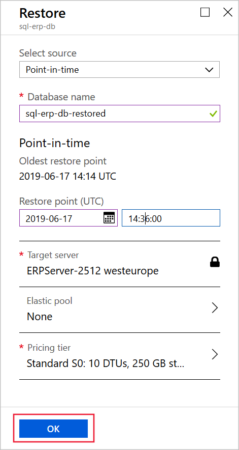

Trial restores are a key component of any disaster recovery strategy.

You want to reassure yourself that you can restore a backed-up database to a specific point-in-time should it become necessary. You also want to investigate how long a restore operation will take so that, if the worst happens, you can inform stake holders and manage their expectations correctly

Here, you will perform trial restores from automated Azure SQL Database backups.

> [!IMPORTANT]
> The first automatic backup operation must be complete before your can restore a database. Don't start this exercise until 15 minutes or so after you completed the exercise in unit 3.

## Add a new table to the database

Let's start by simulating a mistaken database modification.

1. In the [Azure portal](https://portal.azure.com/learn.docs.microsoft.com?azure-portal=true), click **All resources** and then click the **sql-erp-db** database.

1. Click **Query editor**, and then sign in with the username **dbadmin** and the password **P4ssw0rd**.

1. Let's drop the **Person** table. In the **Query 1** window, run this command.

    <!-- ```sql
    CREATE TABLE Company
    (
        PersonId INT IDENTITY PRIMARY KEY,
        CompanyName NVARCHAR(50) NOT NULL,
    )
    ``` -->

    ```sql
    DROP TABLE Person
    ```

1. To check the tables in the database, click **New Query**, and then in the **Query 2** window, run this command.

    ```sql
    SELECT schema_name(t.schema_id) as schema_name,
        t.name as table_name
    FROM sys.tables t
    ORDER BY schema_name, table_name;
    ```

## Run a point-in-time restore

The **Person** table has been mistakenly deleted. Now, let's restore the database to its previous state.

1. In the [Azure portal](https://portal.azure.com/learn.docs.microsoft.com?azure-portal=true), click **All resources** and then click the **sql-erp-db** database.

1. At the top of the **Overview** page, click **Restore**.

1. Complete the **Restore** page with these values, and then click **OK**.

    | Setting | Value |
    | --- | --- |
    | Select source | Point-in-time |
    | Database name | sql-erp-db-restored |
    | Restore point | Select a time 10 minutes ago, before you dropped the **Person** table |
    | Target server | ERPServer |
    | Elastic pool | None |
    | Pricing tier | Default value |
    | | |

    

## View the restored database

The restored database should contain the **Person** table. You can check that in the portal.

1. In the [Azure portal](https://portal.azure.com/learn.docs.microsoft.com?azure-portal=true), click **All resources** and then click the **sql-erp-db-restored** database.

1. Click **Query editor**, and then sign in with the username **dbadmin** and the password **P4ssw0rd**.

1. To check the tables in the database, in the **Query 1** window, run this command.

    ```sql
    SELECT schema_name(t.schema_id) as schema_name,
        t.name as table_name
    FROM sys.tables t
    ORDER BY schema_name, table_name;
    ```

1. Examine the results. The **Person** table should not be present.

You've now seen how you can restore a database in the event that something unintended happens to the data.