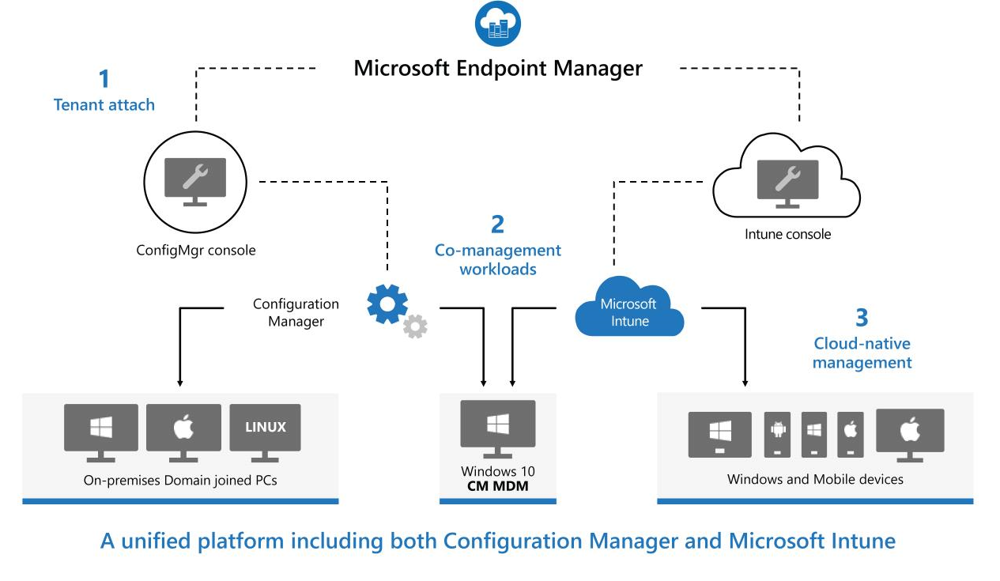

Flexible support for diverse corporate and BYOD scenarios while increasing productivity and collaboration.

## Unified Management
Manage your PCs, Macs, and mobile devices in one place.
- **Manage all your endpoints from a single console** - M365 Admin Center provides a single console for all management activities.
- **Extend on-premises infrastructure with cloud security** - Use guided deployments to extend on-premises infrastructure.
- **Provide the best Office 365 management experience** - Provide the best Office Experience with security and config management, cloud content optimization.
- **Manage key mobile apps Microsoft Outlook and Edge** - Stay secure with Microsoft Apps (aka Office 365 Pro Plus) and Microsoft Edge for iOS and Android.

## Zero Touch Provisioning
With Microsoft Endpoint Manager, you can simplify software updates and provisioning for all devices. By using Windows Autopilot, Android Enterprise, Apple DEP, and Samsung Knox Mobile Enrollment, you can do the following:

- **Decrease costly image creation workload**
- **Self-service provisioning directly by end users**
- **Faster time to productivity**
- **Out of the box security**
- **Lower OPEX for staying current**
