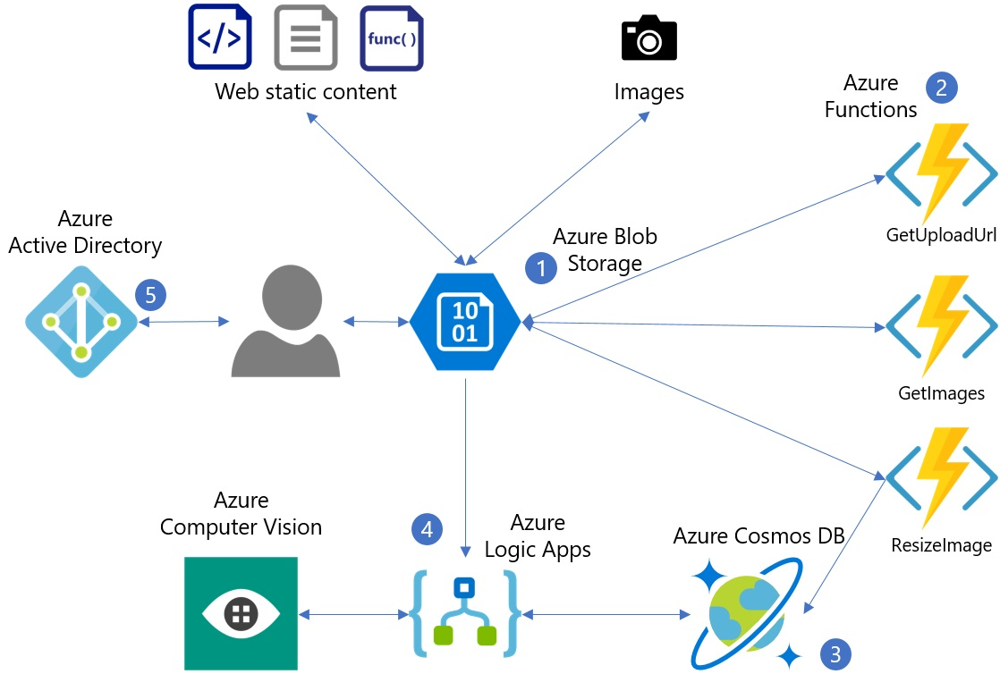
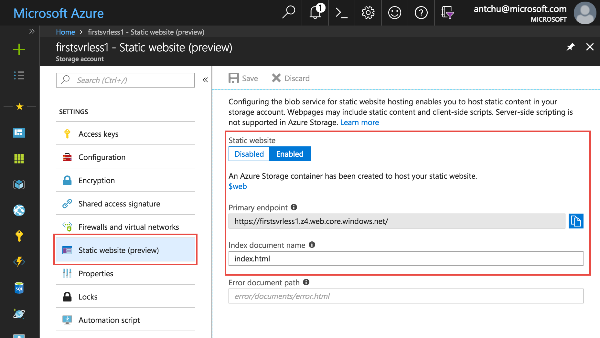

In this module, you will deploy a simple web application that presents an HTML-based user interface. A serverless backend enables the application to upload images and automatically get captions describing them.


The following diagram shows the Azure services used by the application:

1. Blob Storage serves static web content (HTML, CSS, JS) and stores images.
2. Azure Functions manages image uploads, resizing, and metadata storage.
3. Cosmos DB stores image metadata.
4. Logic Apps gets image captions from Computer Vision API.
5. Azure Active Directory manages user authentication.



In this module, you will learn how to:
> [!div class="checklist"]
> * Configure Azure Blob storage to host a static website and uploaded images.
> * Upload images to Azure Blob storage using Azure Functions.
> * Resize images using Azure Functions.
> * Store image metadata in Azure Cosmos DB.
> * Use Cognitive Services Vision API to auto-generate image captions.
> * Use Azure Active Directory to secure the web app by authenticating users.

Azure Blob storage is a low-cost and massively scalable service that can be used to host static files. For this tutorial, you use it to serve static content (for example, HTML, JavaScript, CSS) for the web app that you build.

## Create a Storage account

A Storage account is an Azure resource that allows you to store tables, queues, files, blobs (objects), and virtual machine disks.

1. Log in to the Cloud Shell (Bash), by selecting the **Enter focus mode** button. This button is at the top right or the bottom of the page, depending on how wide your browser window is. Focus mode docks a Cloud Shell window on the right side of your browser window, so you can easily execute commands that are shown in the tutorial.

1. In Azure, a Resource Group is a container that holds related Azure resources for ease of management. Create a new resource group named **first-serverless-app**.

    ```azurecli
    az group create -n first-serverless-app -l westcentralus
    ```

1. The static content (HTML, CSS, and JavaScript files) for this tutorial is hosted in Blob Storage. Blob Storage requires a Storage account. Create a Storage account (general purpose V2) in the resource group. Replace `<storage account name>` with a unique name.

    ```azurecli
    az storage account create -n <storage account name> -g first-serverless-app --kind StorageV2 -l westcentralus --https-only true --sku Standard_LRS
    ```

1. Using the Search bar at the top of the [Azure portal](https://portal.azure.com), find the storage account you just created and open it.

1. On the left navigation, select **Static website (preview)** to configure a container for static website hosting.
    - Select **Enabled** to enable static website.
    - Enter *index.html* as the index document name. The field already has *index.html* in a gray font but this is only example text; you still have to enter that value in the field.
    - Click **Save**.
    
    

1. Save the **Primary Endpoint** somewhere you can conveniently copy it from while working through the tutorial. This is the URL of your web application.

## Upload the web application

1. The source files for the application that you build in this tutorial are located in a [GitHub repository](https://github.com/Azure-Samples/functions-first-serverless-web-application). Make sure that you are in your home directory in Cloud Shell and clone this repository.

    ```azurecli
    cd ~
    git clone https://github.com/Azure-Samples/functions-first-serverless-web-application
    ```

    The repository is cloned to `/home/<username>/functions-first-serverless-web-application`.

1. The client-side web application is located in the **www** folder and is built using the Vue.js JavaScript framework. Change into the folder and run npm commands to install the application's dependencies and build the application. The last of these commands might take several minutes to complete.

    ```azurecli
    cd ~/functions-first-serverless-web-application/www
    npm install
    npm run generate
    ```

    The application is generated in the **dist** folder.

1. Change the current directory to **dist** and upload the application to the **$web** Blob container.

    ```azurecli
    cd dist
    az storage blob upload-batch -s . -d \$web --account-name <storage account name>
    ```

1. Open the Storage static websites primary endpoint URL in a web browser to view the application.

    


## Summary

In this unit, you created a resource group named **first-serverless-app** containing a Storage account. A blob container named **$web** in the Storage account stores the static content for your web application and makes the content available publicly. Next, you learn how to use a serverless function to upload images to Blob storage from this web application.