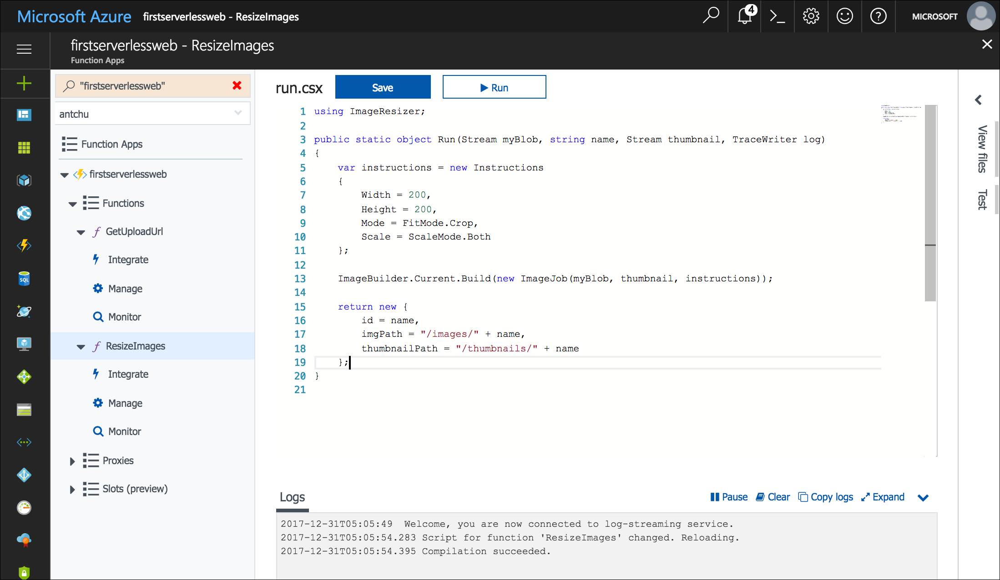

Azure Cosmos DB is Microsoft's serverless, globally distributed, multi-model database. In this module, you learn how to use Azure Functions to store and retrieve image metadata as JSON documents in Azure Cosmos DB.

## Create an Azure Cosmos DB account, database, and collection

An Azure Cosmos DB account is an Azure resource that contains Azure Cosmos DB databases.

1. Create an Azure Cosmos DB account with a unique name in the same resource group as the other resources in this module. This command may take a minute or two to complete.

    ```azurecli
    az cosmosdb create \
        -g <rgn>[Sandbox resource group name]</rgn> \
        -n <cosmos db account name>
    ```

1. After the Azure Cosmos DB account is created, create a new database named **imagesdb** in the account.

    ```azurecli
    az cosmosdb database create \
        -g <rgn>[Sandbox resource group name]</rgn> \
        -n <cosmos db account name> \
        --db-name imagesdb
    ```

1. After the database is created, create a new collection named **images** in the database with a throughput of 400 request units (RUs).

    ```azurecli
    az cosmosdb collection create \
        -g <rgn>[Sandbox resource group name]</rgn> \
        -n <cosmos db account name> \
        --db-name imagesdb \
        --collection-name images \
        --throughput 400
    ```

## Save a document to Azure Cosmos DB when a thumbnail is created

The Azure Cosmos DB output binding lets you create documents in an Azure Cosmos DB collection from Azure Functions. In the following steps, you configure an Azure Cosmos DB output binding in the **ResizeImage** function and modify the function to return a document (object) to be saved.

1. Sign into the [Azure portal](https://portal.azure.com/triplecrownlabs.onmicrosoft.com?azure-portal=true) using the same account you activated the sandbox with.

1. Open the function app.

1. In the left navigation, expand the **ResizeImage** function, and then select **Integrate**.

1. Under **Outputs**, click **New Output**.

1. Find the **Azure Cosmos DB** item and select it. Then click **Select**.

    

1. Fill out the fields under **Azure Cosmos DB output** with the following values.

    | Setting      |  Suggested value   | Description                                        |
    | --- | --- | ---|
    | **Document parameter name** | Select **Use function return value**. | The value in the box is automatically set to **$return**. |
    | **Database name** | imagesdb | Use the name of the database that you created. |
    | **Collection name** | images | Use the name of the collection that you created. |

1. Next to **Azure Cosmos DB account connection**, click **new**. Select the Azure Cosmos DB account that you previously created.

    

1. Click **Save** to create the Azure Cosmos DB output binding.

1. Click on the **ResizeImage** function name on the left to open the function.

::: zone pivot="csharp"

10. Close the error popup and change the return type of the function from **void** to **object**.

1. At the end of the function, add the following code block to return the document to be saved:

    ```csharp
    return new {
        id = name,
        imgPath = "/images/" + name,
        thumbnailPath = "/thumbnails/" + name
    };
    ```

    

1. Click **Logs** below the code window to expand the logs panel.

1. Click **Save**. Check the logs panel to ensure the function is successfully saved and there are no errors.

::: zone-end

::: zone pivot="javascript"

10. Change the `context.done()` statement in the `else` clause to return the document to be saved to Azure Cosmos DB.

    ```javascript
    if (error) {
        context.done(error);
    } else {
        context.bindings.thumbnail = stream;
        context.done(null, {
            id: context.bindingData.name,
            imgPath: "/images/" + context.bindingData.name,
            thumbnailPath: "/thumbnails/" + context.bindingData.name
        });
    }
    ```
1. Click **Logs** below the code window to expand the logs panel.

1. Click **Save**. Check the logs panel to ensure the function is successfully saved and there are no errors.

::: zone-end

## Create a function to list images from Azure Cosmos DB

The web application requires an API to retrieve image metadata from Azure Cosmos DB. In the following steps, you create an HTTP-triggered function that uses an Azure Cosmos DB input binding to query the database collection.

1. In your function app, point to **Functions** on the left and click the plus sign (+) to create a new function.

1. Find the **HttpTrigger** template and select it.

1. Use these values to create a function that generates a get images URL:

    | Setting      |  Suggested value   | Description                                        |
    | --- | --- | ---|
    | **Name your function** | GetImages | Enter this name exactly as shown, so the application can discover the function. |
    | **Authorization level** | Anonymous | Allow the function to be accessed publicly. |

1. Click **Create**.

1. When the new function is created, click **Integrate** under the function name on the left navigation.

1. Click **New Input** and select **Azure Cosmos DB**.

    

1. Click **Select**.

1. Fill out the following values:

    | Setting      |  Suggested value   | Description                                        |
    | --- | --- | ---|
    | **Document parameter name** | documents | Matches the parameter name in the function. |
    | **Database name** | imagesdb |  |
    | **Collection name** | images |  |
    | **SQL query** | select * from c order by c._ts desc | Get documents, latest documents first. |
    | **Azure Cosmos DB account connection** | Select the existing connection string. |  |

1. Click **Save** to create the input binding.

::: zone pivot="csharp"

10. Click the function name to open the code window. Replace all of the **run.csx** file with the content in the [**/csharp/GetImages/run.csx**](https://raw.githubusercontent.com/Azure-Samples/functions-first-serverless-web-application/master/csharp/GetImages/run.csx) file.

::: zone-end

::: zone pivot="javascript"

10. Click the function name to open the code window. Replace all of the **index.js** file with the content in the [**/javascript/GetImages/index.js**](https://raw.githubusercontent.com/Azure-Samples/functions-first-serverless-web-application/master/javascript/GetImages/index.js) file.

::: zone-end

11. Click **Logs** below the code window to expand the Logs panel.

1. Click **Save**. Check the Logs panel to ensure the function is successfully saved and there are no errors.

## Test the application

1. Open the application in a browser. Select an image file and upload it.

1. After a few seconds, the thumbnail of the new image appears on the page.

1. In the Azure portal, use the **Search** box to search for your Azure Cosmos DB account by name. Click on the name to open the account.

1. Click **Data Explorer** on the left to browse collections and documents.

1. Under the **imagesdb** database, select the **images** collection.

1. Confirm that a document was created for the uploaded image.

    

## Summary

In this unit, you learned how to create an Azure Cosmos DB account, database, and collection. You also learned how to use the Azure Cosmos DB bindings to save and retrieve image metadata in the Azure Cosmos DB collection. Next, you will learn how to automatically generate a caption for each uploaded image using Microsoft Cognitive Services.