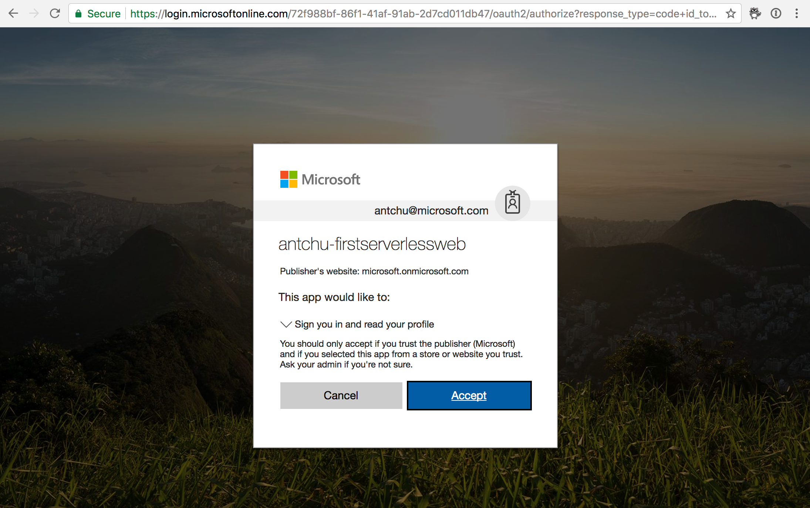

Azure App Service authentication enables turn-key authentication support in an Azure Functions app. It integrates seamlessly with Facebook, Twitter, Microsoft accounts, Google, and Azure Active Directory. You'll add App Service authentication to protect the back-end APIs of your web app.

## Enable App Service authentication

1. Sign into the [Azure portal](https://portal.azure.com/learn.docs.microsoft.com?azure-portal=true) using the same account you activated the sandbox with.

1. Open the function app.

1. Under **Platform features**, select **Authentication/Authorization**.

    

1. Select the following values:

    | Setting      |  Suggested value   | Description                                        |
    | --- | --- | ---|
    | **App Service Authentication** | On | Enable authentication. |
    | **Action when request is not authenticated** | Sign in with Azure Active Directory. | Select a configured authentication method (See below). |
    | **Authentication Providers** | See below. | See below. |
    | **Token store** | On | Allow App Service to store and manage tokens. |
    | **Allowed external redirect URLs** | The URL of your application, for example https://firstserverlessweb.z4.web.core.windows.net/. | URLs that App Service is allowed to redirect to, after a user is authenticated. |

1. Select **Azure Active Directory** to reveal **Azure Active Directory Settings**.

    1. Select **Express** as the **Management Mode** and fill in the following information.

        | Setting      |  Suggested value   | Description                                        |
        | --- | --- | ---|
        | **Management mode** | Express, Create new AD app | Automatically set up a service principal and Azure Active Directory authentication. |
        | **Create app** | my-serverless-webapp | Enter a unique application name. |

    1. Click **OK** to save the Azure Active Directory settings.

    

1. Click **Save**.

## Modify the web app to enable authentication

1. In Cloud Shell, ensure that the current directory is the **www/dist** folder.

    ```azurecli
    cd ~/functions-first-serverless-web-application/www/dist
    ```

1. You enable authentication in your function app by modifying **settings.js**. Open the file in Cloud Shell Editor.

    ```azurecli
    code settings.js
    ```

1. Append the following line to the file and save it.

    ```azurecli
    window.authEnabled = true
    ```

1. Confirm the change was made to the file.

    ```azurecli
    cat settings.js
    ```

1. Upload the file to Blob storage.

    ```azurecli
    az storage blob upload \
        -c \$web \
        --account-name <storage account name> \
        -f settings.js \
        -n settings.js
    ```

## Test the application

1. Open the application in a browser. Click **Log in** and log in.

1. Select an image file and upload it.

    

## Summary

In this unit, you learned how to add authentication to the application using Azure App Service authentication.