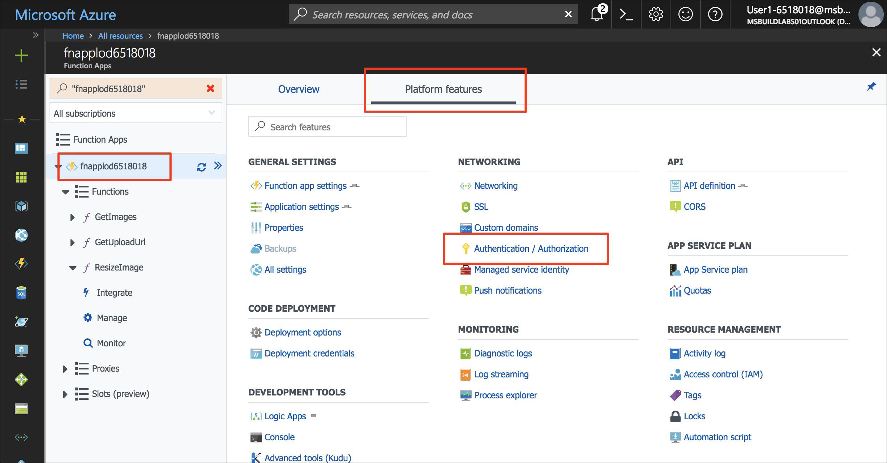

Azure App Service Authentication enables turn-key authentication support in an Azure Function app. It integrates seamlessly with Facebook, Twitter, Microsoft Account, Google, and Azure Active Directory. You'll add App Service Authentication to protect the backend APIs of your web app.

## Enable App Service Authentication

1. Open the function app in the Azure Portal.

1. Under **Platform features**, select **Authentication/Authorization**.

    

1. Select the following values:
    
    | Setting      |  Suggested value   | Description                                        |
    | --- | --- | ---|
    | **App Service Authentication** | On | Enable authentication. |
    | **Action when request is not authenticated** | Log in with Azure Active Directory | Select a configured authentication method (below). |
    | **Authentication Providers** | See below | See below |
    | **Token store** | On | Allow App Service to store and manage tokens. |
    | **Allowed external redirect URLs** | The URL of your application, for example: https://firstserverlessweb.z4.web.core.windows.net/ | URL(s) that App Service is allowed to redirect to after a user is authenticated. |

1. Select **Azure Active Directory** to reveal **Azure Active Directory Settings**.

    1. Select **Express** as the **Management Mode** and fill in the following information.
    
        | Setting      |  Suggested value   | Description                                        |
        | --- | --- | ---|
        | **Management mode** | Express, Create new AD app | Automatically set up a service principal and Azure Active Directory authentication. |
        | **Create app** | my-serverless-webapp | Enter a unique application name. |
    
    1. Click **OK** to save the Azure Active Directory settings.

    

1. Click **Save**.


## Modify the web app to enable authentication

1. In the Cloud Shell, ensure that the current directory is the **www/dist** folder.

    ```azurecli
    cd ~/functions-first-serverless-web-application/www/dist
    ```

1. To enable authentication in your function app, append the following line of code to **settings.js**.

    `window.authEnabled = true`

    Make the change and view the result by using the following commands or by using a command-line editor like VIM.

    ```azurecli
    echo "window.authEnabled = true" >> settings.js
    ```

    Confirm the change was made to the file.

    ```azurecli
    cat settings.js
    ```

1. Upload the file to Blob storage.

    ```azurecli
    az storage blob upload -c \$web --account-name <storage account name> -f settings.js -n settings.js
    ```


## Test the application

1. Open the application in a browser. Click **Log in** and log in.

1. Select an image file and upload it.

    
    

## Summary

In this unit, you learned how to add authentication to the applcation using Azure App Service Authentication.