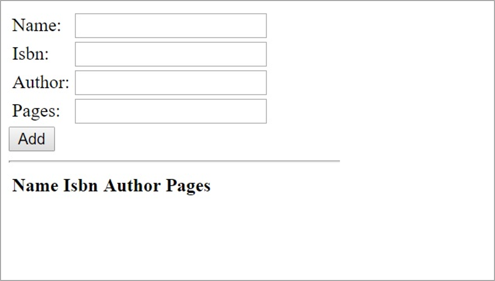

In this unit, you're going to create a simple AngularJS application hosted in Node.js and use Express for routing. On the back end, MongoDB will serve as your data store. The application is a book database, where you will be able to list, add, and delete books.

> [!Important]
> This is a simple application. Its purpose is to test the newly installed MEAN stack. This application is not sufficiently secure or ready for production use.

## Create the application

First, we're going to create the code, script and HTML files for our application. We'll do this in the Cloud Shell editor then copy the files to the VM.

1. In Cloud Shell, if you are still SSHed into your VM, use `exit` to return to the Cloud Shell filesystem.

    ```bash
    exit
    ```

1. Create the folders and files for your application and open them in the Cloud Shell editor.

    ```bash
    cd ~
    mkdir Books
    mkdir Books/app
    mkdir Books/public
    touch Books/app/model.js
    touch Books/app/routes.js
    touch Books/server.js
    touch Books/public/script.js
    touch Books/public/index.html
    code Books
    ```

    This creates a folder called "Books" to contain your project's app and its dependencies. Within that folder, you created an "app" folder to contain all your application resources and scripts. Finally, we will also create a "public" folder to hold all of the client-side files that will be served up directly to appropriate HTTP requests.

## Create the application

1. Create the Mongoose data model. In the editor, open `app/model.js` and paste in the following code.

    ```javascript
    var mongoose = require('mongoose');
    var dbHost = 'mongodb://localhost:27017/Books';
    mongoose.connect(dbHost,  { useNewUrlParser: true } );
    mongoose.connection;
    mongoose.set('debug', true);
    var bookSchema = mongoose.Schema( {
        name: String,
        isbn: {type: String, index: true},
        author: String,
        pages: Number
    });
    var Book = mongoose.model('Book', bookSchema);
    module.exports = Book // mongoose.model('Book', bookSchema);
    ```

    > [!IMPORTANT]
    > Whenever you paste or change code into a file in the editor, make sure to save afterwards using the "..." menu, or the accelerator key (<kbd>Ctrl+S</kbd> on Windows and Linux, <kbd>Cmd+S</kbd> on macOS).

    This code is connecting to a database called "Books" on the local VM's MongoDB server. It then creates a database document called "Book" with the schema defined by the `bookSchema` variable.

2. Create the Express routes that will handle HTTP requests. Open `app/routes.js` in the editor and paste in the following code.

    ```javascript
    var path = require('path');
    var Book = require('./model');
    var routes = function(app) {
        app.get('/book', function(req, res) {
            Book.find({}, function(err, result) {
                if ( err ) throw err;
                res.json(result);
            });
        });
        app.post('/book', function(req, res) {
            var book = new Book( {
                name:req.body.name,
                isbn:req.body.isbn,
                author:req.body.author,
                pages:req.body.pages
            });
            book.save(function(err, result) {
                if ( err ) throw err;
                res.json( {
                    message:"Successfully added book",
                    book:result
                });
            });
        });
        app.delete("/book/:isbn", function(req, res) {
            Book.findOneAndRemove(req.query, function(err, result) {
                if ( err ) throw err;
                res.json( {
                    message: "Successfully deleted the book",
                    book: result
                });
            });
        });
        app.get('*', function(req, res) {
            res.sendFile(path.join(__dirname + '/public', 'index.html'));
        });
    };
    module.exports = routes;
    ```

    This code will create four routes for our application. The first three specify what to do when someone sends an API GET, POST, or DELETE request to the `/book` resource. The last one is a catch-all route to send the requester to the index page.

    Express can serve up HTTP responses directly in the route handling code, or it can serve up static content from files. We are doing both in this sample web application. We respond with JSON data for book API requests and with HTML data direct from the index.html file.

3. Create the Express server to host the application. Open `server.js` in the editor and paste in the following code:

    ```javascript
    var express = require('express');
    var bodyParser = require('body-parser');
    var app = express();
    app.use(express.static(__dirname + '/public'));
    app.use(bodyParser.json());
    require('./app/routes')(app);
    app.set('port', 80);
    app.listen(app.get('port'), function() {
        console.log('Server up: http://localhost:' + app.get('port'));
    });
    ```

    This code creates the web application itself. It will serve static files from a folder named **public** (created next) and will use the routes defined in the previous step.

4. Create the client-side JavaScript application. Open `public/script.js` in the editor and paste in this code:

    ```javascript
    var app = angular.module('myApp', []);
    app.controller('myCtrl', function($scope, $http) {
        var getData = function() {
            return $http( {
                method: 'GET',
                url: '/book'
            }).then(function successCallback(response) {
                $scope.books = response.data;
            }, function errorCallback(response) {
                console.log('Error: ' + response);
            });
        };
        getData();
        $scope.del_book = function(book) {
            $http( {
                method: 'DELETE',
                url: '/book/:isbn',
                params: {'isbn': book.isbn}
            }).then(function successCallback(response) {
                console.log(response);
                return getData();
            }, function errorCallback(response) {
                console.log('Error: ' + response);
            });
        };
        $scope.add_book = function() {
            var body = '{ "name": "' + $scope.Name +
            '", "isbn": "' + $scope.Isbn +
            '", "author": "' + $scope.Author +
            '", "pages": "' + $scope.Pages + '" }';
            $http({
                method: 'POST',
                url: '/book',
                data: body
            }).then(function successCallback(response) {
                console.log(response);
                return getData();
            }, function errorCallback(response) {
                console.log('Error: ' + response);
            });
        };
    });
    ```

    This client-side AngularJS code creates a new angular application `myApp` containing one controller `myCtrl`. When the application is run in the viewer's browser, it will issue an HTTP GET request to retrieve the list of books in the database.

5. Create the user interface for the app. Open `public/index.html` in the editor and paste in this code:

    ```html
    <!doctype html>
    <html ng-app="myApp" ng-controller="myCtrl">
    <head>
        <script src="https://ajax.googleapis.com/ajax/libs/angularjs/1.7.2/angular.min.js"></script>
        <script src="script.js"></script>
    </head>
    <body>
        <div>
        <table>
            <tr>
            <td>Name:</td>
            <td><input type="text" ng-model="Name"></td>
            </tr>
            <tr>
            <td>Isbn:</td>
            <td><input type="text" ng-model="Isbn"></td>
            </tr>
            <tr>
            <td>Author:</td>
            <td><input type="text" ng-model="Author"></td>
            </tr>
            <tr>
            <td>Pages:</td>
            <td><input type="number" ng-model="Pages"></td>
            </tr>
        </table>
        <button ng-click="add_book()">Add</button>
        </div>
        <hr>
        <div>
        <table>
            <tr>
            <th>Name</th>
            <th>Isbn</th>
            <th>Author</th>
            <th>Pages</th>
            </tr>
            <tr ng-repeat="book in books">
            <td><input type="button" value="Delete" data-ng-click="del_book(book)"></td>
            <td>{{book.name}}</td>
            <td>{{book.isbn}}</td>
            <td>{{book.author}}</td>
            <td>{{book.pages}}</td>
            </tr>
        </table>
        </div>
    </body>
    </html>
    ```

    This code will create a simple HTML form with four fields to submit new book data and a table to display all the books already stored in the database. The various `ng-` HTML attributes will wire up the AngularJS code to the UI.

6. We're done editing files. Make sure you have saved all of them, then run the following command to copy them to the VM. Enter your password when prompted.

    ```bash
    scp -r ~/Books <vm-admin-username>@<vm-public-ip>:~/Books
    ```

## Install Node packages

1. SSH back into your VM.

    ```bash
    ssh <vm-admin-username>@<vm-public-ip>
    ```

1. Change directories to the `Books` directory.

    ```bash
    cd ~/Books
    ```

1. Install **Express** to handle routing of your HTTP requests, to decide what content to return to a user of your web application.

    Run the following command to add Express as a package for your web application to use.

    ```bash
    npm install express
    ```

1. Install **Mongoose** to help relay your book data between MongoDB and the HTTP request routing.

    The book information will be queried via REST API requests. To simplify the transfer of data in and out of MongoDB to our API, we will use Mongoose. Mongoose is a schema-based system for modeling data. We will be using it in our sample application to keep our data models consistent through the various GET, POST, and DELETE HTTP requests.

    Run the following command to add Mongoose as a package for your web application to use.

      ```bash
      npm install mongoose
      ```

1. Install **body-parser** to pre-process JSON request data for use in our Express routing.

    On the back end, `body-parser` will serve as a middleware between Node.js and Express for parsing incoming JSON request data.

    Run the following command to add `body-parser` as a package for your web application to use.

      ```bash
      npm install body-parser
      ```

    > [!TIP]
    > When installing multiple npm packages, you can include them all in a single command such as this:
    >
    > ```bash
    > npm install express mongoose body-parser
    > ```

## Test the application

1. Start the application with Node.js with the following command.

    ```bash
    sudo node server.js
    ```

    This will start the back end of our application, which will then start listening on port 80 for incoming HTTP requests.

1. Test the application functionality.

    Open your preferred browser, and navigate to the public IP address of your Azure VM as the URL.

    ```bash
    http://<vm-public-ip>
    ```

    If everything is in order, you should see a screen similar to this:

    The following screenshot displays the user interface to submit book details for storage in the MongoDB database.

    

    You should now be able to submit books to save to the MongoDB database. As well, you can see the full list of books loaded from the database.