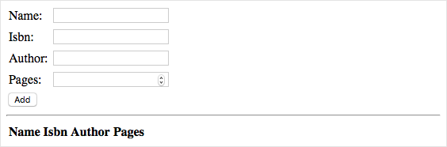
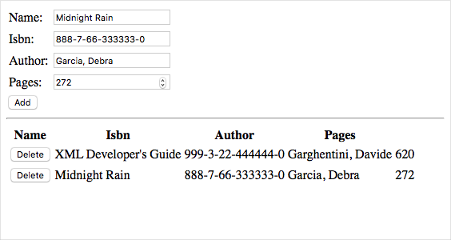

So far, you have MongoDB and Node.js installed on your Ubuntu VM. Now it's time to create a basic web application to see things in action. Along the way, you'll see how AngularJS and Express fit in.

A great way to learn is by example. The web application you'll build implements a basic book database. The web application lets you list information about books, add new books, and delete existing books.

The web application you'll see here demonstrates many concepts that apply to most MEAN stack web applications. Based on your needs and interests, you can explore the features you need to build your own MEAN stack applications.

Here's what the Books web application will look like.



Here's how each component of the MEAN stack fits in.

* MongoDB stores information about books.
* Express.js routes each HTTP request to the appropriate handler.
* AngularJS connects the user interface with the program's business logic.
* Node.js hosts the server-side application.

> [!IMPORTANT]
> For learning purposes, here you're building a basic web application. Its purpose is to test out your MEAN stack and give you a sense of how it works. The application isn't sufficiently secure or ready for production use.

## What about Express?

So far, you've installed MongoDB and Node.js on your VM. What about Express.js, the **E** in the MEAN acronym?

Express.js is a web server framework that's built for Node.js that simplifies the process for building web applications.

The main purpose of Express is to handle request routing. _Routing_ refers to how the application responds to a request to a specific endpoint. An endpoint is made up of a path, or URI, and a request method such as GET or POST. For example, you might respond to a GET request to the `/book` endpoint by providing the list of all books in the database. You might respond to a POST request to the same endpoint by adding an entry to the database based on fields the user entered into a web form.

In the web application you'll build shortly, you'll use Express to route HTTP requests and to return web content to your user. Express can also help your web applications work with HTTP cookies and process query strings.

Express is a Node.js package. You use the **npm** utility, which comes with Node.js, to install and manage Node.js packages. Later in this unit, you'll create a file named `package.json` to define Express and other dependencies, then run the `npm install` command to install these dependencies.

## What about AngularJS?

Like Express, you haven't yet installed AngularJS, the **A** in the MEAN acronym.

AngularJS makes web applications easier to write and test because it allows you to better separate the _appearance_ of your web page—your HTML code—from how your web page behaves. If you're familiar with the model–view–controller (MVC) pattern or the concept of data binding, AngularJS will be familiar to you.

AngularJS is what's called a front-end JavaScript framework, which means it needs to only be available on the client that accesses the application. In other words, AngularJS runs in your user's web browser, not on your web server. And because AngularJS is JavaScript, you can use it to easily fetch data from your web server to show on the page.

You don't really _install_ AngularJS. Instead, you add a reference to the JavaScript file in your HTML page, just as you do with other JavaScript libraries. There are several ways to include AngularJS in your web pages. Here, you'll load AngularJS from a content delivery network, or CDN. A CDN is a way to distribute images, video, and other content geographically to improve download speeds.

Don't add this code quite yet, but here's an example that loads AngularJS from a CDN. You'd typically add this code to the `<head>` section of your HTML page.

```html
<script src="https://ajax.googleapis.com/ajax/libs/angularjs/1.7.2/angular.min.js"></script>
```

> [!NOTE]
> Don't confuse AngularJS with Angular. While many of the concepts are similar between the two, AngularJS is the predecessor to Angular. AngularJS is still commonly used for building web applications. While AngularJS is based on JavaScript, Angular is based on TypeScript, a programming language that makes it easier to write JavaScript programs.

## How will I build the application?

Here, you'll use a basic process. You'll write application code from the Cloud Shell and then use SCP, or secure copy protocol, to copy the files to your VM. Then, you'll start the Node.js application and see the results in your browser.

In practice, you'd typically write and test your web application in a more local environment, such as from your laptop or from a virtual machine you run locally. You might then store your code in a version-control system such as Git and use a continuous integration and continuous delivery—or CI/CD— system such as Azure DevOps to test your changes and upload them to your VM. We'll point you to more resources at the end of this module.

## Create the Books web application

Here, you'll create all the code, script, and HTML files that make up your web application. For brevity, we'll highlight the important parts of each file but won't go into complete details.

If you're still connected to your VM over SSH, run `exit` to leave the SSH session and return to the Cloud Shell.

```bash
exit
```

You're now back at your Cloud Shell session.

### Create the files

1. From the Cloud Shell, run these commands to create the folders and files for your web application:

    ```bash
    cd ~
    mkdir Books
    touch Books/server.js
    touch Books/package.json
    mkdir Books/app
    touch Books/app/model.js
    touch Books/app/routes.js
    mkdir Books/public
    touch Books/public/script.js
    touch Books/public/index.html
    ```

    Here's what's included:

    * `Books` is the project's root directory.
      * `server.js` defines the entry point to the web application. It loads the required Node.js packages, specifies the port to listen on, and begins listening for incoming HTTP traffic.
      * `package.json` provides information about your application, including its name, description, and what Node.js packages your application needs to run.
    * `Books/app` contains code that runs on the server.
      * `model.js` defines the database connection and schema. Think of it as the data model for your application.
      * `routes.js` handles request routing. For example, it defines GET requests to the `/book` endpoint by providing the list of all books in the database.
    * `Books/public` contains files that are served directly to the client's browser.
      * `index.html` contains the index page. It contains a web form that enables the user to submit information about books. It also displays all books in the database and enables you to delete entries from the database.
      * `script.js` contains JavaScript code that runs in your user's browser. It can send requests to the server to list books, add books to the database, and delete books from the database.

1. Run the `code` command to open your files through the Cloud Shell editor.

    ```bash
    code Books
    ```

### Create the data model

1. From the editor, open `app/model.js` and add the following:

    ```javascript
    var mongoose = require('mongoose');
    var dbHost = 'mongodb://localhost:27017/Books';
    mongoose.connect(dbHost, { useNewUrlParser: true } );
    mongoose.connection;
    mongoose.set('debug', true);
    var bookSchema = mongoose.Schema( {
        name: String,
        isbn: {type: String, index: true},
        author: String,
        pages: Number
    });
    var Book = mongoose.model('Book', bookSchema);
    module.exports = Book;
    ```

    > [!IMPORTANT]
    > Whenever you paste or change code into a file in the editor, make sure to save afterwards using the "..." menu, or the accelerator key (<kbd>Ctrl+S</kbd> on Windows and Linux, <kbd>Command+S</kbd> on macOS).

    This code uses Mongoose to simplify the process of transferring data in and out of MongoDB. Mongoose is a schema-based system for modeling data. The code defines a database document called "Book" with the provided schema. The schema defines four fields that describe a single book:

    * The book's name, or title
    * Its International Standard Book Number—or ISBN—which uniquely identifies the book
    * Its author
    * The number of pages it contains

    Next, you'll create HTTP handlers that map GET, POST, and DELETE requests to database operations.

### Create the Express.js routes that handle HTTP requests

1. From the editor, open `app/routes.js` and add the following code:

    ```javascript
    var path = require('path');
    var Book = require('./model');
    var routes = function(app) {
        app.get('/book', function(req, res) {
            Book.find({}, function(err, result) {
                if ( err ) throw err;
                res.json(result);
            });
        });
        app.post('/book', function(req, res) {
            var book = new Book( {
                name:req.body.name,
                isbn:req.body.isbn,
                author:req.body.author,
                pages:req.body.pages
            });
            book.save(function(err, result) {
                if ( err ) throw err;
                res.json( {
                    message:"Successfully added book",
                    book:result
                });
            });
        });
        app.delete("/book/:isbn", function(req, res) {
            Book.findOneAndRemove(req.query, function(err, result) {
                if ( err ) throw err;
                res.json( {
                    message: "Successfully deleted the book",
                    book: result
                });
            });
        });
        app.get('*', function(req, res) {
            res.sendFile(path.join(__dirname + '/public', 'index.html'));
        });
    };
    module.exports = routes;
    ```

    This code creates four routes for the application. Here's a brief overview of each.

    | HTTP verb | Endpoint | Description |
    |---|---|---|
    | GET | `/book` | Retrieves all books from the database. |
    | POST | `/book` | Creates a `Book` object based on the fields the user provided on the web form and writes that object to the database. |
    | DELETE | `/book/:isbn` | Deletes the book as identified by its ISBN from the database. |
    | GET | `*` | Returns the index page when no other route is matched. |

    Express.js can serve up HTTP responses directly in the route-handling code, or it can serve up static content from files. This code shows both. The first three routes return JSON data for book API requests. The fourth route (the default case) returns the contents of the index file, `index.html`.

### Create the client-side JavaScript application

1. From the editor, open `public/script.js` and add this code:

    ```javascript
    var app = angular.module('myApp', []);
    app.controller('myCtrl', function($scope, $http) {
        var getData = function() {
            return $http( {
                method: 'GET',
                url: '/book'
            }).then(function successCallback(response) {
                $scope.books = response.data;
            }, function errorCallback(response) {
                console.log('Error: ' + response);
            });
        };
        getData();
        $scope.del_book = function(book) {
            $http( {
                method: 'DELETE',
                url: '/book/:isbn',
                params: {'isbn': book.isbn}
            }).then(function successCallback(response) {
                console.log(response);
                return getData();
            }, function errorCallback(response) {
                console.log('Error: ' + response);
            });
        };
        $scope.add_book = function() {
            var body = '{ "name": "' + $scope.Name +
            '", "isbn": "' + $scope.Isbn +
            '", "author": "' + $scope.Author +
            '", "pages": "' + $scope.Pages + '" }';
            $http({
                method: 'POST',
                url: '/book',
                data: body
            }).then(function successCallback(response) {
                console.log(response);
                return getData();
            }, function errorCallback(response) {
                console.log('Error: ' + response);
            });
        };
    });
    ```

    Notice how this code defines a module named "myApp" and a controller named "myCtrl". We won't go into full details about how module and controllers work here, but you'll use these names in the next step to bind the user interface (HTML code) with the application's business logic.

    Earlier, you created four routes that handle various GET, POST, and DELETE operations on the server. This code resembles those same operations, but from the client side (the user's web browser).

    The `getData` function, for example, sends a GET request to the `/book` endpoint. Recall that the server handles this request by retrieving information about all books from the database and returning that information as JSON data. Notice how the resulting JSON data is assigned to the `$scope.books` variable. You'll learn how this affects what the user sees on the web page in the next step.

    This code calls the `getData` function when the page loads. You can examine the `del_book` and `add_book` functions to get a sense for how they work. You don't need client-side code to match the server's default handler, because the default handler returns the index page and not JSON data.

### Create the user interface

1. From the editor, open `public/index.html` and add this code:

    ```html
    <!doctype html>
    <html ng-app="myApp" ng-controller="myCtrl">
    <head>
        <script src="https://ajax.googleapis.com/ajax/libs/angularjs/1.7.2/angular.min.js"></script>
        <script src="script.js"></script>
    </head>
    <body>
        <div>
        <table>
            <tr>
            <td>Name:</td>
            <td><input type="text" ng-model="Name"></td>
            </tr>
            <tr>
            <td>Isbn:</td>
            <td><input type="text" ng-model="Isbn"></td>
            </tr>
            <tr>
            <td>Author:</td>
            <td><input type="text" ng-model="Author"></td>
            </tr>
            <tr>
            <td>Pages:</td>
            <td><input type="number" ng-model="Pages"></td>
            </tr>
        </table>
        <button ng-click="add_book()">Add</button>
        </div>
        <hr>
        <div>
        <table>
            <tr>
            <th>Name</th>
            <th>Isbn</th>
            <th>Author</th>
            <th>Pages</th>
            </tr>
            <tr ng-repeat="book in books">
            <td><input type="button" value="Delete" data-ng-click="del_book(book)"></td>
            <td>{{book.name}}</td>
            <td>{{book.isbn}}</td>
            <td>{{book.author}}</td>
            <td>{{book.pages}}</td>
            </tr>
        </table>
        </div>
    </body>
    </html>
    ```

    This code creates a basic HTML form, with four fields to submit book data and a table that displays all the books stored in the database.

    Although this is standard HTML code, the `ng-` HTML attributes may be unfamiliar to you. These HTML attributes wire up the AngularJS code to the user interface. For example, when you select **Add**, AngularJS calls the `add_book` function, which sends the form data to the server.

    You can examine the code here to get a sense of how each of the `ng-` attributes relates to application's business logic.

### Create the Express.js server to host the application

1. From the editor, open `server.js` and add this code:

    ```javascript
    var express = require('express');
    var bodyParser = require('body-parser');
    var app = express();
    app.use(express.static(__dirname + '/public'));
    app.use(bodyParser.json());
    require('./app/routes')(app);
    app.set('port', 80);
    app.listen(app.get('port'), function() {
        console.log('Server up: http://localhost:' + app.get('port'));
    });
    ```

    This code creates the web application itself. It serves static files from the `public` directory and uses the routes you defined previously to handle requests.

### Define package information and dependencies

Recall that `package.json` provides information about your application, including its name, description, and what Node.js packages your application needs to run.

1. From the editor, open `package.json` and add this code:

    ```json
    {
      "name": "books",
      "description": "Sample web app that manages book information.",
      "license": "MIT",
      "repository": {
        "type": "git",
        "url": "https://github.com/MicrosoftDocs/mslearn-build-a-web-app-with-mean-on-a-linux-vm"
      },
      "main": "server.js",
      "dependencies": {
        "express": "~4.16",
        "mongoose": "~5.3",
        "body-parser": "~1.18"
      }
    }
    ```

You see information, or metadata, about your application including its name, description, and license.

The `repository` field specifies where the code is maintained. For reference, you can later review the code on GitHub at the URL shown here.

The `main` field defines the application's entry point. It's provided here for completeness, but it's not important because you're not planning to publish your application as a Node.js package for others to download and use.

The `dependencies` field is important. It defines the Node.js packages your application needs. Shortly, you'll connect to your VM a second time and run the `npm install` command to install these packages.

Node packages typically use the [Semantic Versioning](https://semver.org?azure-portal=true) versioning scheme. The version number contains three components: major version, minor version, and patch. The tilde `~` notation here tells npm to install the latest patch version under the provided major and minor versions. The versions you see here are the latest with which this module was tested. In practice, you can increment the version over time as you update and test your application to use the latest features each dependent package provides.

### Copy the files to your VM

Before you proceed, make sure you have your VM's IP address handy. If you don't have it, run these commands from the Cloud Shell to retrieve it:

```azurecli
ipaddress=$(az vm show \
  --name MeanStack \
  --resource-group <rgn>[sandbox resource group name]</rgn> \
  --show-details \
  --query [publicIps] \
  --output tsv)
```

```bash
echo $ipaddress
```

1. You're all done editing files. Make sure that you saved changes to each file and then close the editor.

    To close the editor, select the ellipses in the top-right corner, then select **Close Editor**.

1. Run the following `scp` command to copy the contents of the `~/Books` directory in your Cloud Shell session to the same directory name on your VM:

    ```bash
    scp -r ~/Books azureuser@$ipaddress:~/Books
    ```

## Install additional Node packages

Let's say that during the development process, you identified additional Node packages that you want to use. For example, recall that `app/model.js` starts with this line.

```javascript
var mongoose = require('mongoose');
```

Recall that the application uses Mongoose to help transfer data in and out of your MongoDB database.

The application also requires Express.js and the body-parser packages. Body-parser is a plugin that enables Express to work with data from the web form sent by the client.

Let's connect to your VM and install the packages you specified in `package.json`.

1. Before you connect to your VM, make sure you have your VM's IP address handy. If you don't have it, run the Cloud Shell commands in the previous section to retrieve it.

1. Like you did earlier, create an SSH connection to your VM:

    ```bash
    ssh azureuser@$ipaddress
    ```

1. Move to the `Books` directory under the home directory:

    ```bash
    cd ~/Books
    ```

1. Run `npm install` to install the dependent packages:

    ```bash
    sudo apt install npm -y && npm install
    ```

Keep your SSH connection open for the next section.

## Test the application

You're now ready to test out your Node.js web application!

1. From the `~/Books` directory, run this command to start the web application:

    ```bash
    sudo nodejs server.js
    ```

    This command starts the application by listening on port 80 for incoming HTTP requests.

1. From a separate browser tab, navigate to your VM's public IP address.

    You see the index page, which includes a web form.

    

    Try adding a few books to the database. Each time you add a book, the page updates the complete list of books.

    

    To delete a book from the database, you can also select **Delete**.
