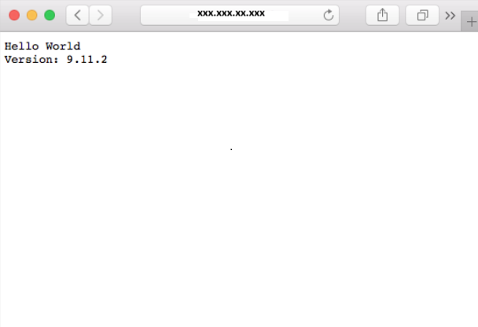

Container images can be pulled from Azure Container Registry using many container management platforms, such as Azure Container Instances, Azure Kubernetes Service, and Docker for Windows or Mac. Here, we will deploy our image to an Azure Container Instance.

<!-- Activate the sandbox -->
[!include[](../../../includes/azure-sandbox-activate.md)]

First, create a variable in the Cloud Shell named `ACR_NAME` with the name of your container registry in lowercase (for example, instead of "MyContainer" make the value "mycontainer"). This variable is used throughout this unit.

```azurecli
ACR_NAME=<acrName>
```

## About registry authentication

Azure Container Registry does not support unauthenticated access &mdash; all operations on a registry require a login. Registries support two types of identities:

- **Azure Active Directory identities**, including both user and service principals. Access to a registry with an Azure Active Directory identity is role-based, and identities can be assigned one of three roles: **reader** (pull access only); **contributor** (push and pull access); or **owner** (pull, push, and assign roles to other users).
- The **admin account** included with each registry. The admin account is disabled by default.

The admin account provides a quick and easy way to try out a new registry: you can simply enable the account and use its username and password in workflows and apps that need access. Once you have confirmed that the registry works as expected, you should disable the admin account and use Azure Active Directory identities exclusively to ensure the security of your registry.

> [!IMPORTANT]
> Only use the registry admin account for early testing and exploration, and do not share the username and password. Disable the admin account and use only role-based access with Azure Active Directory identities to maximize the security of your registry.

## Enable the registry admin account

In this exercise, we will enable the registry admin account and use it to deploy your image to an Azure Container Instance from the command line.

Run the following commands to enable the admin account on your registry and retrieve its username and password.

```azurecli
az acr update -n $ACR_NAME --admin-enabled true
az acr credential show --name $ACR_NAME
```

The output is similar to below. Take note of the `username` and the value for `password`.

```output
{  
  "passwords": [
    {
      "name": "password",
      "value": "aaaaa"
    },
    {
      "name": "password2",
      "value": "bbbbb"
    }
  ],
  "username": "ccccc"
}
```

## Deploy a container with Azure CLI

1. Execute the following `az container create` command to deploy a container instance. Replace `<username>` and `<password>` in the following command with your registry's admin username and password.

    ```azurecli
    az container create \
        --resource-group <rgn>[sandbox resource group name]</rgn> \
        --name acr-tasks \
        --image $ACR_NAME.azurecr.io/helloacrtasks:v1 \
        --registry-login-server $ACR_NAME.azurecr.io \
        --ip-address Public \
        --location eastus \
        --registry-username <username> \
        --registry-password <password>
    ```

1. Get the IP address of the Azure container instance using the following command.

    ```azurecli
    az container show --resource-group  <rgn>[sandbox resource group name]</rgn> --name acr-tasks --query ipAddress.ip --output table
    ```

1. Open a browser and navigate to the IP address of the container. If everything has been configured correctly, you should see the following results:

