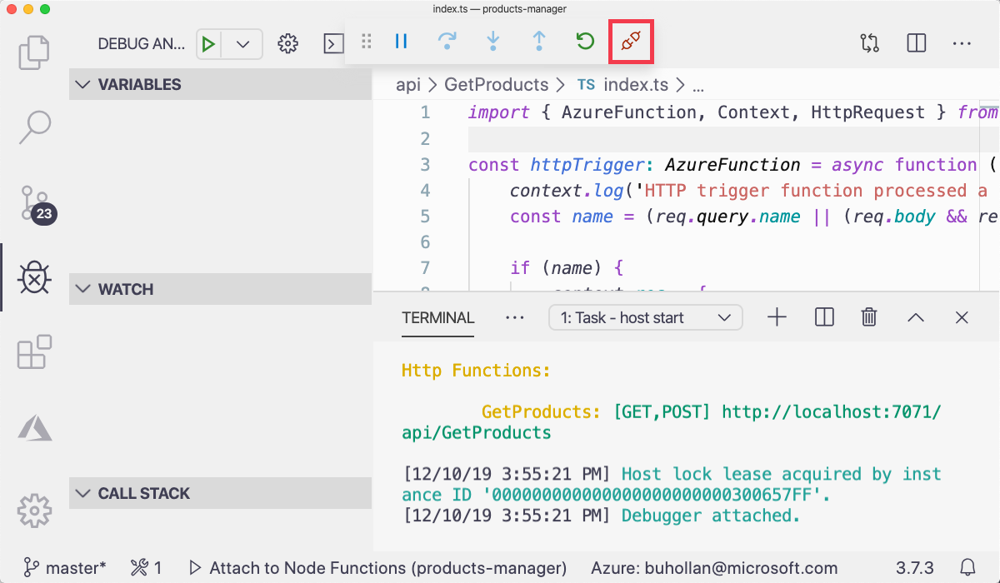
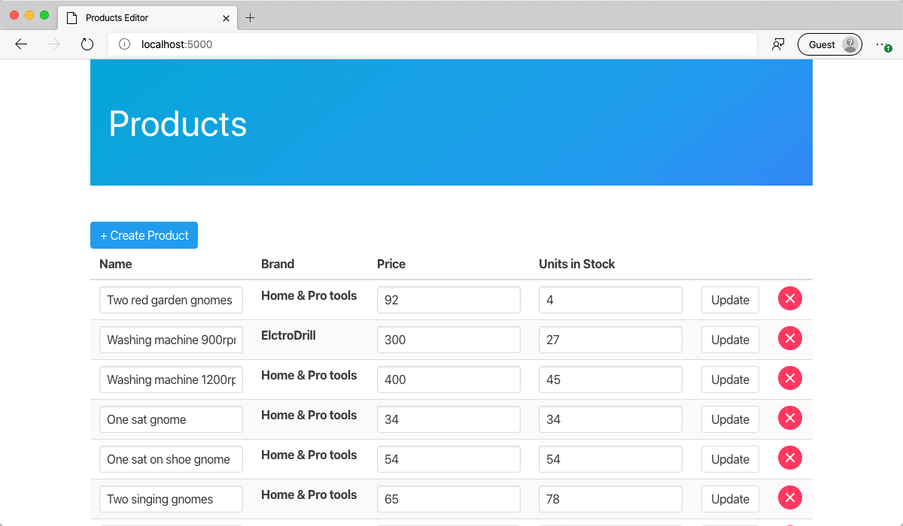

CORS is nifty for production, but it's a bummer when you're trying to build an application locally. In this exercise, you'll disable it in development so that you can fully test your application and API.

## Allow CORS access for development

1. If the Function app is running, press the "disconnect" button in the debug bar to terminate it.

   

1. Open the `api/local.settings.json` file.

1. Add a setting after the "Values" block that specifies the "Host" and "CORS" properties.

   ```json
   {
     "IsEncrypted": false,
     "Values": {
       "AzureWebJobsStorage": "",
       "FUNCTIONS_WORKER_RUNTIME": "node",
       "CONNECTION_STRING": "AccountEndpoint=https://tailwind-traders-2778.documents.azure.com..."
     },
     "Host": {
       "CORS": "*"
     }
   }
   ```

1. Start the Function project with <kbd>F5</kbd>.

## Connect the frontend web application

1. Open the `frontend/index.js` file.

1. On the second line of the file, set the `API` variable to "http://localhost:7071/api".

   ```javascript
   const API = "http://localhost:7071/api";
   ```

1. The frontend application should still be running in a browser tab on port 5000. Refresh the page.

1. The application loads in the data from the API.

   

1. Try creating, updating, and deleting products to ensure that all endpoints work.

That application looks good. It looks **very** good. None of it would be possible without your brilliant API. Are you ready to take this thing to production? Tailwind Traders is on a tight deadline to ship this. Going to production in Azure has its caveats, though. The first thing that you'll need to address is security. Wide-open APIs are OK in production, but you'll need to lock them down once they go live.
