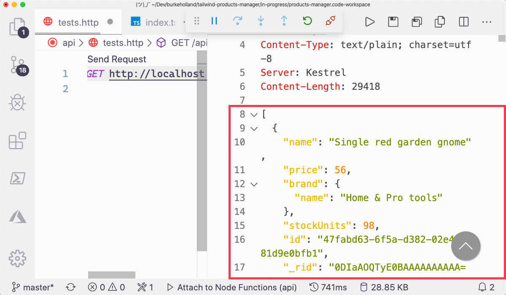

In the previous exercises you created all of the endpoints for the products API. In this exercise, you'll connect to Cosmos DB from those functions to create, read, update, and delete product data.

## Get the database connection string

1. Open the command palette in VS Code by pressing <kbd>F1</kbd>.

1. Type "connection string"

1. Select "Cosmos DB: Copy Connection String"

1. Select the "tailwind-xxxxx" account. Your five-digit number will be different than the ones shown in this screenshot as each database account has a unique name.

   

1. Press <kbd>Enter</kbd>

   The connection string is now on your clipboard. Now we'll use it to tell the Cosmos DB SDK how to connect the database.

## Add connection string to local settings

1. Open the `local.settings.json` file.

1. In the "Values" section, add a setting for "CONNECTION_STRING" and paste in the value you copied in the previous section.

   ```json
   {
     "IsEncrypted": false,
     "Values": {
       "AzureWebJobsStorage": "",
       "FUNCTIONS_WORKER_RUNTIME": "node",
       "CONNECTION_STRING": "AccountEndpoint=https://tailwind-11478.documents.azure.com:443/;AccountKey=SWBo68p0tZmiGOhjy8n48GYV63QkjsTRwMBhCLnmyNHhXr4lwZDXQWYgPDP32sMXZYoTNsivWVUdeje08EyFHg=="
     }
   }
   ```

## Connect to the Cosmos DB database

Install the Cosmos DB package from npm.

1.  Open the terminal by pressing <kbd>Ctrl</kbd> + <kbd>Shift</kbd> + <kbd>`</kbd>.

1.  Select the "api" project.

1.  Install the "@azure/cosmos" package from npm.

    ```bash
    npm install @azure/cosmos
    ```

1.  Remove all of the code in the `index.ts` file and replace it with the following...

    ```typescript
    import { AzureFunction, Context, HttpRequest } from "@azure/functions";
    import { CosmosClient } from "@azure/cosmos";

    const httpTrigger: AzureFunction = async function(
      context: Context,
      req: HttpRequest
    ): Promise<void> {
      try {
        // Use the CONNECTION_STRING setting from local.settings.json
        const client = new CosmosClient(process.env.CONNECTION_STRING);

        const database = client.database("tailwind");
        const container = database.container("products");

        let iterator = container.items.readAll();
        let items = await iterator.fetchAll();

        context.res = {
          // status: 200, /_ Defaults to 200 _/
          body: items.resources
        };
      } catch (err) {
        context.res = {
          status: 500,
          body: err.message
        };
      }
    };

    export default httpTrigger;
    ```

## Test out the GetProducts endpoint

1. Press F5 to start the project

1. Open the `api/tests.http` file.

1. Delete any text in that file and enter the following line...

   ```http
   GET http://localhost:7071/api/GetProducts
   ```

1. Click "Send Request".

1. View the results of the "products" collection in the returned result.

   

In this exercise, you learned how to connect to and query Cosmos DB. You also were able to return the items in the database with an Azure Function. In the next section, you'll learn how to make the "GetProducts" function comply with a RESTful architecture.
