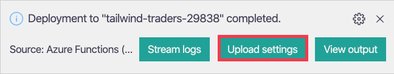
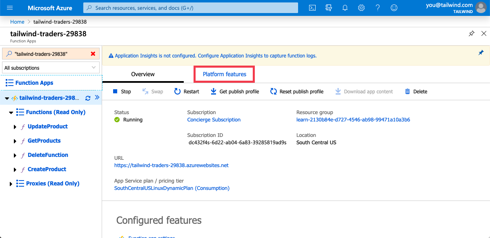
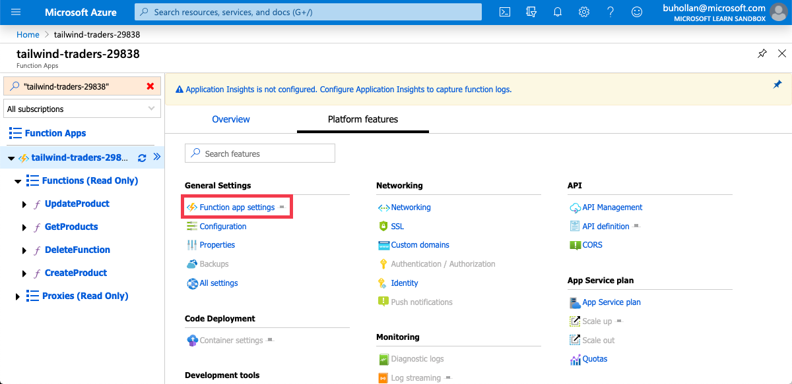
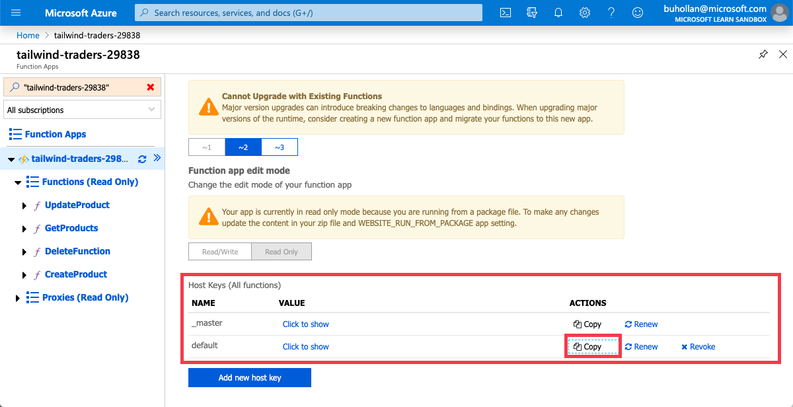
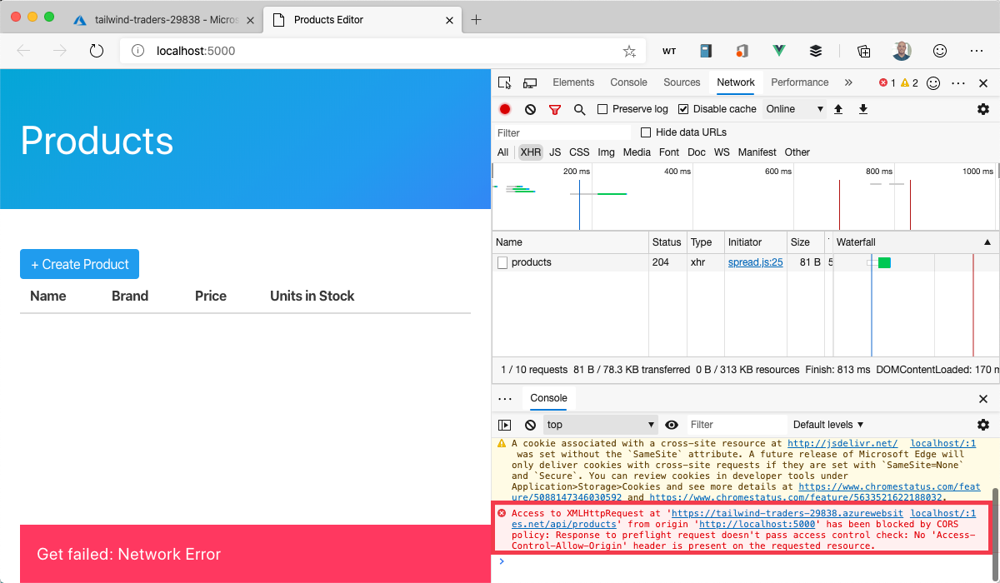
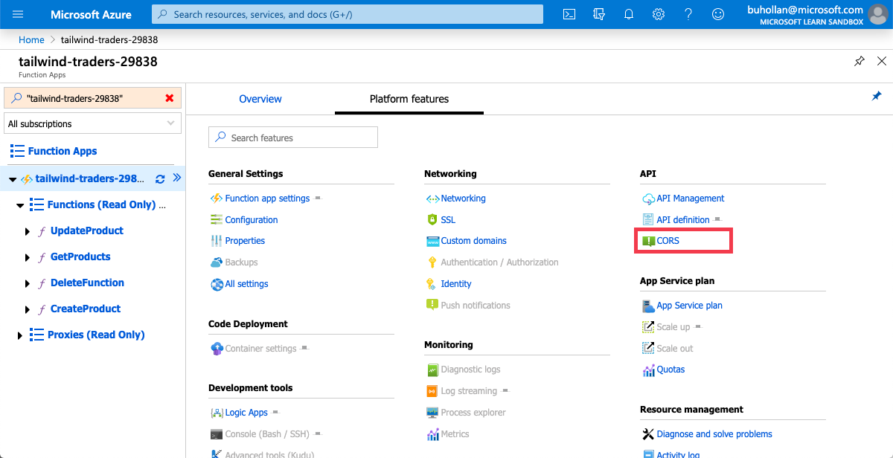

Your API is ready for prime time. Let's put it in the cloud. Azure, here we come.

## Publish the api project to Azure

1. Open the Command Palette

1. Type "deploy to function"

1. Select "Azure Functions: Deploy to Function App"

1. When prompted, selected the following values.

   | Name            | Value                                                    |
   | --------------- | -------------------------------------------------------- |
   | project folder  | api                                                      |
   | Function App    | Create new Function App in Azure (Advanced)              |
   | Name            | Your Azure Cosmos DB Account Name (i.e. tailwind-traders-xxxx) |
   | OS              | Linux                                                    |
   | Hosting Plan    | Consumption                                              |
   | Runtime         | Node 10.x                                                |
   | Resource Group  | learn-....                                               |
   | Storage Account | cloudshell...                                            |
   | App Insights    | Skip for now                                             |

   > [!IMPORTANT]
   > There are two "Create Function App in Azure" options. It's important that you choose the option that is marked "(Advanced)".

1. When prompted, select "Upload Settings".

   

## Set the API URL for the frontend application

1. Replace the value of `API` on line 3 in the `frontend/index.js` file with the following URL, replacing the "tailwind-traders-xxxx" with the name of your Function app.

   ```javascript
   const API = "https://tailwind-traders-xxx.azurewebsites.net/api";
   ```

## Get function key

1. Open the Command Palette.

1. Type "functions portal".

1. Select "Azure Functions: Open in Portal"

1. Select the "tailwind-traders-xxxx" function app that you created.

   This will open the Function App in your browser.

1. Click on "Platform Features" for a specific Function App.

   

1. Click on "Function App Settings"

   

1. Scroll down to the "Host Keys" section.

1. Click the "copy" button next to the "default" key.

   

## Set the function key for the frontend application

1. Open the `frontend/index.js` file.

1. Paste the value on your clipboard into the value of the `KEY` variable on line 3...

   ```javascript
   const KEY = "Iry/Itp6ou9y8SpOoz3hb3D7iaDAkzejXSmVs...";
   ```

1. Refresh the Products Manager application in your browser.

1. You should see a "Network Error" message.

1. Press <kbd>Cmd</kbd>/<kbd>Ctrl</kbd> + <kbd>Shift</kbd> + <kbd>I</kbd> to open the browser developer tools.

1. Notice there's a "blocked by CORS policy" message.

   

## Enable CORS on the Function app in Azure

1. Return to the Azure portal page for the function app.

1. Click on "Platform Features"

   

1. Click on the "CORS" option.

   

1. Add `http://localhost:5000` to the list of allowed URLs.

   ```http
   http://localhost:5000
   ```

1. Click "Save" at the top.

## Test the frontend application

1. Return to the Products Manager application running in your browser.

1. Refresh the page. The application should still show the data, but this time using the API that is in production.

   
