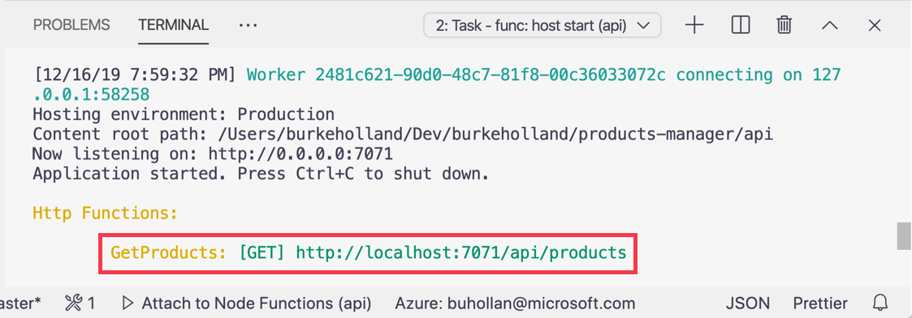
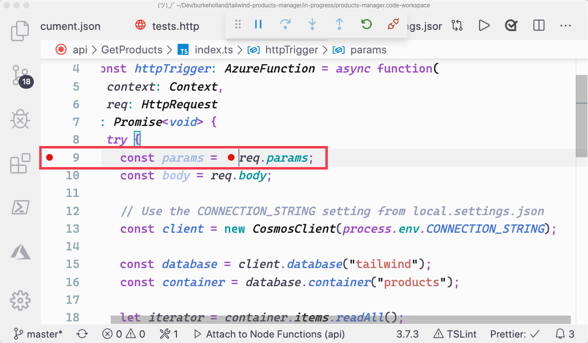
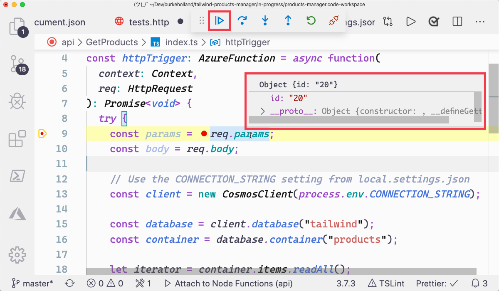

1. Open the `api/GetProducts/function.json` file.

1. Directly below the "methods" property and value, add a line that sets the route to "products".

   ```json
   {
     "bindings": [
       {
         "authLevel": "function",
         "type": "httpTrigger",
         "direction": "in",
         "name": "req",
         "methods": ["get"],
         "route": "products"
       },
       {
         "type": "http",
         "direction": "out",
         "name": "res"
       }
     ],
     "scriptFile": "../dist/GetProducts/index.js"
   }
   ```

1. Save the file.

   Saving the file will cause the Azure Functions process to terminate the debugger will disconnect.

1. Start the Azure Functions project by pressing <kbd>F5</kbd>.

1. Notice that the "GetProducts" function is now exposed to an HTTP GET request method at the "api/products" route.



## Test the endpoint

1. Open the `api/tests.http` file.

1. Add the following line to the file.

   ```http
   GET http://127.0.0.1:/api/products
   ```

1. Click "Send Request".

1. Note that the function now responds at the new route which you specified in the `function.json` file.

## Pass a route parameter

1. Open the `api/GetProducts/function.json` file.

1. Modify the "routes" property so that it specifies a parameter called "id" as part of the "products" route.

   ```json
   {
     "bindings": [
       {
         "authLevel": "function",
         "type": "httpTrigger",
         "direction": "in",
         "name": "req",
         "methods": ["get"],
         "route": "products/{id}"
       },
       {
         "type": "http",
         "direction": "out",
         "name": "res"
       }
     ],
     "scriptFile": "../dist/GetProducts/index.js"
   }
   ```

1. Save the file. This will terminate the running Azure Functions process.

1. Press <kbd>F5</kbd> to restart the Azure Functions project.

## Test the endpoint

1. Open the `api/GetProducts/index.ts` file.

1. Place a breakpoint by clicking in the gutter on the lefthand side of line 9.

   

1. Open the `api/tests.http` file.

1. Delete everything in the file and replace it with the following...

   ```http
   GET GET http://127.0.0.1:/api/products/20
   ```

1. Click "Send Request".

1. In VS Code put your cursor over the req.params object on line 9 to see that the value "20" is passed on a property called "id".

1. Press the "continue" button in the VS Code debug bar.

   

## Pass parameters on the request body

1. Open the `api/tests.http` file.

1. Delete everything in the file and replace it with the following...

   ```http
    GET http://localhost:7071/api/products/20
    content-type: application/json

    {
      "name": "Test Product",
      "brand": {
        "name": "Test Brand"
      }
    }
   ```

1. Click "Send Request"

1. VS Code will break in the `api/GetProduts/index.ts` file.

1. Place your cursor over the `req.body` object on line 10 to inpect it's value. Notice that the object that was sent as the body of the HTTP request shows up on this object.

1. Click the disconnect button in the VS Code debug toolbar to stop execution.

   

1. Delete lines 9 and 10 in the `api/GetProducts/index.ts` file. They were only for testing and are no longer needed.

The "GetProducts" method is now a RESTful endpoint. In the next section, you'll learn how to modify data in Cosmos DB. This will enable you to create the final endpoints needed to complete the API.

1. Open the `api/GetProducts/function.json` file.

1. Remove the "id" parameter from the "route" value so that it only contains "products". The "id" parameter was only for testing and is no longer needed.

```json
{
  "bindings": [
    {
      "authLevel": "function",
      "type": "httpTrigger",
      "direction": "in",
      "name": "req",
      "methods": ["get"],
      "route": "products"
    },
    {
      "type": "http",
      "direction": "out",
      "name": "res"
    }
  ],
  "scriptFile": "../dist/GetProducts/index.js"
}
```
