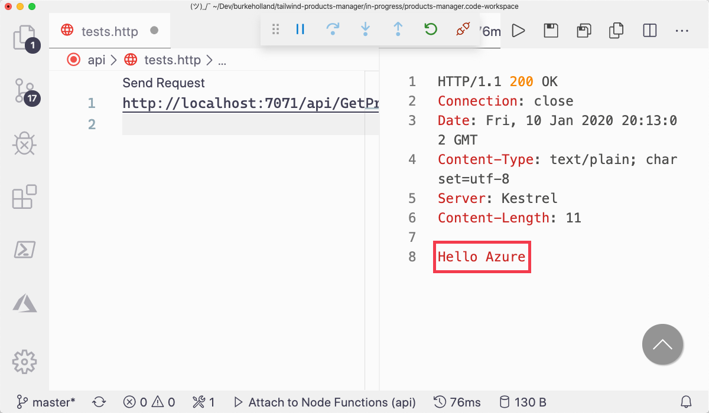
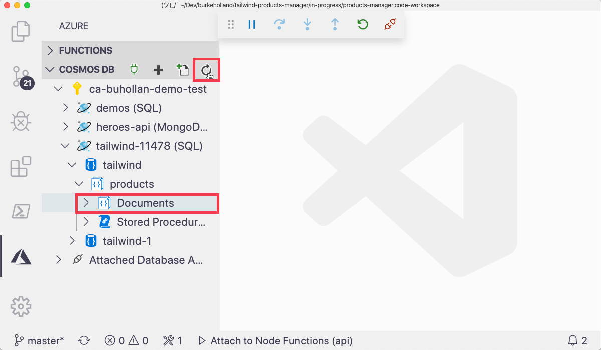
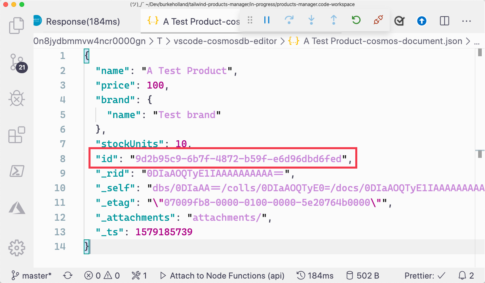

In this exercise, you'll create the three remainin endpoints for the API - CreateProduct, UpdateProduct and DeleteProduct. You'll use your knowledge of HTTP request methods and custom routes to make them RESTful.

## Create the CreateProduct function

1. Open the Command Palette in VS Code by pressing <kbd>F1</kbd>.

1. Type "create function".

1. Select "Azure Functions: Create Function".

1. Select "api".

1. When prompted, enter the following values

   | Name          | Value         |
   | ------------- | ------------- |
   | Template      | HTTP trigger  |
   | Name          | CreateProduct |
   | Authorization | Function      |

   VS Code will create a new folder in the "api" project called "CreateProduct". The `index.ts` file in this folder will be opened in the editor.

1. Replace all of the code in the `api/CreateProduct/index.ts` file with the following...

   ```typescript
   import { AzureFunction, Context, HttpRequest } from "@azure/functions";
   import { CosmosClient } from "@azure/cosmos";

   const httpTrigger: AzureFunction = async function(
     context: Context,
     req: HttpRequest
   ): Promise<void> {
     try {
       const client = new CosmosClient(process.env.CONNECTION_STRING);

       const database = client.database("tailwind");
       const container = database.container("products");

       const productToCreate = req.body;

       let result = await container.items.create(productToCreate);

       context.res = {
         // status: 200, /* Defaults to 200 */
         body: result.resource
       };
     } catch (err) {
       context.res = {
         status: 500,
         body: err.message
       };
     }
   };

   export default httpTrigger;
   ```

## Modify HTTP request method

1. Open the `api/CreateFunction/function.json` file.

1. Modify the "methods" property so that the function only accepts a "post".

   ```json
   {
     "bindings": [
       {
         "authLevel": "function",
         "type": "httpTrigger",
         "direction": "in",
         "name": "req",
         "methods": ["post"]
       },
       {
         "type": "http",
         "direction": "out",
         "name": "res"
       }
     ],
     "scriptFile": "../dist/CreateProduct/index.js"
   }
   ```

## Modify the route

1. Add a "route" property directly below the "methods" property and specify "product" as the route.

   ```json
   {
     "bindings": [
       {
         "authLevel": "function",
         "type": "httpTrigger",
         "direction": "in",
         "name": "req",
         "methods": ["post"],
         "route": "product"
       },
       {
         "type": "http",
         "direction": "out",
         "name": "res"
       }
     ],
     "scriptFile": "../dist/CreateProduct/index.js"
   }
   ```

## Test the function

1. Start the "api" project by pressing <kbd>F5</kbd>.

1. Open the `api/tests.http` file.

1. Remove everything in the file and replace it with the following...

   ```http
   POST http://localhost:7071/api/product
   content-type: application/json

   {
     "name": "A Test Product",
     "price": 100,
     "brand": {
       "name": "Test brand"
     },
     "stockUnits": 10
   }
   ```

1. Click "Send Request".

1. Note that request returns a 200 status code indicating that the operation was successful.

   

## View result in CosmosDB explorer

1. Open the Command Palette in VS Code by pressing <kbd>F1</kbd>.

1. Type "focus cosmos" and select "Azure: Focus on CosmosDB View".

1. Highlight the "Documents" node in the "products" collection and hit the refresh button in the explorer view toolbar.

   

1. Click on the new item called "A Test Product".

1. Copy the value from the "id" field to your clipboard.

   

1. Click on the "disconnect" icon in the VS Code debugger bar to stop the application.

   

In the next exercise, you'll create the `UpdateProduct` endpoint.
