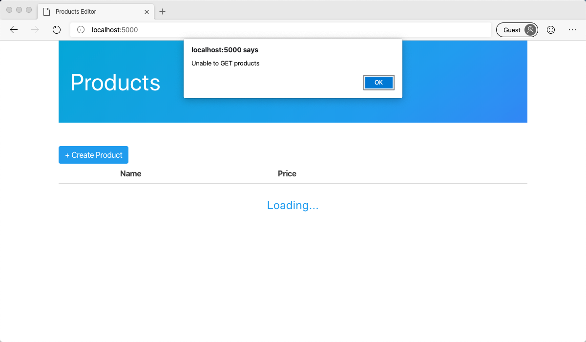

Before you create the HTTP API with Azure Functions, you need to setup the database and the frontend web project. First, you'll clone the products admin website repo. Then you'll run a script which will create the products database and populate it with product data.

## Clone the products admin website

The products admin website already exists. You'll need to clone it to your local environment to add the API.

1. Clone the frontend project repo

   ```bash
   git clone https://github.com/burkeholland/tailwind-products-editor
   ```

1. Open the project in VS Code

   ```bash
   cd tailwind-products-editor
   code .
   ```

## Install dependencies

1. Open the integrated terminal in VS Code by running <kbd>Ctrl</kbd> + <kbd>`</kbd>

1. Install all of the dependencies required for the project to run.

   ```bash
   npm install
   ```

## Create the database

1. Open a terminal instance in VS Code by pressing <kbd>Ctrl</kbd> + <kbd>`</kbd>

1. Log in to the Azure CLI

   ```bash
   az login
   ```

   This will open a browser window where you can sign in.

   

1. Run the following command in the command shell to create the database and populate it with sample data.

   ```bash
   ./data/CREATE_DB.sh
   ```

> [!IMPORTANT]
> The database creation step can take upwards of 10 minutes to complete. While it may look like nothing is happening in the terminal, the database creation process is underway in Azure.

## Running the frontend site

The frontend web page for the Products Dashboard already exists. It is not wired up to a backend yet, but you're going to be doing that in the next few exerises. For now, let's get it loaded up in your browser.

1. Open a new integrated terminal instance by pressing <kbd>Ctrl</kbd> <kbd>Shift</kbd> <kbd>`</kbd>

1. Start the project by running the `start` command from the "package.json" file.

   ```bash
   npm start
   ```

   This will start a small web server and tell you what the address is so you can view the page. It will likely be on port 5000, but your port may be different. You can <kbd>Ctrl</kbd>-click on the address to open the page in your browser.

   

1. You should see the page displayed in the browser. It will display a "loading" message with an "Unable to GET products" error. This is because you have not yet connected it to your database yet.

   

## Viewing a Cosmos DB database with VS Code

By this time, Azure should have finished creating and populating the Azure Cosmos DB database. This database account will be in the format "tailwind-xxxx". The name of the database itself is **"tailwind"** and there will be a single collection inside called **"products"**.

1. Open Visual Studio Code and select the "Azure" item in the Action Bar. This will open the Azure extension area in the sidebar.

   

1. Click on the "Sign In to Azure" option in the "Cosmos DB" section.

   

1. Return to VS Code and expand your subscription in the "Cosmos DB" sidebar explorer. Notice the account named "tailwind-xxxx"

   

1. Expand this account, expand the "tailwind" database, expand the "products" collection and then the "Documents" node.

   

1. Click on the "Artificial Tree" item to view the document in the database

   

At this point, you have successfully created a new database account, a new database called "tailwind" and a new collection called "products". You have connected to that database from Azure. You have also run the frontend project. You are now ready to connect the frontend project to the database using Azure Functions.
