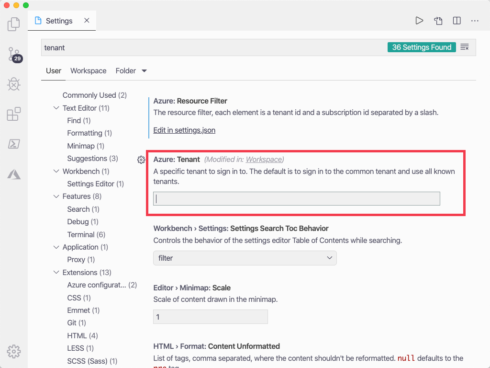
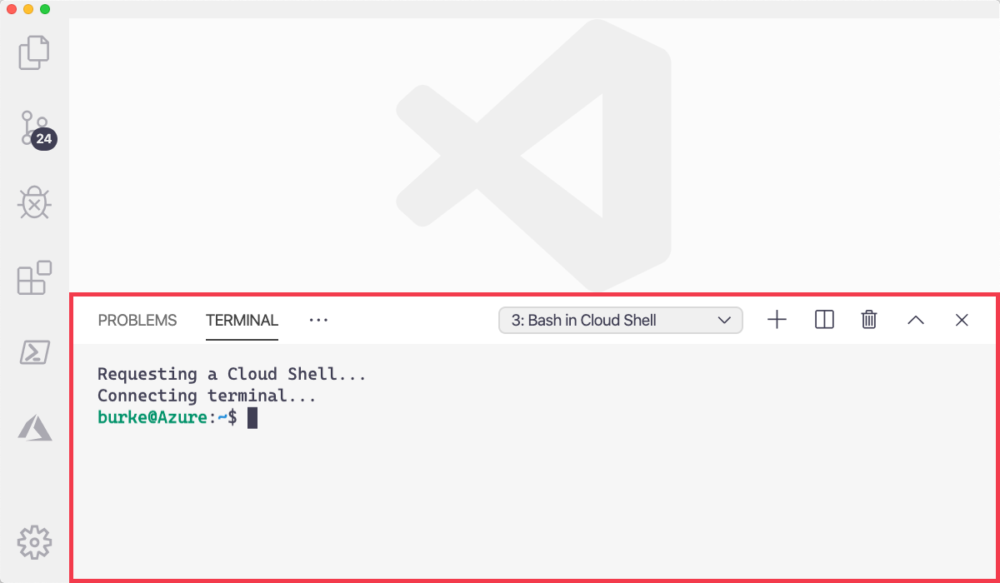
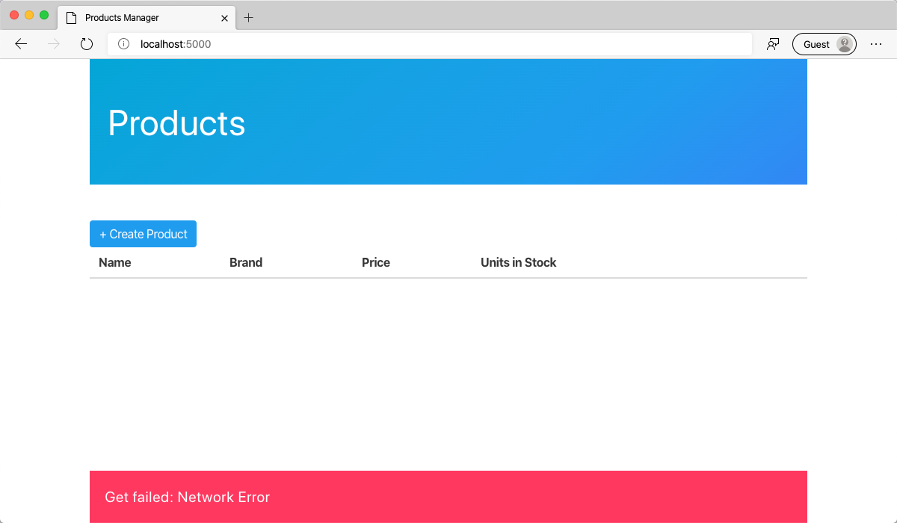

You're a new developer at Tailwind Traders. Before you can start, you'll need to get your development environment configured. Don't worry, Tailwind Traders has made the onboarding process easy. There are just a few small steps you need to follow to get up and running.

## Create the database

1. Sign into the sandbox (AKA Tailwind Traders "production environment") as indicated at the top of this page.

1. Run the following command to get the tenant id for your sandbox subscription.

   ```bash
   az account list --query "[?name=='Concierge Subscription'].tenantId" -o tsv
   ```

1. Highlight the id in the sandbox and copy it to your clipboard.

## Setup VS Code

1. Open VS Code.

1. Open settings in Visual Studio Code by pressing <kbd>Ctrl</kbd>/<kbd>Cmd</kbd> + <kbd>,</kbd>.

1. Type "azure tenant".

1. Enter the tenant from your clipboard into the **Azure: Tenant** textbox.

   

1. Press <kbd>F1</kbd> to open the Command Palette.

1. Type "select subscription".

1. Choose "Azure: Select Subscriptions".

1. Select "Concierge Subscription" by checking the box next to it.

   

## Create the database

1. Open the Command Palette by Pressing <kbd>F1</kbd>.

1. Type "Cloud Shell" and select "Azure: Open Bash in Cloud Shell"

   

1. Copy the following line and paste it into the Cloud Shell terminal instance in VS Code

   ```bash
   git clone https://github.com/burkeholland/tailwind-products && cd tailwind-products && ./CREATE_DATABASE.sh
   ```

   This will create a new Cosmos DB account, database, and collection populated with product data. This process can take up to 15 minutes. Feel free to continue with the Learn Module. Just be sure to keep the terminal instance open until the process is complete.

## Clone the existing project

Fortunately, someone has already written the frontend part of the application. They have creatively named it, "Product Manager". All you need to do is create an API for it. First, though, you need to pull down and set up the Product Manager project.

1. Open the Command Palette in VS Code by pressing <kbd>F1</kbd>.

1. Type "clone" in the prompt.

1. Select "Git: Clone" from the Command Palette.

1. Enter the following repo URL.

   ```bash
   https://github.com/burkeholland/tailwind-products-editor
   ```

1. Select a folder on your local drive where the project will be cloned.

1. When prompted to open the cloned repository, click the "Open" button.

1. VS Code will detect a workspace file in this project and ask if you want to open it. Select "Open Workspace".

   

There will be two projects in VS Code: "frontend" and "api". The "frontend" project contains the web application. The "api" project is where you will be building the serverless API with Azure Functions.

## Run the frontend project

1. Open the integrated terminal in VS Code by pressing <kbd>Ctrl</kbd> + <kbd>Shift</kbd> + <kbd>`</kbd>.

1. Select "frontend".

1. Run the frontend project in the browser by executing the `npm start` command from the integrated terminal.

   ```bash
   npm start
   ```

   A small webserver called "serve" should be running in your terminal. It will output the URL where the frontend application is running.

   

1. Click on that url in the terminal to open the application in the browser.

1. The application will load, but there will be no data present. This is because you have not yet created the API for this application.

   

Excellent! You've successfully configured your environment to be a productive developer at Tailwind Traders. You've got VS Code connected to Azure and the frontend project is running locally on your machine. That means that it's time to create the Azure Functions project that will serve as the API for the Product Manager application.
