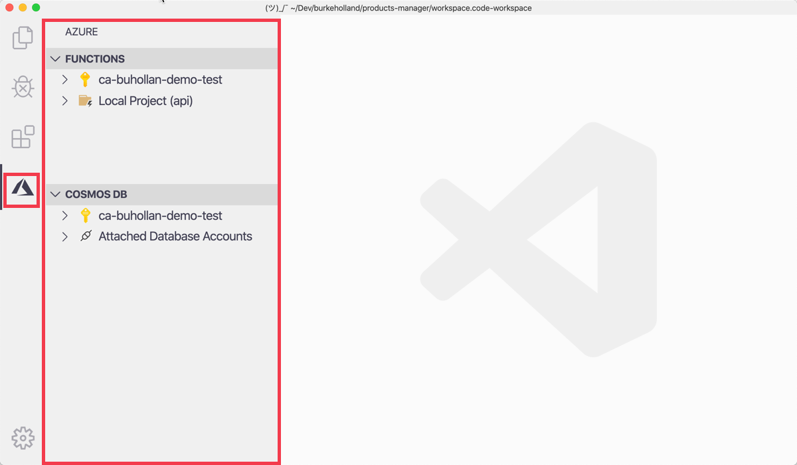
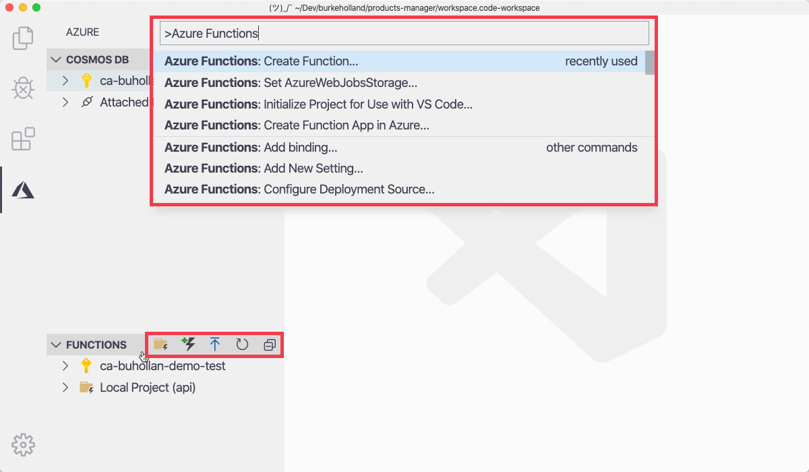

At Tailwind Traders, a highly prestigious (and fictitious) hardware company, you'll be doing all of your development in VS Code.

VS Code is, at its core, a text editor. Out of the box it doesn't aim to be much more than that. The difference between VS Code and your standard text editor is that VS Code is like a dial. It has thousands of available extensions. These extensions allow you to turn the dial from "text editor" to "integrated development environment".

## Azure Extensions for VS Code

When you install Azure extensions for VS Code, such as the Azure Functions extension and the Azure Cosmos DB extension, an Azure icon will appear in the ActivityBar. The ActivityBar is the bar that runs vertically along the side of your editor. Clicking on that icon will open the Azure Explorer view in the SideBar.

Inside this new Azure Explorer view, each extension that you have installed will show up as a section. There will be a menu item that says "Log In". Once you do, you will see any Azure subscriptions that you have access to under each section.

> [!TIP]
> You can filter the subscriptions that you see in these extensions by opening the Command Palette (F1) and selecting "Azure: Select Subscriptions"

## Azure Functions Extension

If you have completed previous Learn modules, you'll be familiar with using the CLI to create Azure Function projects, run them locally, publish them to Azure, ect.

The Azure Functions extension for VS Code wraps the Azure Functions CLI. This means that virtually anything that can be done on the CLI can also be done from within VS Code. That increases initial productivity because you can immediately see what you are doing.

All Azure Functions extension actions can be accessed two ways - either from the Azure Functions explorer item header icons, or from the Command Palette. The Command Palette contains every command available in VS Code. You can open the Command Palette by pressing <kbd>F1</kbd>.

> [!TIP]
> You can also summon the Command Palette by pressing <kbd>Cmd</kbd>/<kbd>Ctrl</kbd> + <kbd>Shift</kbd> + <kbd>P</kbd>. Some find this easier, paticularly if you don't have function keys or if those function keys are mapped to, well, other functions.

## Azure Cosmos DB extension

Similar to the Azure Functions extension, the Cosmos DB extension wraps the Azure CLI. If you have completed previous modules on Cosmos DB, you may be familiar with using the Azure CLI to create, delete and otherwise manage Cosmos DB accounts.

The extension also lets you do things like view documents within collections and upload a document locally into Cosmos DB. Just like the Functions extension, all available Cosmos DB commands are located in the Command Palette.

## Workspaces

Another feature in VS Code that makes it well suited for the kind of application that you're building in this module is something called "Workspaces". This is where you're able to load two top-level projects into VS Code at the same time, even though they're separate projects.

In the case of an application like the one in this exercise, there is a "frontend" project and an "api" project. Both of these are separate projects, but together they create a complete solution, so it's likely that you will have both of these projects together in the same workspace.

A workspace is defined by a file with the extension `.workspace`. If you have a file with this extension present when you open a folder in VS Code, the editor will detect that and ask you if you would like to open the workspace. You can modify workspace settings by opening the Command Palette and selecting "Preferences: Open Workspace Settings".

In the next exercise, you will open VS Code and use the integrated terminal to scaffold out the enviornment needed for this project.

## Integrated terminal

VS Code offers an integrated terminal that functions as your command line, PowerShell prompt or bash shell, but from within VS Code. This makes it easy to execute CLI commands without having to leave the editor.

There are two ways to summon the integrated terminal in VS Code.

The first way is to press <kbd>Ctrl</kbd> + <kbd>`</kbd>. This will open the bottom section of VS Code which is called the "Panel". This Panel contains the terminal. If you use this key combination again, it will toggle the terminal between a visible and hidden state.

The second way is to press <kbd>Ctrl</kbd> + <kbd>Shift</kbd> + <kbd>`</kbd>. This difference in this command is that it creates a _new_ terminal instance. This is useful for when you have a terminal open already, and you want another instance of the terminal so you can run another command without stopping the current one.
