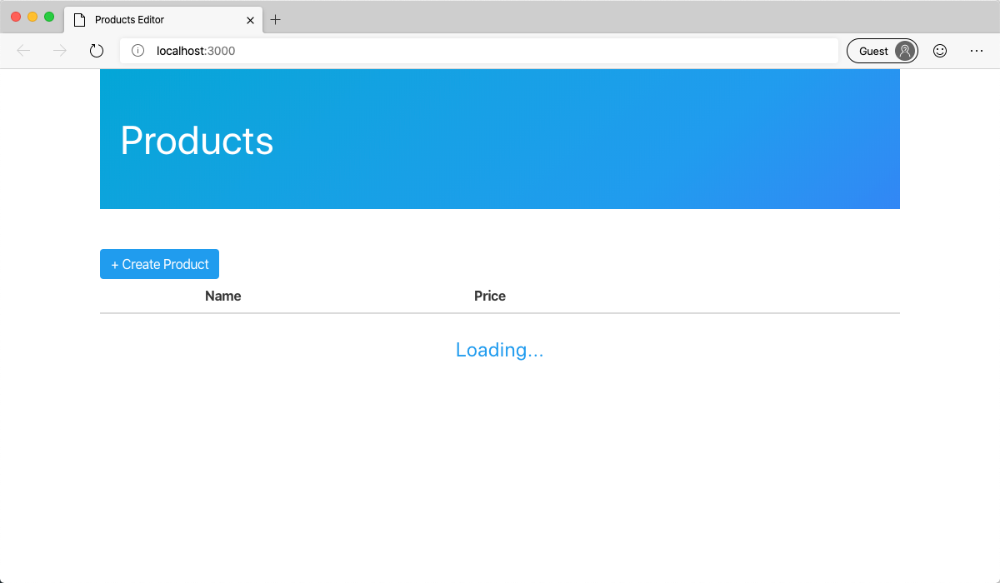
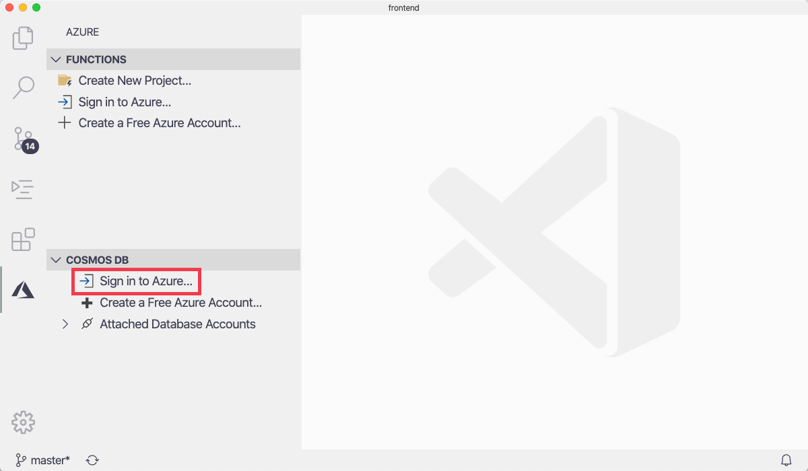
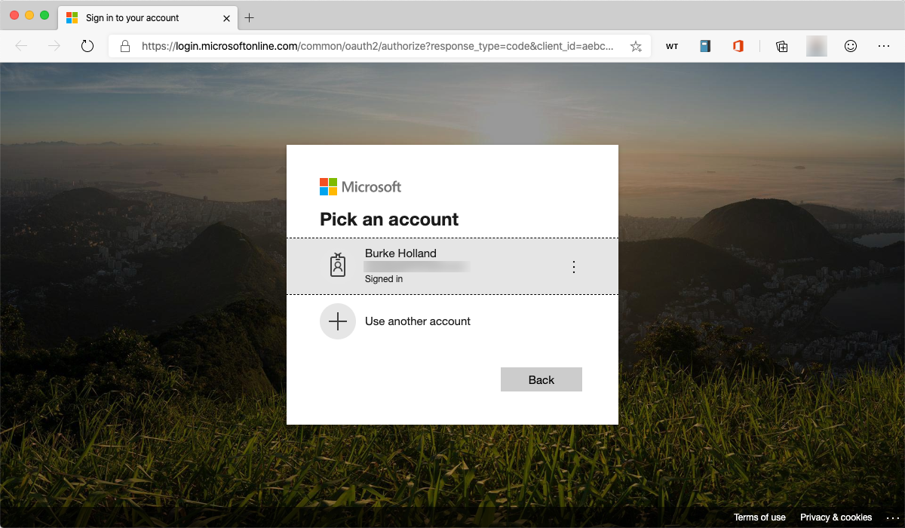
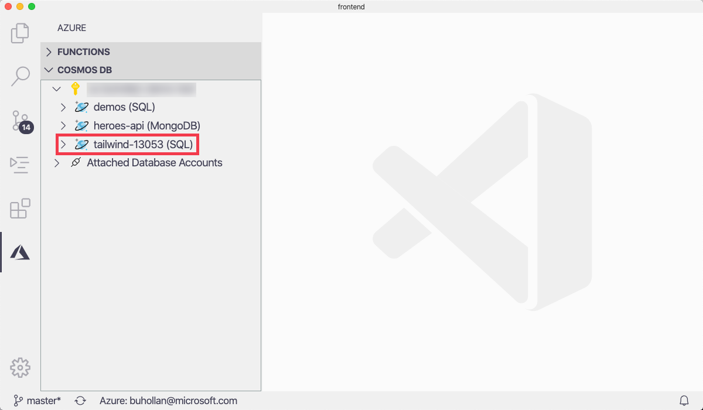
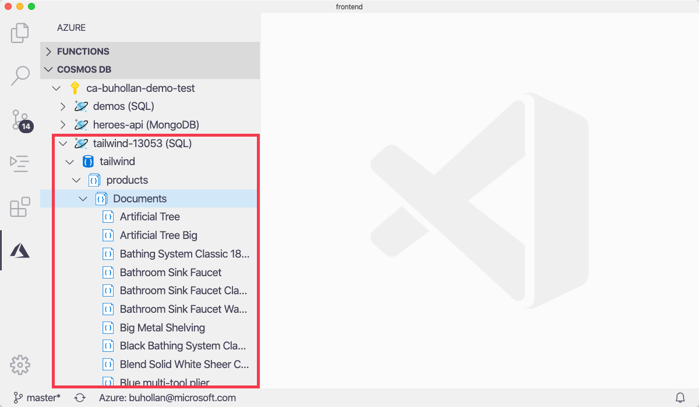
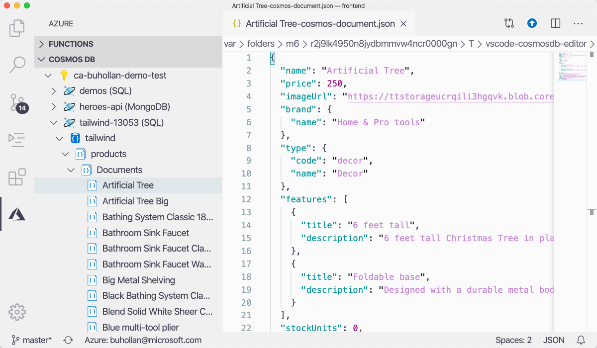

In this exercise, you'll create a new project in Azure Functions that will be the REST API for the Product Management application. You'll learn how to create endpoints, run the endpoints locally and set breakpoints.

## Create a new Azure Functions project

From VS Code, select the "New Function Project" button in the Azure Functions extension.

1. Clone the frontend project repo

   ```bash
   git clone https://github.com/burkeholland/tailwind-products-editor
   ```

1. Open the project in VS Code

   ```bash
   cd tailwind-products-editor
   code .
   ```

## Run the project

In order to run the project, you'll need to install a small web server. For this exercise, we're going to use the `lite-server` npm package. Install that and then run it from within VS Code.

1. Open the integrated terminal in VS Code by pressing <kbd>Ctrl + `</kbd>.

1. Install the `lite-server` npm package

   ```bash
   npm install -g lite-server
   ```

1. Run the `lite-server` web server on the current directory

   ```bash
   lite-server
   ```

Your browser will open and the site will be loaded. Note that from here on out you can leave this instance of the application running. Any changes that you make to the application will be reflected automatically.



## Create the database

Now that the project is running, it's time to setup the database that will be used to provide data to the API.

1. Run the following command in the command shell to create the database and populate it with sample data.

```bash
./CREATE_DB.sh
```

[!INCLUDE[OS-specific keyboard shortcuts](../../../includes/azure-cloudshell-copy-paste-tip.md)]

This command will create a new database account in the format "tailwind-xxxx". The name of the database itself is "tailwind" and there will be a single collection inside called "products".

    > [!IMPORTANT]
    > The database creation step can take upwards of 10 minutes to complete. While it may look like nothing is happening in the terminal, the database creation process is underway in Azure. Please wait for it to fully complete.

Now that the database has been created, you can view it within VS Code via the Cosmos DB extension.

1. Open Visual Studio Code and select the "Azure" item in the Action Bar. This will open the Azure extension area in the sidebar.


1. Click on the "Sign In to Azure" option in the "Cosmos DB" section.



This will open a browser window where you can sign in.



1. Return to VS Code and expand your subscription in the "Cosmos DB" sidebar explorer. Notice the account named "tailwind-xxxx"



1. Expand this account, expand the "tailwind" database, expand the "products" collection and then the "Documents" node.



1. Click on the "Artificial Tree" item to view the document in the database



You now have the frontend running, and you have a database with the products in it. The next step is to create a Serverless API that connects the frontend web page to the backend database.
