In this exercise, you'll create a new project in Azure Functions that will be the REST API for the Product Management application. You'll learn how to create endpoints, run the endpoints locally and set breakpoints.

## Create a new Azure Functions project

1. From VS Code, select the "New Function Project" button in the Azure Functions extension.

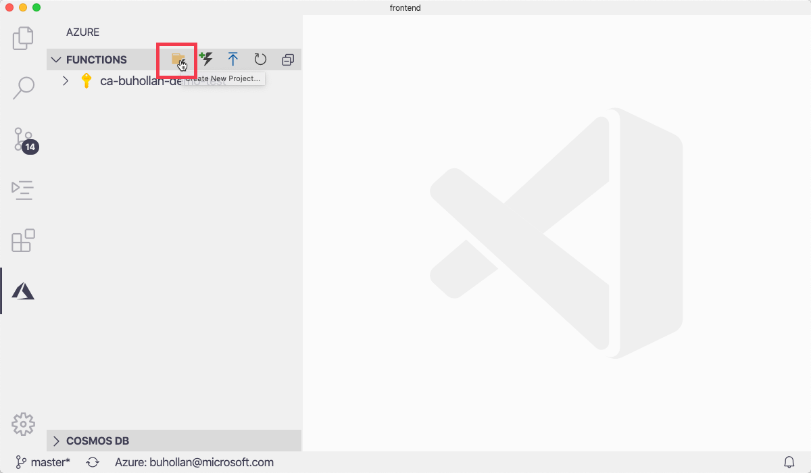

1. Select "Browse" and create a new folder in the same parent folder as the "frontend" folder

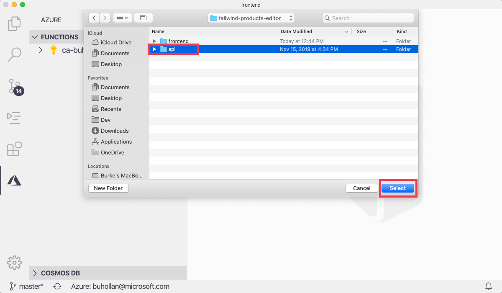

1. Select "TypeScript" as the language type.

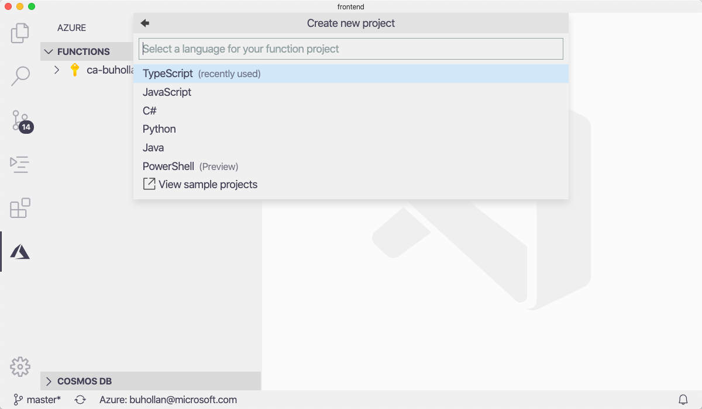

1. Select "HTTP trigger" as the template for the function.


1. Name the function "GetProducts".


1. Select "Function" authorization level.

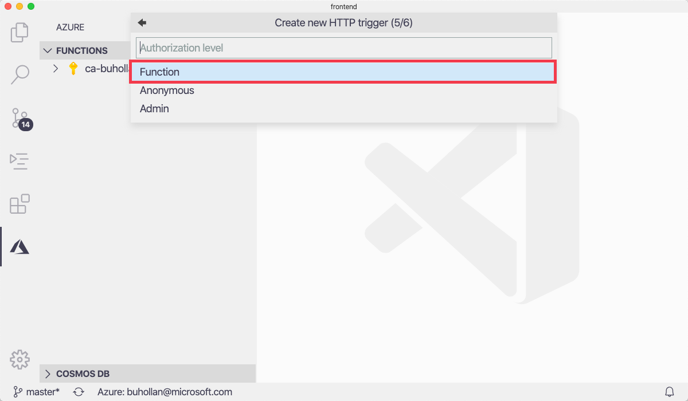

1. Select "Add to workspace".

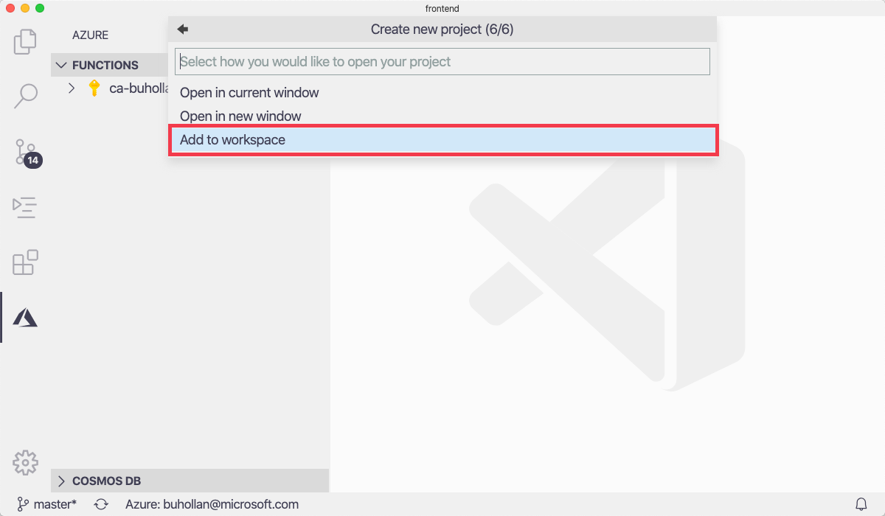

There will now be a second folder in VS Code called "api". When you have multiple top-level folders in VS Code, this is called a "Workspace".

The `index.ts` file from the "GetProducts" folder should be open. This file is what is executed by Azure Functions when the Azure Function's project is run.

## Run the project

Azure Functions projects can be run and debugged locally from within VS Code.

1. Switch to the "Debug View" in VS Code by clicking on the debug icon in the action bar.

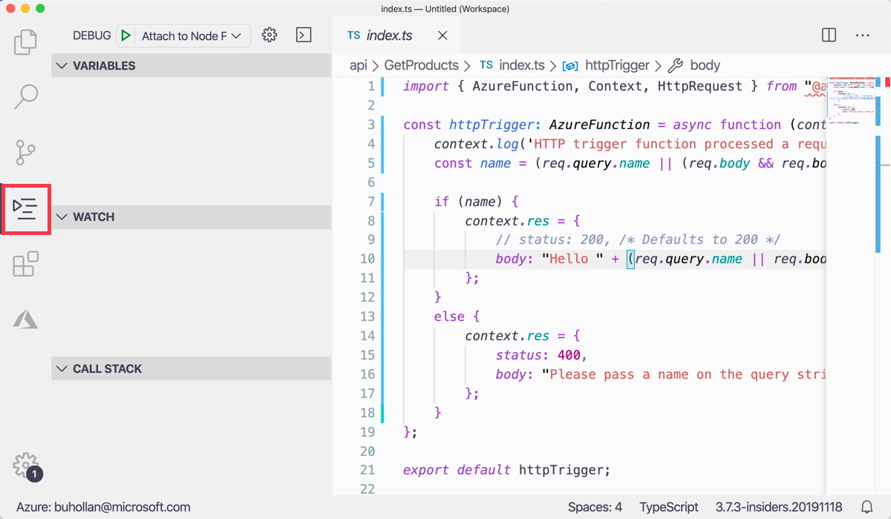

1. Make sure that "Attach to Node Functions" is selected in the dropdown list at the top and press the green "Start Debugging" triangle button.

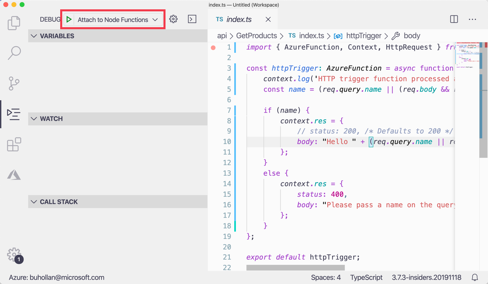

1. The Azure Functions project will launch. Notice that the terminal shows you what URL the function is running on. Press Cmd/Ctrl and click on the link to open it in a browser.


1. The default function template takes in a name parameter and returns a greeting. To pass in the name parameter, modify the url to pass in a query string parameter called "name"

   ```
   http://localhost:7071/api/GetProducts?name=YourName
   ```


## Debug the GetProducts function

1. Return to the `index.ts` file in VS Code. Click in the left-hand gutter next to line number 7.


This will set a breakpoint in the code. You can hit this breakpoint by executing the function from the browser.

1. Return to the browser where the greeting message was returned. Press refresh on the page. VS Code will break on line 7.

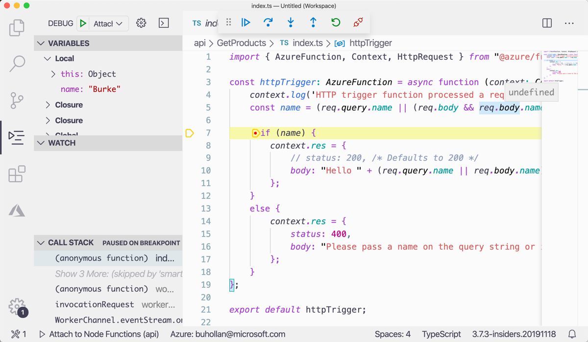

1. Press F5 to continue the program execution and see the greeting in the browser. Remove the breakpoint in the editor by clicking on the red dot next to line 7.

## Create the UpdateProduct function

1. Create a new Function called "UpdateProducts" by pressing Cmd/Ctrl + Shift + P and typing "create function". Select "Azure Functions: Create Function" from the list.

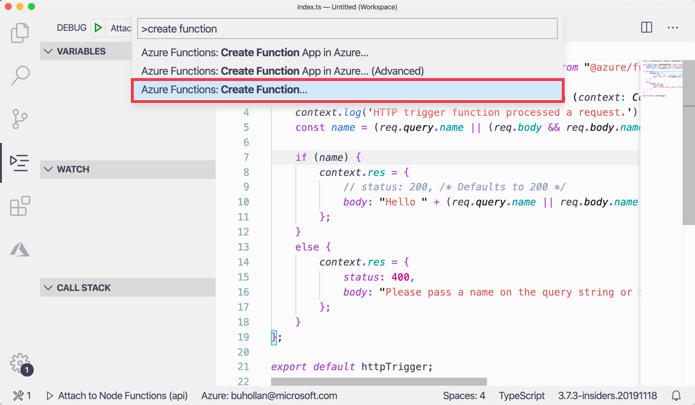

1. Select the "api" folder.


1. Select the "Http Trigger" type. Name it "UpdateProduct" and select "Function" as the authorization type.

A new folder called "UpdateProduct will be added under the "api" folder. This folder contains an `index.ts` which is the code for the "UpdateProduct" function.

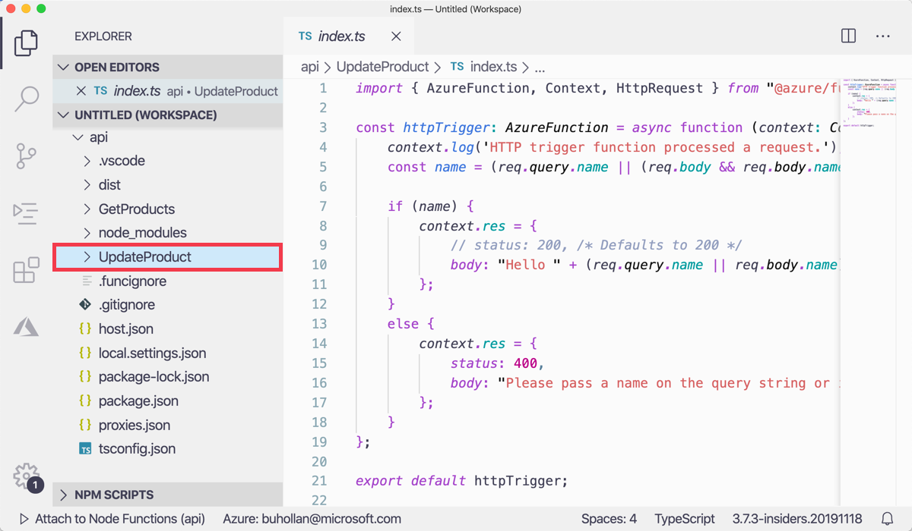

1. repeat the steps in this section to create a "CreateProduct" function and a "DeleteProduct" function.

When you are finished, your project should look like this...

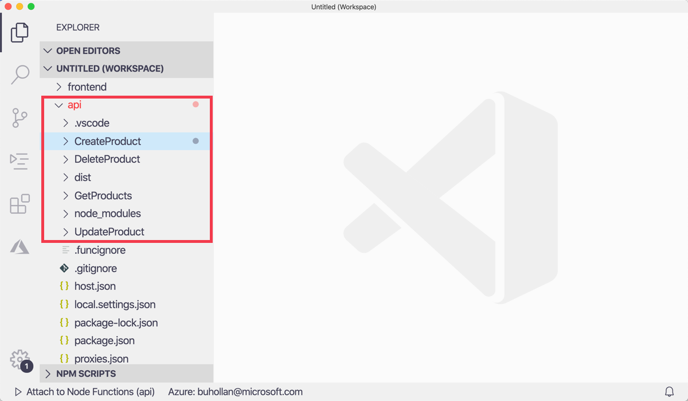

You have now learned how to create a new Azure Functions project. How to run Azure Functions locally, how to pass query string parameters to an Azure Function, how to debut an Azure Function in Visual Studio Code and how to create additional Azure Functions in your project. The next step is to connect the newly generated Create, Read, Update and Delete (CRUD) endpoints to the database.
