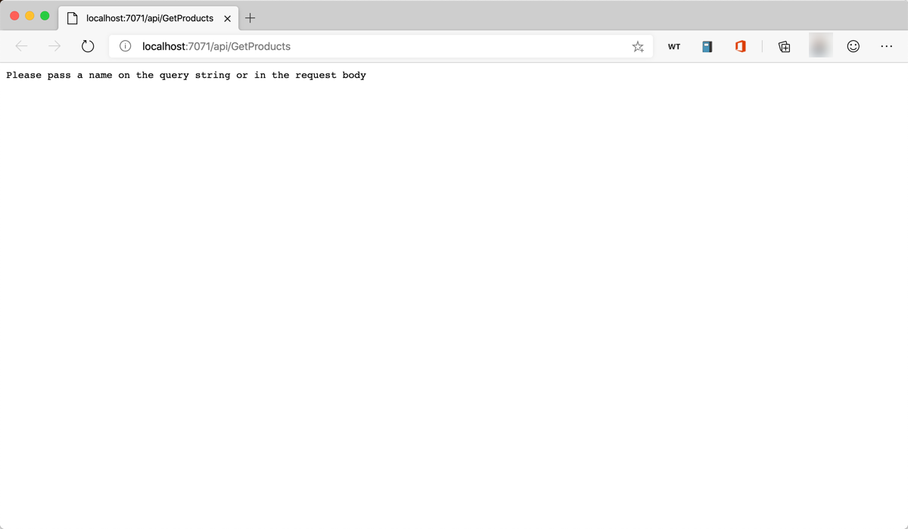
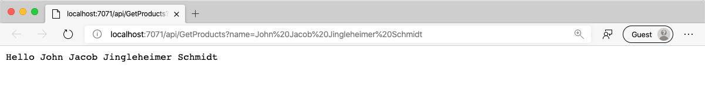

In this exercise, you'll create a new project in Azure Functions that will be the HTTP API for the Product Management application. You'll learn how to create a new HTTP Trigger function, run the function locally and set breakpoints. Finally, you'll wire the function up to the database you created in the previous exercise.

## Create a new Azure Functions project

1. Open the Command Palette.

1. Type "create new project".

1. Select "Azure Functions: Create New Project".

1. Select the "api" folder

1. When prompted, enter the following values

   | Name          | Value        |
   | ------------- | ------------ |
   | Language      | TypeScript   |
   | Template      | HTTP trigger |
   | Name          | GetProducts  |
   | Authorization | Function     |

The "api" folder in VS Code will now contain a new Azure Functions project along with a new function called "GetProducts".

## Create the Create, Update and Delete functions

### Create the CreateProduct function

1. Open the Command Palette in VS Code.

1. Type "create function".

1. Select "Azure Functions: Create Function".

1. Select "api".

1. When prompted, enter the following values

   | Name          | Value         |
   | ------------- | ------------- |
   | Template      | HTTP trigger  |
   | Name          | CreateProduct |
   | Authorization | Function      |

### Create the UpdateProduct function

1. Open the Command Palette in VS Code.

1. Type "create function".

1. Select "Azure Functions: Create Function".

1. Select "api".

1. When prompted, enter the following values

   | Name          | Value         |
   | ------------- | ------------- |
   | Template      | HTTP trigger  |
   | Name          | UpdateProduct |
   | Authorization | Function      |

### Create the DeleteProduct function

1. Open the Command Palette in VS Code.

1. Type "create function".

1. Select "Azure Functions: Create Function".

1. Select "api".

1. When prompted, enter the following values

   | Name          | Value         |
   | ------------- | ------------- |
   | Template      | HTTP trigger  |
   | Name          | DeleteProduct |
   | Authorization | Function      |

## Run the project

Azure Functions projects can be run and debugged locally from within VS Code.

1. Open the Command Palette.

1. Type "debug",

1. Select "Debug: Select and Start Debugging".

1. Select "Attach to Node Functions".

The Azure Functions project will launch. Notice that the terminal shows you what URL the function is running on.

1. Press <kbd>Cmd/Ctrl</kbd> and click on the "GetProducts" link to open it in a browser.

   

1. The default function template takes in a name parameter and returns a greeting. To pass in the name parameter, modify the url to pass in a query string parameter called "name"

   ```html
   http://localhost:7071/api/GetProducts?name=YourName
   ```

   

In this exercise you created all of the endpoints that you need for the product manager API. In the next section, you'll learn how to use REST to architect your API endpoints.
