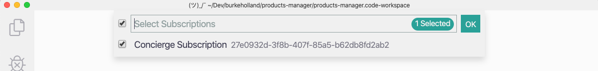
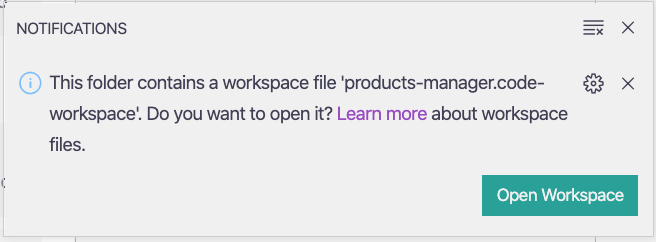
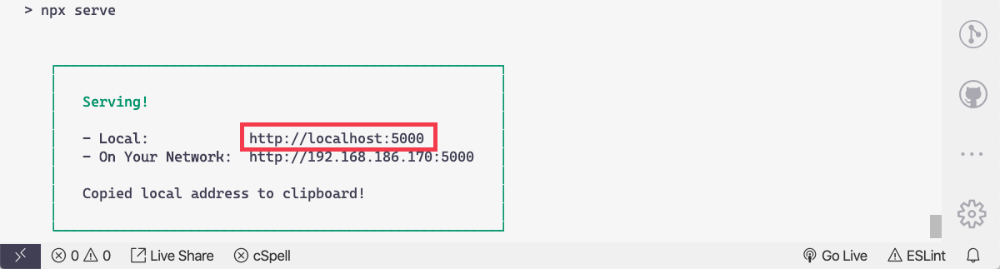
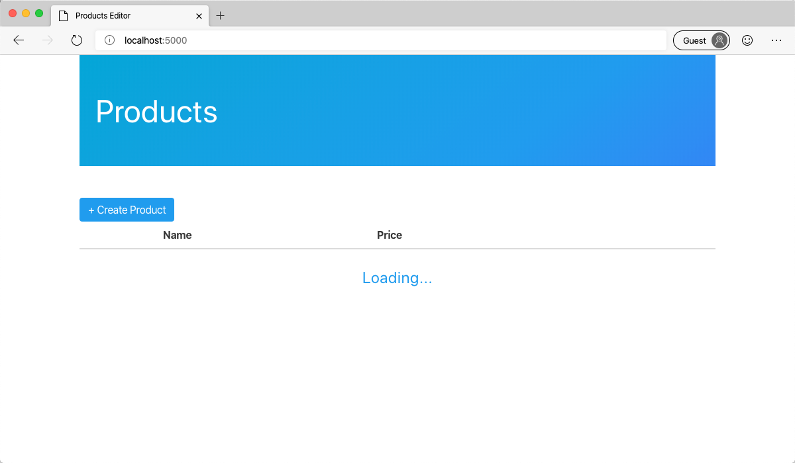

In this exercise, you'll create the database that will provide data to your API. You'll also configure VS Code for use with this module.

## Create the database

1. Sign into the sandbox as indicated above.

1. Run the following command to get the tenant id for your sandbox subscription.

   ```bash
   az account list --query "[?name=='Concierge Subscription'].tenantId" -o tsv
   ```

1. Highlight the id in the sandbox and copy it to your clipboard.

## Setup VS Code

1. Open VS Code.

1. Open settings in Visual Studio Code. Windows: <kbd>Ctrl</kbd>/<kbd>Cmd</kbd> + <kbd>,</kbd>.

1. Type "azure tenant".

1. Enter the tenant from your clipboard into the **Azure: Tenant** textbox.

1. Press <kbd>F1</kbd> to open the Command Palette.

1. Type "select subscription".

1. Chose "Azure: Select Subscriptions".

1. Select "Concierge Subscription" by checking the box next to it.

   

## Clone the frontend project

1. Open the Command Palette in VS Code by pressing <kbd>F1</kbd>.

1. Type "clone" in the prompt.

1. Select "Git: Clone" from the Command Palette.

1. Enter the following repo URL.

   ```bash
   https://github.com/burkeholland/tailwind-products-editor
   ```

1. Select a folder on your local drive where the project will be cloned.

1. When prompted to open the cloned repository, click the "Open" button.

1. VS Code will detect a workspace file in this project and ask if you want to open it. Select "Open Workspace".



There will be two projects in VS Code: "frontend" and "api".

## Run the frontend project

1. Open the integrated terminal in VS Code by pressing <kbd>Ctrl</kbd> + <kbd>Shift</kbd> + <kbd>`</kbd>.

1. Select "frontend".

1. Install the project dependencies.

   ```bash
   npm install
   ```

1. Run the frontend project in the browser by executing the `npm start` command from the integrated terminal.

   ```bash
   npm start
   ```

   A small webserver called "serve" should be running in your terminal. It will output the URL where the frontend application is running.

   

1. Click on that url in the terminal to open the application in the browser.

1. The application will load, but there will be no data present. This is because we have not yet created the API for this application.

   

In this exercise, you setup the project enviornment in VS Code. You also connected VS Code to the sandbox concierge subscription. Next, you'll learn how to use VS Code to build HTTP endpoints with Azure Functions.
