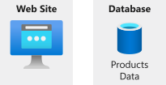
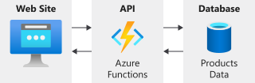

The acronym API stands for "Application Programming Interface". Sounds fancy, doesn't it?

But what is an "Application Programming Interface"?

The definition of "Application Programming Interface (API)" is, "an interface or protocol between different parts of an application". A shorter definition would be, "How parts of an application talk to each other".

Let's look at the "parts" of the Products Manager application.

In the Products Manager application, there are two distinct parts of the application:

* Website
* Database

Sometimes, applications talk directly to a database. Other times, it's just not a good idea to talk directly to the database. The Products Manager application is a website that runs in a browser. Databases require secure connection information. You don't want to put secure connection information in the browser where anyone can see it.

A better idea would be to put all of the database connection code into a separate part of the application. This part connects securely to the database, but keeps your secret connection information safe and sound. Instead of talking to the database, the website talks to this new part of the application. This new part is the "API".

In this module, you're going to build the "API" that the Products Manager application will use to "interface" with the database.

The API will be URLs that you can call which will return data or perform some action on the database. We call these URLs "HTTP Endpoints". These URLs are also sometimes called "Web Services".

In the next exercise, you'll set up the HTTP Endpoints for your API using Azure Functions. Ready to get going? Awesome. Let's get started.
