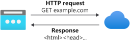

You've created a wonderful API. It doesn't do much, but hey, it exists, and that's more than people who aren't building API's right now can say.

You created endpoints called CreateProduct, GetProducts, UpdateProduct, and DeleteProduct. Endpoints named that way follow a traditional API naming pattern - Action/Resource.

The "Action/Resource" naming pattern is fine for smaller APIs. Remember, though, that in this simulation, Tailwind Traders is an internet giant. The Products API could get out of hand in a hurry. For instance, you could imagine that you might have a method called "GetProductByIdAndQuantityAndDate". Not only are these types of method names verbose, but they make code that consumes them look cluttered. Wordy API names also make it harder for developers to figure out how to use the API in their projects.

What you need to do is make this API clean and intuitive. For that, look no further than REST.

## What is REST?

Representational State Transfer, or REST, is an architectural pattern that provides guidance on how to name and structure endpoints in an API. There are a lot of fancy ideas behind REST, but you only need to understand two:

1. Action defined by HTTP request method
1. Organization by resource

### Action defined by HTTP request method

When you load a web page in the browser, the browser makes an HTTP request. That request is called a "GET". It's just that the browser does that automatically. All _you_ ever see is the URL and the page that gets returned.



When you're calling an API, you can control the _method_ that is used to call a URL. The method is called, wait for it, the "HTTP request method". In a REST architecture, these HTTP request methods are used to define the action that you want to take on a resource. REST says that HTTP request methods match up to what a service does.

| Service Action     | HTTP Request Method |
| ------------------ | ------------------- |
| Create something   | POST                |
| Retrieve something | GET                 |
| Update something   | PUT                 |
| Delete something   | DELETE              |

A service that returns a set of records from a database should listen for a GET request. When a service's job is to delete a record, the service should listen for the DELETE request method. You get the idea.

> [!TIP]
> Sometimes people will refer to HTTP request methods as "verbs" or "HTTP verbs". It's a slightly cooler-sounding way of saying the same thing.

### Organization by resource

The second concept is called "Organization by resource". The URLs for your services should closely match the resources that they're managing. For example, if you have a service that retrieves all of the products in a database, then you would call that endpoint, "products".

```http
http://127.0.0.1:7071/api/products
```

The fact that "products" is plural indicates that it returns multiple results. If you are getting only one product, you would call a "product" endpoint and pass the id if the item you want as part of the route.

```http
http://127.0.0.1/api/product/1
```

You are are officially a REST expert. Kind of. Let's take a look at how we implement these ideas using Azure Functions.

### Azure Functions routes and HTTP request methods

By default, any HTTP trigger function will respond to GET and POST requests. It also sets the URL to your function to the name of that function prefixed by "/api". Both of these things are configurable.

#### Changing which HTTP request method a function responds to

Each function that is created has a corresponding `function.json` file in the function folder. That file specifies which HTTP request methods a function responds to. Below is the `function.json` file for the "GetProducts" function that you created in the previous exercise.

```json
{
  "bindings": [
    {
      "authLevel": "function",
      "type": "httpTrigger",
      "direction": "in",
      "name": "req",
      "methods": ["get", "post"]
    },
    {
      "type": "http",
      "direction": "out",
      "name": "res"
    }
  ],
  "scriptFile": "../dist/GetProducts/index.js"
}
```

See the `methods` property above? That array specifies which HTTP request methods this function will respond to. If a method that is not in that list is used, you'll get a nice 404 error.

#### Changing the function route

You can change the URL, or "route", that Azure Functions listens on for a specific function by adding a "routes" parameter in the `function.json` configuration file.

```json
"route": "products"
```

```json
{
  "bindings": [
    {
      "authLevel": "function",
      "type": "httpTrigger",
      "direction": "in",
      "name": "req",
      "methods": ["get", "post"],
      "route": "products"
    },
    {
      "type": "http",
      "direction": "out",
      "name": "res"
    }
  ],
  "scriptFile": "../dist/GetProducts/index.js"
}
```

Specifying a route changes everything after the "api" section of the URL. In the above configuration file, the route to the "GetProducts" function is now "http://localhost:7071/api/products".

You can pass parameters along with a route. Parameters take the form of "{parameterName}". This means that to pass a parameter called "id" to the "product" endpoint, you would specify the following route...

```json
"route": "product/{id}"
```

Armed with this new knowledge of REST and how to implement it in Azure Functions, you can now make that unwieldy Products API a "RESTful" one. That's exactly what you'll do in the next exercise.
