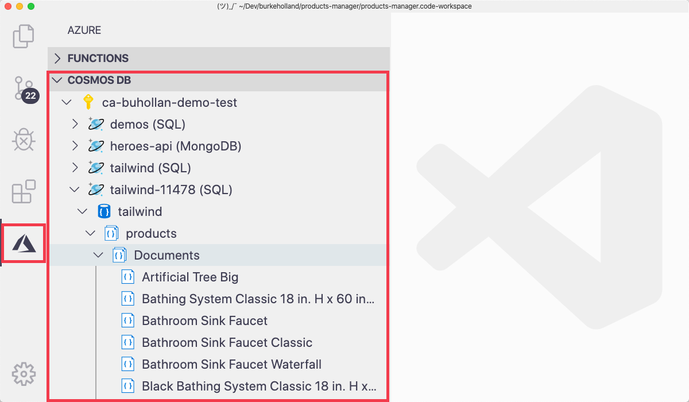
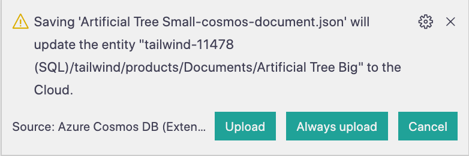

Databases can be frustrating to work with, because they are by definition a bit of a "black box". Your data sits inside of them, but you cannot see that data until you retrieve it. But you cannot retrieve it if you don't know what the structure is. But you cannot see the structure because you can't see into the database. It's a bit of a "chicken and egg" scenario.

To solve the "black box" problem, we use database management tools. These tools give us a visual representation of our database. Sometimes these tools are installed as separate desktop applications. Sometimes they're accessed via a web-based interface. For instance, there's a Cosmos DB "Document Explorer" that you can use from within the Azure Portal.

These solutions are fine, but they require you to move from your code, to another tool, and then back again. A better solution would be if you could work with your database without having to leave VS Code at all.

The Cosmos DB extension for VS Code lets you work with Cosmos DB databases without having to leave the editor.

## Accessing the Cosmos DB extension

The Cosmos DB extension shows up in the sidebar, just like the Azure Functions extension. You can get to it by clicking on the "Azure" icon in the Activity Bar.

Expanding a subscription will show all Cosmos DB accounts within it. Each account can be expanded to reveal databases, collections, and documents.

Most Cosmos DB commands can be accessed by right-clicking in the Cosmos DB extension. For instance, if you right-click on a database in the explorer, you can choose actions such as...

- Create Collection
- Delete Database
- Refresh

All Cosmos DB commands can also be accessed from the Command Palette and then searching for "cosmos db".

## Viewing documents

Documents within Cosmos DB can be viewed directly from the extension. Clicking on a document in the Sidebar will open it as a JSON document in VS Code.

These documents can be edited just like any other document in VS Code. When you save the file, VS Code will ask you if you want to "update the entity". If you select "Upload", your change will be pushed to Cosmos DB in Azure.

You can view, manage, and even edit your Cosmos DB data right from within VS Code. In the next exercise, you'll inspect the Tailwind database and have a look at some of the data inside.
