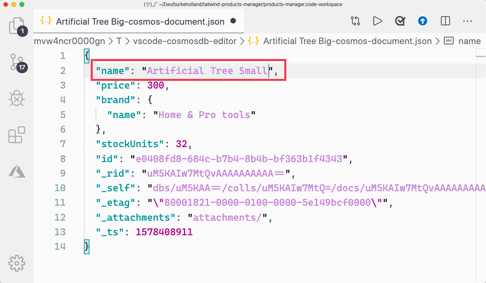

In this exercise, you'll get to work with the Cosmos DB extension. You'll get to see how you can use it to inspect Tailwind's product database. This products collection is the data that you'll be exposing later with the Azure Functions endpoints you created.

## Expand the Tailwind database in the Cosmos DB extension

1. Open the Command Palette by pressing <kbd>F1</kbd>.

1. Type "focus on cosmos".

1. Select "Azure: Focus on Cosmos DB View".

1. Expand the "Concierge Subscription" node.

1. Expand the "tailwind-xxxx" account. The "xxxx" will be four numbers.

1. Expand the "tailwind" database node.

1. Expand the "products" collection node.

1. Expand the "Documents" node.

1. Note all of the items within the "Documents" node and that each one corresponds to a product item in the database.

## Modify a product

1. Select the "Artificial Tree Big" item from the items listed under "Documents"

1. Change the name of the product to "Artificial Tree Small"

   

1. Press <kbd>Cmd/Ctrl</kbd> + <kbd>S</kbd> to save the document.

1. When prompted, select "Upload"

   > [!TIP]
   > If you select "Always Upload" in the prompt, any changes that you make and save in a a Cosmos DB document will be automatically uploaded to Azure. This will be saved as a setting in your VS Code User Settings.

1. Right-click the "products" collection in the VS Code extension view.

1. Select "Refresh" from the context menu.

1. Notice that the changes you made are reflected in the database in Azure.

That's a quick look the Cosmos DB extension in VS Code. It's nice for just viewing your data structures, but it also comes in handy in places that you don't expect. You'll see how that works in the next exercise. Next you are going to connect your Azure Functions project to the Cosmos DB database.
