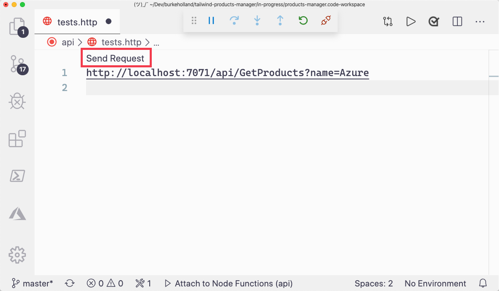
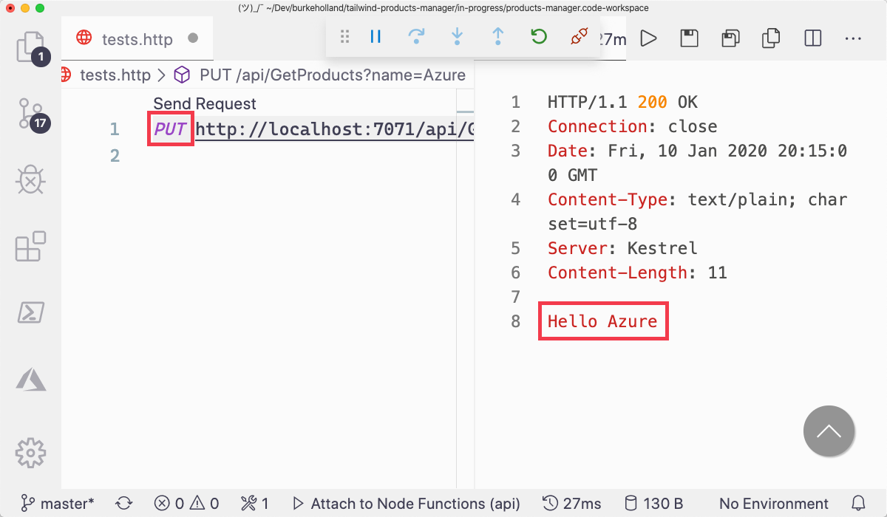
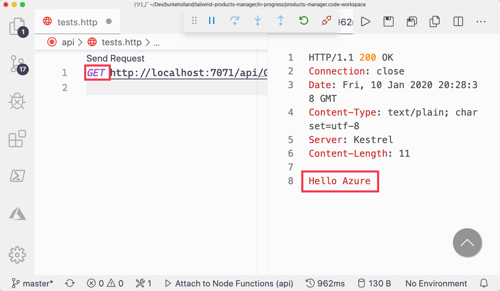

As you're building out the API for the Product Manager application, you'll need to specify different HTTP request methods for your endpoints depending on what that endpoint does. In this exercise, you'll learn how to modify which HTTP request methods your Azure Functions respond to. You'll also learn how to compose and execute HTTP requests from the command line using the built-in tools on your operating system.

## Modify the methods for the GetProducts function

1. Open the `api/GetProducts/function.json` file.

1. Find the line that contains the property "methods"

1. Modify that line by adding "put" to the "methods" array.

   ```json
   {
     "bindings": [
       {
         "authLevel": "function",
         "type": "httpTrigger",
         "direction": "in",
         "name": "req",
         "methods": ["get", "post", "put"]
       },
       {
         "type": "http",
         "direction": "out",
         "name": "res"
       }
     ],
     "scriptFile": "../dist/GetProducts/index.js"
   }
   ```

1. Save the file.

1. Start the Azure Functions project by pressing F5.

1. Open the `api/tests.http` file.

1. Add the following line to the file

   ```http
   GET http://127.0.0.1:7071/api/GetProducts?name=Azure
   ```

1. Click on "send request" that appears above the line you entered to send a GET request.

   

1. Notice that the request completes and returns the "Hello Azure" response.

   

1. Modify the line by swapping out the GET for a PUT

   ```http
   PUT http://127.0.0.1:7071/api/GetProducts?name=Azure
   ```

1. Click "Send Request"

1. Notice that the request completes and returns the "Hello Azure" response.

   

## Restrict GetProducts to GET requests only

1. Open the `api/GetProducts/function.json` file.

1. Modify the "methods" array so that it only contains "get".

   ```json
   {
     "bindings": [
       {
         "authLevel": "function",
         "type": "httpTrigger",
         "direction": "in",
         "name": "req",
         "methods": ["get"]
       },
       {
         "type": "http",
         "direction": "out",
         "name": "res"
       }
     ],
     "scriptFile": "../dist/GetProducts/index.js"
   }
   ```

1. Save the file.

1. Modifying this file will cause the Azure Functions process to terminate. Start it again by pressing <kbd>F5</kbd>.

1. Open the `api/tests.http` file.

1. Click "send request".

1. Notice that the request returns a "404: Not Found: because it is a PUT request, which the function no longer allows.

   

1. Modify the text of the command in the `api/tests.http` file by changing the PUT text to GET.

1. Click "Send Request".

1. Notice that the request succeeds this time since it is a GET request.

   

In this exercise, you learned how to send HTTP requests from VS Code. You also learned how to specify which HTTP request method to use when sending requests, and how to specify which types of HTTP requests your function will respond to.

In the next section, you'll learn how to read data from the Cosmos DB database and return it with the GetProducts function.
