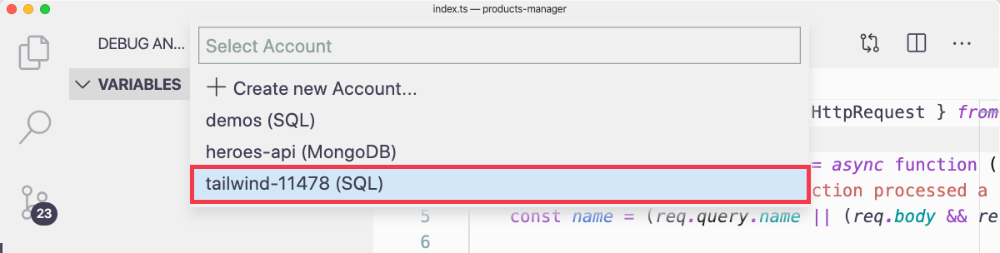
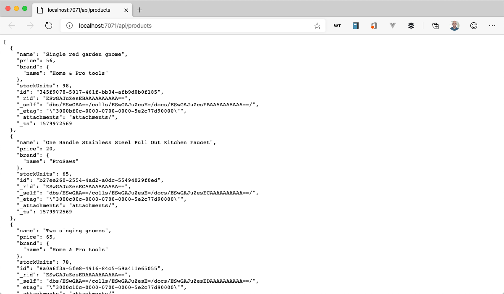

It's time to put some gasoline in this API engine and fire it up. That's an analogy for connecting the function endpoints to the database. You're probably better at coding than we are with analogies.

## Get the database connection string

1. Open the command palette in VS Code by pressing <kbd>F1</kbd>.

1. Type "connection string"

1. Select "Cosmos DB: Copy Connection String"

1. Select the "tailwind-xxxxx" account. Your five-digit number will be different than the ones shown in this screenshot as each database account is unique and special. Like a snowflake.

   

1. Press <kbd>Enter</kbd>

## Add connection string to local settings

1. Open the `local.settings.json` file.

1. In the "Values" section, add a setting for "CONNECTION_STRING" and paste in the value you copied in the previous section.

   ```json
   {
     "IsEncrypted": false,
     "Values": {
       "AzureWebJobsStorage": "",
       "FUNCTIONS_WORKER_RUNTIME": "node",
       "CONNECTION_STRING": "PASTE YOUR CONNECTION STRING HERE"
     }
   }
   ```

## Install Cosmos DB JavaScript SDK

Install the Cosmos DB package from npm.

1.  Open the terminal by pressing <kbd>Ctrl</kbd> + <kbd>Shift</kbd> + <kbd>`</kbd>.

1.  Select the "api" project.

1.  Install the "@azure/cosmos" package from npm.

    ```bash
    npm install @azure/cosmos
    ```

## Wire up the CreateProducts function

1. Open the `api/CreateProduct/index.ts` file.

1. Replace all of the code in the file with the following...

   ```typescript
   import { AzureFunction, Context, HttpRequest } from "@azure/functions";
   import { CosmosClient } from "@azure/cosmos";

   const httpTrigger: AzureFunction = async function(
     context: Context,
     req: HttpRequest
   ): Promise<void> {
     try {
       const client = new CosmosClient(process.env.CONNECTION_STRING);

       const database = client.database("tailwind");
       const container = database.container("products");

       const productToCreate = req.body;

       let { resource } = await container.items.create(productToCreate);

       context.res = {
         // status: 200, /* Defaults to 200 */
         body: resource
       };
     } catch (err) {
       context.res = {
         status: 500,
         body: err.message
       };
     }
   };

   export default httpTrigger;
   ```

## Wire up the GetProducts function

1. Open the `api/GetProducts/index.ts` file.

1. Replace all of the code in the file with the following...

   ```typescript
   import { AzureFunction, Context, HttpRequest } from "@azure/functions";
   import { CosmosClient } from "@azure/cosmos";

   const httpTrigger: AzureFunction = async function(
     context: Context,
     req: HttpRequest
   ): Promise<void> {
     try {
       const client = new CosmosClient(process.env.CONNECTION_STRING);

       const database = client.database("tailwind");
       const container = database.container("products");

       let iterator = container.items.readAll();
       let { resources } = await iterator.fetchAll();

       context.res = {
         // status: 200, /* Defaults to 200 */
         body: resources
       };
     } catch (err) {
       context.res = {
         status: 500,
         body: err.message
       };
     }
   };

   export default httpTrigger;
   ```

## Wire up the UpdateProduct function

1. Open the `api/UpdateProduct/index.ts` file.

1. Replace all of the code in the file with the following...

   ```typescript
   import { AzureFunction, Context, HttpRequest } from "@azure/functions";
   import { CosmosClient } from "@azure/cosmos";

   const httpTrigger: AzureFunction = async function(
     context: Context,
     req: HttpRequest
   ): Promise<void> {
     try {
       const client = new CosmosClient(process.env.CONNECTION_STRING);

       const database = client.database("tailwind");
       const container = database.container("products");

       const product = req.body;
       const { id, brand } = product;

       let { resource } = await container.item(id, brand.name).replace(product);

       context.res = {
         // status: 200, /* Defaults to 200 */
         body: resource
       };
     } catch (err) {
       context.res = {
         status: 500,
         body: err.message
       };
     }
   };

   export default httpTrigger;
   ```

## Wire up the DeleteProduct function

1. Open the `api/DeleteProduct/index.ts` file.

1. Replace all of the code in the file with the following...

   ```typescript
   import { AzureFunction, Context, HttpRequest } from "@azure/functions";
   import { CosmosClient } from "@azure/cosmos";

   const httpTrigger: AzureFunction = async function(
     context: Context,
     req: HttpRequest
   ): Promise<void> {
     try {
       const client = new CosmosClient(process.env.CONNECTION_STRING);

       const database = client.database("tailwind");
       const container = database.container("products");

       const brand = req.body.brand;
       const id = req.params.id;

       const result = await container.item(id, brand.name).delete();

       context.res = {
         // status: 200, /* Defaults to 200 */
         body: result.resource
       };
     } catch (err) {
       context.res = {
         status: 500,
         body: err.message
       };
     }
   };

   export default httpTrigger;
   ```

## Test out the GetProducts endpoint from VS Code

1. Press F5 to start the project

1. Navigate to the "/api/products" URL...

   ```http
   http://localhost:7071/api/products
   ```

1. Behold the products.

   

This API is DONE. Excellent work. Now you'll bring the frontend web project to life like a mad scientist by pointing it at your API. Unfortunately, your browser isn't going to go for that plan at all. The reason for that is something called "Cross-Origin Resource Sharing". Let's talk about that.
