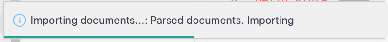

In this exercise, you'll get to work with the Cosmos DB extension. You'll use it to create a database in Azure, create the products collection and then upload data into the database.

## Create a new Cosmos DB database

1. Open the Command Palette by pressing <kbd>F1</kbd>.

1. Type "focus on cosmos".

1. Select "Azure: Focus on Cosmos DB View".

1. Expand the "Concierge Subscription" node.

1. Right-click the "tailwind-xxxx" account. The "xxxx" will be a set of random numbers.

1. Select "Create database".

1. When prompted, enter the following values...

   | Name          | Value    |
   | ------------- | -------- |
   | Database Name | tailwind |

1. Right-click the newly created "tailwind" database in the Cosmos DB explorer view.

1. Select "Create Collection"

1. When prompted, enter the following values...

   | Name               | Value       |
   | ------------------ | ----------- |
   | id                 | products    |
   | Partition Key      | leave blank |
   | Initial Throughput | 400         |

1. Right-click the newly created "products" collection.

1. Select "Import Document into a Collection".

1. Select the `frontend/data/products.json` file.

   VS Code will begin the import of the items into the database. This may take a few minutes.

   

1. When the import finishes, expand the "products" collection node in the Cosmos DB extension explorer.

1. Expand the "Documents" node.

## Modify a product

1. Select the "Artificial Tree" item from the items listed under "Documents"

1. Change the name of the product to "Artificial Tree Big"

   

1. Press <kbd>Cmd/Ctrl</kbd> + <kbd>S</kbd> to save the document.

1. When prompted, select "Upload"

   > [!TIP]
   > If you select "Always Upload" in the prompt, any changes that you make and save in a a Cosmos DB document will be automatically uploaded to Azure. This will be saved as a setting in your VS Code User Settings.

1. Right-click the "products" collection in the VS Code extension view.

1. Select "Refresh" from the context menu.

1. Notice that the changes you made are reflected in the database in Azure.

That's a quick look the Cosmos DB extension in VS Code. It's nice for just viewing your data structures, but it also comes in handy in places that you don't expect. You'll see how that works in the next exercise. Next you are going to connect your Azure Functions project to the Cosmos DB database.
