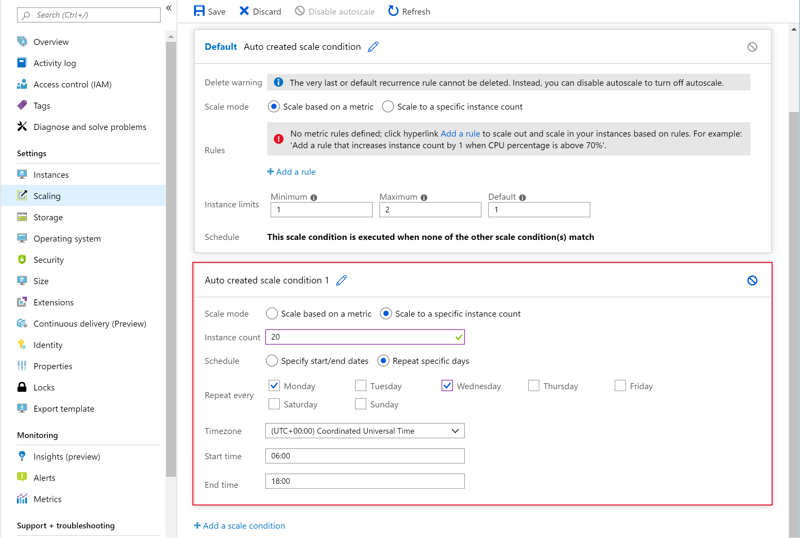

If you need to handle a steady expansion of work over time, the best approach is to scale horizontally. When the workload increases in complexity rather than volume – and this complexity places more demand on resources – you might find scaling vertically more appropriate.

Horizontal scaling enables you to add instances to your virtual machine scale set. In the shipping company scenario, horizontal scaling is a useful strategy to handle the fluctuating number of requests over time.

In the shipping company scenario, horizontal scaling is useful to adjust the number of virtual machines running the web application as the number of users increase and decrease. In this way, the system will maintain an even response time, regardless of the current load.

In this unit, you'll learn how to scale a virtual machine scale set. You can scale manually by explicitly setting the number of virtual machines instances in the scale set. Alternatively, you can configure autoscaling for a virtual machine scale set by defining scale rules that trigger the allocation and deallocation of virtual machines. These scale rules determine when to scale the system by monitoring various performance metrics.

## Manually scaling virtual machine scale sets

You scale a virtual machine scale set manually by increasing or decreasing the instance count. You do this task in the Azure portal, or programmatically. The following code uses the Azure CLI to change the number of instances in a virtual machine scale set.

```azurecli
az vmss scale \
    --name MyVMScaleSet \
    --resource-group MyResourceGroup \
    --new-capacity 6
```

## Autoscaling virtual machine scale sets

Manual scaling is useful under some circumstances, but in many situations, it's better to use autoscaling to let the system control the number of instances in a scale set. Two different strategies are available:

- **Schedule-based** – use this approach if you know you'll have an increased workload during a specified date/time window.
- **Metrics-based** – with this strategy, you monitor performance metrics associated with the scale set. When these metrics exceed a specified  threshold, the scale set can automatically start new virtual machine instances. When the metrics indicate that the additional resources are no longer required, the scale set can arrange to stop any excess instances.

### Define autoscale conditions, rules, and limits

Autoscaling is based on a set of scale conditions, rules, and limits. A scale condition combines a time and a set of scale rules. If the current time falls within the period defined in the scale condition, the scale rules associated with the condition are evaluated. The results of this evaluation determine whether to add or remove instances in the scale set. The scale condition also contains the limits of scaling, for the maximum and minimum number of instances.

In the shipping company scenario, you can add scale rules that monitor the CPU utilization across the scale set. If the CPU utilization exceeds the 75 percent threshold, the scale rule can increase the number of virtual machine instances. You can create a second scale rule that monitors the same statistic (CPU utilization), but reduces the number of virtual machine instances when utilization falls below 50 percent. Due to the global nature of the application, these rules should be active all the time rather than just at specific hours.

A virtual machine scale set can contain many scale conditions, and each matching scale condition will be acted on. A scale set also contains a default scale condition that's used if no other scale conditions match the current time and performance metrics. The default scale condition is always active (it has no time constraints), and contains no scale rules, effectively acting as a *null* scale condition that neither scales in nor out. However, you can modify the default scale condition to set a default instance count, or you can add a pair of scale rules that scale out and back in again.

### Implement schedule-based autoscaling

Schedule-based scaling specifies a start and end time, and the number of instances to add to the scale set. The following screenshot shows an example in the Azure portal. The number of instances is scaled out to 20 between 6AM and 6PM each Monday and Wednesday. Outside of these times, if there are no other scale conditions, the default scale condition will be applied. In the example shown, the default scale rule will scale the system back down to 2 instances (the **Maximum** value shown in the default scale condition).



### Implement metrics-based autoscaling

A metrics-based scale rule specifies the resources to monitor, such as CPU utilization, response time, and so on. This scale rule adds or removes instances from the scale set according to the values of these metrics. You specify limits on the number of instances to prevent a scale set from scaling in or out excessively. In the example scenario, you want to increase the instance count by one when the average CPU utilization exceeds 75 percent. Additionally, you might want to limit the scale out operation to 50 instances; this limit can help to prevent costly, runaway scaling caused by an attack of some sort. Similarly, you want to scale in when the average CPU utilization drops below 50 percent.

Commonly used metrics you can monitor for a virtual machine scale set include:

- **Percentage CPU** – this metric is an indication of the CPU utilization across all instances. A high value shows that instances are becoming CPU-bound, which could delay processing client requests.
- **Inbound Flows and Outbound Flows** – these metrics show the rate at which network traffic is flowing in to and out from virtual machines in the scale set.
- **Disk Read Operations/sec and Disk Write Operations/sec** – these metrics are a measure of the volume of disk I/O that's occurring across the scale set.
- **Data Disk Queue Depth** – this metric shows how many I/O requests to the data disks – as opposed to the operating system disks – on the virtual machines are waiting to be serviced.

A scale rule aggregates the values retrieved for a metric for all instances across a period of time known as the *time grain*. Each metric has its own intrinsic time grain, but in most cases this period is one minute. The aggregated value is known as the *time aggregation*. The options available are *Average*, *Minimum*, *Maximum*, *Total*, *Last*, and *Count*.

A one-minute interval is too short a period in which to determine whether any change in metric is long-lasting enough to make autoscaling worthwhile. A scale rule does a second step that generates a further aggregation of the value calculated by the *time aggregation* over a longer, user-specified period, known as the *Duration*. The minimum *Duration* is five minutes. For example, if the *Duration* is set to 10 minutes, the scale rule aggregates the 10 values calculated for the *time grain*.

The aggregation calculation for the *Duration* can be different for that of the *time grain*. For example, if the *time aggregation* is *Average* and the statistic gathered is *Percentage CPU* across a one-minute *time grain*, each minute the average CPU percentage utilization across all instances for that minute will be calculated. If the *time grain statistic* is set to *Maximum*, and the *Duration* of the rule is set to 10 minutes, the maximum of the 10 average values for the CPU percentage utilization is used to determine whether the rule threshold has been crossed.

When a scale rule detects that a metric has crossed a threshold, it can do a scale action. A scale action can be *scale-out* or *scale-in*. A scale-out action increases the number of instances, and a scale-in action reduces the instance count. A scale action uses an operator (such as *less than*, *greater than*, *equal to*, and so on) to determine how to react to the threshold. Scale-out actions typically use the *greater than* operator to compare the metric value to the threshold. Scale-in actions tend to compare the metric value to the threshold with the *less than* operator. A scale action also sets the instance count to a specific level, rather than incrementing or decrementing the number available.

A scale action has a *cool down* period, specified in minutes. During this interval, the scale rule won't be triggered again. This situation allows the system to stabilize between scale events. It takes time to start up or shut down instances, so any metrics gathered might not show significant changes for several minutes. The minimum cool down period is five minutes.

Finally, you'll plan for scaling-in when a workload decreases. Consider defining scale rules in pairs in the same scale condition. One scale rule should indicate how to scale the system out when a metric exceeds an upper threshold. The other rule needs to define how to scale the system back in again when the same metric drops below a lower threshold. Don't make both thresholds the same value because you could trigger a series of oscillating events to scale out and back in again.

The image below shows a scale rule defined by using the Azure portal.


