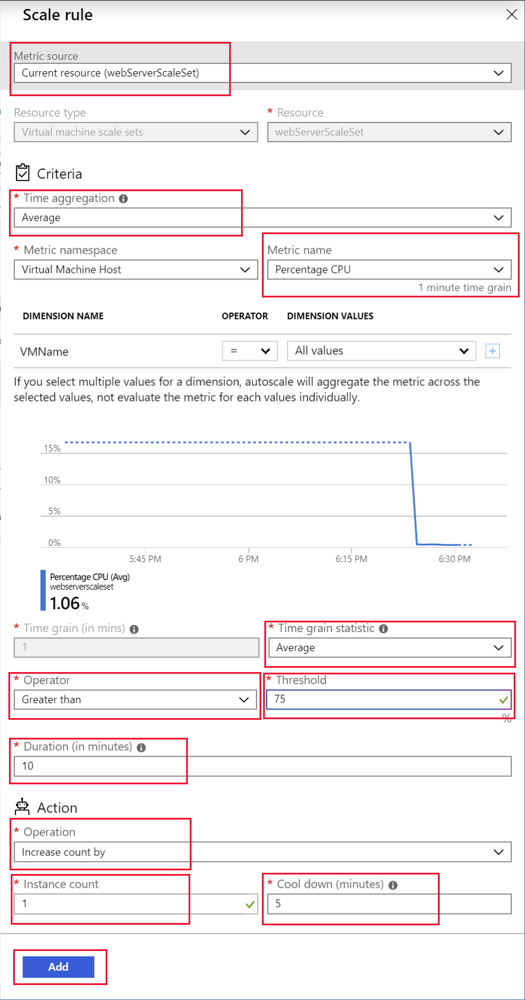

In the shipping company scenario, you have noticed that users' response times start to increase significantly when the overall CPU utilization of the virtual machines in the scale set exceeds 75 percent. This is causing dissatisfaction amongst the users. You need to arrange for the virtual machine scale set hosting your web application to scale horizontally when the system hits this threshold, to reduce the length of time users are waiting.

Additionally, to save costs, you also want to get the scale set to scale back in when demand drops and the overall CPU utilization across the scale set drops below 50 percent.

In this exercise, you'll configure autoscaling, and define scale rules that scale out and back again, according to the CPU utilization of the system.

## Create a scale-out scale rule

[!include]

1. Return to the [Azure portal](https://portal.azure.com/learn.docs.microsoft.com?azure-portal=true). If necessary, sign in using your MSLearn account.

2. Go to the page for the virtual machine scale set.

3. On the virtual machine scale set page, under **Settings**, select **Scaling**.

4. Select **Enable autoscale**.

    

5. In the **Default** scale rule, set the **Scale mode** to **Scale based on a metric**, and then select **+ Add a rule**.

   

6. On the **Scale rule** page, specify the following settings, and then select **Add**:

    | Property  | Value  |
    |---|---|
    | Metric source | Current resource (webServerScaleSet) |
    | Time aggregation | Average  |
    | Metric name | Percentage CPU |
    | Time grain statistic | Average |
    | Operator | Greater than |
    | Threshold | 75 |
    | Duration | 10 |
    | Operation | Increase count by |
    | Instance count | 1 |
    | Cool down (minutes) | 5 |

    

## Create a scale-in scale rule

1. In the **Default** scale rule, select **+ Add a rule** again.

2. On the **Scale rule** page, specify the following settings, and then select **Add**:

    | Property  | Value  |
    |---|---|
    | Metric source | Current resource (webServerScaleSet) |
    | Time aggregation | Average  |
    | Metric name | Percentage CPU |
    | Time grain statistic | Average |
    | Operator | Less than |
    | Threshold | 50 |
    | Duration | 10 |
    | Operation | Decrease count by |
    | Instance count | 1 |
    | Cool down (minutes) | 5 |

3. Select **Save**.

    The **Default** scale condition now contains two scale rules. One rule scales the number of instances out, and another rule scales the number of instances back in again.

    
