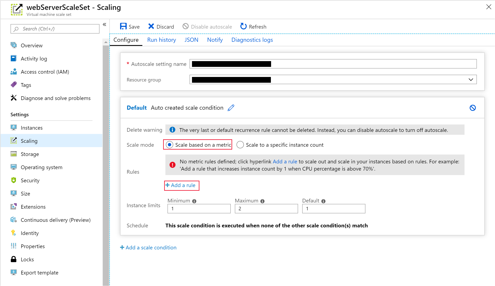

Recall from the example scenario that your customers use one of the company's websites to manage and check the status of their shipments. This website is deployed to VMs and hosted on-premises. 

You notice that users of the website have significant delays in response times when the overall CPU usage of the VMs exceeds 75 percent. You need the virtual machine scale set that hosts your web application to scale horizontally when the system hits this threshold. To save costs, you also want to scale back in when demand falls and the overall CPU usage across the scale set drops below 50 percent.

In this exercise, you'll configure autoscaling. You'll define scale rules that scale out and in again, according to the system's CPU usage.

> [!NOTE]
> This exercise is optional. If you don't have an Azure account, you can read through the instructions to understand how to use the REST API to retrieve metrics.
>
> If you want to complete this exercise but you don't have an Azure subscription or prefer not to use your account, create a [free account](https://azure.microsoft.com/free/?azure-portal=true) before you begin.

## Create a scale-out rule

1. In the [Azure portal](https://portal.azure.com), go to the page for the virtual machine scale set.

1. On the virtual machine scale set page, under **Settings**, select **Scaling**.

1. Select **Custom autoscale**. In the **Default** scale rule, ensure that the **Scale mode** is set to **Scale based on a metric**. Then select **+ Add a rule**.

   

1. On the **Scale rule** page, specify the following settings, and then select **Add**:

    | Property  | Value  |
    |---|---|
    | Metric source | Current resource (webServerScaleSet) |
    | Time aggregation | Average  |
    | Metric name | Percentage CPU |
    | Time grain statistic | Average |
    | Operator | Greater than |
    | Threshold | 75 |
    | Duration | 10 |
    | Operation | Increase count by |
    | Instance count | 1 |
    | Cool down (minutes) | 5 |

## Create a scale-in rule

1. In the **Default** scale rule, select **+ Add a rule**.

1. On the **Scale rule** page, specify the following settings, and then select **Add**:

    | Property  | Value  |
    |---|---|
    | Metric source | Current resource (webServerScaleSet) |
    | Time aggregation | Average  |
    | Metric name | Percentage CPU |
    | Time grain statistic | Average |
    | Operator | Less than |
    | Threshold | 50 |
    | Duration | 10 |
    | Operation | Decrease count by |
    | Instance count | 1 |
    | Cool down (minutes) | 5 |

1. Select **Save**.

    The **Default** scale condition now contains two scale rules. One rule scales the number of instances out. Another rule scales the number of instances back in.

    
