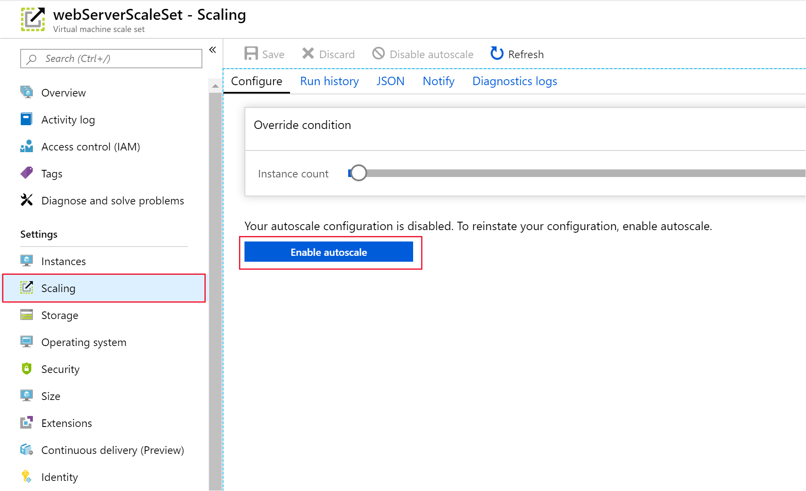

Recall from earlier that your customers use one of the company's websites to manage and check the status of their shipments. This website is deployed to virtual machines and hosted on-premises. You notice that users' accessing the company's website, experience significant delays in response times when the overall CPU utilization of the virtual machines exceeds 75 percent. You need to arrange the virtual machine scale set hosting your web application to scale horizontally when the system hits this threshold.

Additionally, to save costs, you also want to get the scale set to scale back in when demand drops and the overall CPU utilization across the scale set drops below 50 percent.

In this exercise, you'll configure autoscaling, and define scale rules that scale out and back again, according to the CPU utilization of the system.

> [!NOTE]
> This exercise is optional. If you don't have an Azure account, you can read through the instructions to understand how to use the REST API to retrieve metrics.
> If you want to complete this exercise, but you don't have an Azure subscription or prefer not to use your account, you will need to create a [free account](https://azure.microsoft.com/free/?azure-portal=true) before you begin.

## Create a scale-out scale rule

1. Return to the [Azure portal](https://portal.azure.com).

1. Go to the page for the virtual machine scale set.

1. On the virtual machine scale set page, under **Settings**, select **Scaling**.

1. Select **Custom autoscale**.

    

1. In the **Default** scale rule, check that the **Scale mode** is set to **Scale based on a metric**, and then select **+ Add a rule**.

   

1. On the **Scale rule** page, specify the following settings, and then select **Add**:

    | Property  | Value  |
    |---|---|
    | Metric source | Current resource (webServerScaleSet) |
    | Time aggregation | Average  |
    | Metric name | Percentage CPU |
    | Time grain statistic | Average |
    | Operator | Greater than |
    | Threshold | 75 |
    | Duration | 10 |
    | Operation | Increase count by |
    | Instance count | 1 |
    | Cool down (minutes) | 5 |

## Create a scale-in scale rule

1. In the **Default** scale rule, select **+ Add a rule** again.

1. On the **Scale rule** page, specify the following settings, and then select **Add**:

    | Property  | Value  |
    |---|---|
    | Metric source | Current resource (webServerScaleSet) |
    | Time aggregation | Average  |
    | Metric name | Percentage CPU |
    | Time grain statistic | Average |
    | Operator | Less than |
    | Threshold | 50 |
    | Duration | 10 |
    | Operation | Decrease count by |
    | Instance count | 1 |
    | Cool down (minutes) | 5 |

1. Select **Save**.

    The **Default** scale condition now contains two scale rules. One rule scales the number of instances out, and another rule scales the number of instances back in again.

    
