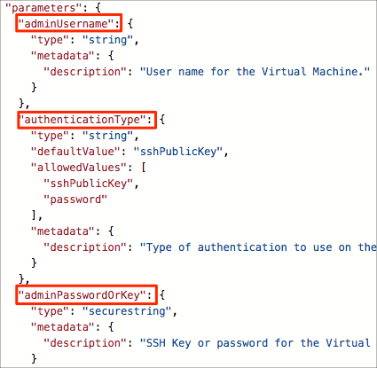

Here you'll deploy the Quickstart template you explored in the previous part. The Quickstart template brings up a basic virtual machine configuration.

[!include[](../../../../includes/azure-exercise-subscription-prerequisite.md)]

Before you do that, let's briefly review the deployment process.

## How do I deploy a Resource Manager template?

You can use automation scripting tools such as the Azure CLI, Azure PowerShell, or even the Azure REST APIs with your favorite programming language to deploy resources from templates. You can also deploy your templates through Visual Studio, Visual Studio Code, and the Azure portal. Shortly, you'll deploy a Resource Manager template using the Azure CLI from Cloud Shell.

### Verifying a template

Before you run your template, you might want to verify it first.

A good first step is to process your template with a _linter_, a tool that verifies that the JSON syntax of your template is correct. You can find JSON linting tools that run on the command line, in a browser, or in your favorite code editor.

> [!TIP]
> Visual Studio Code provides many [built-in features](https://code.visualstudio.com/docs/languages/json?azure-portal=true) that make it easier to work with JSON files. Your favorite editor may provide similar built-in features or plugins.

The next step might be to visualize your template. [Azure Resource Manager Visualizer](http://armviz.io?azure-portal=true) enables you to upload your Resource Manager template and graphically see how your resources relate to one another. You can inspect this visualization to verify that the deployment is set up correctly and meets your requirements.

Finally, you can perform a test deployment from the Azure CLI or Azure PowerShell. A test deployment doesn't create any resources, but it provides you with feedback on what would happen when the deployment runs. You'll perform a test deployment shortly to see the process in action.

## Create a resource group

First, we'll create a _resource group_ to hold all the things that we need to create. This allows us to administer all the VMs, disks, network interfaces, and other elements that make up our solution as a unit. We can use the Azure CLI to create a resource group with the `az group create` command. It takes a `--name` to give it a unique name in our subscription, and a `--location` to tell Azure what area of the world we want the resources to be located by default.

<!---Since we are in the free Azure sandbox environment, you don't need to do this step, instead, you will use the pre-created resource group **<rgn>[Resource Group Name]</rgn>**.--->


1. Sign in to the [Azure portal](https://portal.azure.com).
1. From the menu bar on the top right-hand side, open **Cloud Shell**.
1. Set the resource group name.
    ```bash
    RESOURCEGROUP=learn-quickstart-vm-rg
    ```
1. Set the location. Replace the eastus value with a location near you.
    ```bash
    LOCATION=eastus
    ```
    The following list has some location values you can use.

    [!include[](../../../../includes/azure-sandbox-regions-note.md)]
1. Run the following command to create a resource group.
    ```bash
    az group create --name $RESOURCEGROUP --location $LOCATION
    ```

## Create template parameters

Recall that a Resource Manager template is divided into sections, one of them being **Parameters**.

Near the start of the template, you see a section named `parameters`. This section defines these parameters:

* `adminUsername`
* `authenticationType`
* `adminPasswordOrKey`
* `dnsLabelPrefix`
* `ubuntuOSVersion`
* `location`

This image highlights the first few parameters.



The `authenticationType` parameter specifies whether to use password authentication or key-based authentication to connect to the virtual machine. The `adminPasswordOrKey` parameter specifies the password or SSH key. Although key-based authentication is typically more secure than password authentication, here you'll use password authentication for learning purposes.

Some parameters, such as `ubuntuOSVersion` and `location`, have default values. The default value for `ubuntuOSVersion` is "18.04-LTS" and the default value for `location` is the parent resource group's location.

Let's keep these parameters at their default values. For the remaining parameters, you have two options:

1. Provide the values in a JSON file.
1. Provide the values as command-line arguments.

For learning purposes, here you'll provide the values as command-line arguments. To make the template easy to deploy, you'll start by storing these values as Bash variables.

1. Sign in to the [Azure portal](https://portal.azure.com).
1. From the menu bar on the top right-hand side, open **Cloud Shell**.
1. From Cloud Shell, create a username. For this example, let's use **azureuser**.

    ```bash
    USERNAME=azureuser
    ```

1. Run the **openssl** utility to generate a random password.

    ```bash
    PASSWORD=$(openssl rand -base64 32)
    ```

    There are many ways to generate random passwords. The method you choose depends on your workflow and requirements. This method uses the **openssl** utility to generate 32 random bytes and base64 encode the output. Base64 encoding ensures that the result contains only printable characters.

1. Generate a unique DNS label prefix.

    ```bash
    DNS_LABEL_PREFIX=mydeployment-$RANDOM
    ```

    The DNS label prefix must be unique. The DNS label prefix begins with "mydeployment" followed by a random number. `$RANDOM` is a Bash function that generates a random positive whole number.

    In practice, you would choose a DNS label prefix that fits your requirements.

## Validate and launch the template

With your parameters in place, you have everything you need to launch the template.

As a final verification step, you'll begin by validating that the template is syntactically correct.

1. From Cloud Shell, run `az deployment group validate` to validate the template.

    ```azurecli
    az deployment group validate \
      --resource-group $RESOURCEGROUP \
      --template-uri "https://raw.githubusercontent.com/Azure/azure-quickstart-templates/master/101-vm-simple-linux/azuredeploy.json" \
      --parameters adminUsername=$USERNAME \
      --parameters authenticationType=password \
      --parameters adminPasswordOrKey=$PASSWORD \
      --parameters dnsLabelPrefix=$DNS_LABEL_PREFIX
    ```

    The `--template-uri` argument points to the template on GitHub. The template's filename is **azuredeploy.json**. Later, you'll see how to validate and run a template on your local filesystem.

    You see a large JSON block as output, which tells you that the template passed validation.

    Azure Resource Manager fills in the template parameters and checks whether the template would successfully run in your subscription.

    If validation failed, you would see a detailed description of the failure in the output.

1. Run `az deployment group create` to deploy the template.

    ```azurecli
    az deployment group create \
      --name MyDeployment \
      --resource-group $RESOURCEGROUP \
      --template-uri "https://raw.githubusercontent.com/Azure/azure-quickstart-templates/master/101-vm-simple-linux/azuredeploy.json" \
      --parameters adminUsername=$USERNAME \
      --parameters authenticationType=password \
      --parameters adminPasswordOrKey=$PASSWORD \
      --parameters dnsLabelPrefix=$DNS_LABEL_PREFIX
    ```

    This command resembles the previous command, but also includes the `--name` argument to give your deployment a name.

    This command takes 2-3 minutes to complete. While you wait, now's a great time to take a [closer look at the source code](https://github.com/Azure/azure-quickstart-templates/blob/master/101-vm-simple-linux/azuredeploy.json?azure-portal=true) for this template. Remember, the contents of a Resource Manager template will become more familiar to you as you read existing templates and create your own.

    When the deployment completes, you see another large JSON block as output that describes the deployment.

## Verify the deployment

The deployment succeeded. But let's run a few commands just to verify.

1. Run `az deployment group show` to verify the deployment.

    ```azurecli
    az deployment group show \
      --name MyDeployment \
      --resource-group $RESOURCEGROUP
    ```

    You see the same JSON block as you did previously. You can run this command later if you ever need these details about the deployment. The output is structured as JSON to make it easier to feed into other tools you might use to track your deployments and cloud usage.

1. Run `az vm list` to see which VMs are running.

    ```azurecli
    az vm list \
      --resource-group $RESOURCEGROUP \
      --output table
    ```

    Your output resembles this. Your region is shown under the **Location** column.

    ```bash
    Name        ResourceGroup                         Location        Zones
    ----------  ------------------------------------  --------------  -------
    simpleLinuxVM  learn-quickstart-vm-rg    southcentralus
    ```

    Recall that the template names the VM "simpleLinuxVM". Here you see that this VM exists in your resource group.
