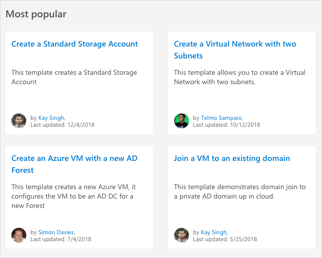

Recall that your analysts' financial models are run on Azure virtual machines. To further automate your deployments, you want to move from Azure CLI commands and scripts to Resource Manager templates.

Before you begin, you may wonder what existing templates are available to learn from and build upon.

Here you'll explore what an Azure Quickstart template is and what prebuilt templates are available for you to use right now.

> [!TIP]
> Prefer Linux or want to try something new? Select **Linux** from the top of this page to deploy a Linux virtual machine.

## What are Azure Quickstart templates?

Azure Quickstart templates are Resource Manager templates that are provided by the Azure community. Quickstart templates are available on GitHub.

Many templates provide everything you need to deploy your solution. Others might serve as a starting point for your template. Either way, you can study these templates to learn how to best author and structure your own templates.

## Discover what's on the Quickstart template gallery

Let's say you want to find a Resource Manager template that brings up a basic VM configuration &ndash; one that includes a VM, basic network settings, and storage.

1. Start by browsing to the [Quickstart template gallery](https://azure.microsoft.com/resources/templates?azure-portal=true) to see what's available.

    You see a number of popular and recently updated templates. These templates work with both Azure resources and popular software packages.

    

1. Let's say you come across the [Deploy a simple Windows VM](https://azure.microsoft.com/resources/templates/101-vm-simple-windows?azure-portal=true) template.

    

    The name sounds like exactly what you need. But let's take a closer look to see what this template accomplishes.

    The **Deploy to Azure** button enables you to deploy the template directly through the Azure portal. But you won't do that here. Rather, you'll use the Azure CLI to deploy the template from Cloud Shell.

1. Click **Browse on GitHub** to navigate to the template's source code on GitHub.

    You see this.

    :::image type="content" source="../../media/3-github-page-windows.png" alt-text="Screenshot of the GitHub README for the Resource Manager template." loc-scope="third-party"::: <!-- GitHub, no-loc -->

    The **Deploy to Azure** button enables you to deploy the template directly through the Azure portal, just like you saw on the gallery page.

1. Click **Visualize** to navigate to the Azure Resource Manager Visualizer.

    You see the resources that make up the deployment, including a VM, a storage account, and network resources.

    You can use your mouse to arrange the resources. You can also use your mouse's scroll wheel to zoom in and out.

    :::image type="content" source="../../media/3-armviz-windows.png" alt-text="Screenshot of the Azure Resource Manager Visualizer that shows Azure resources visually." loc-scope="third-party"::: <!-- product is Azure Resource Manager Visualizer, no-loc -->

1. Click on the **Virtual Machine** resource labeled **simple-vm**.

    You see the source code that defines the VM resource.

    :::image type="content" source="../../media/3-armviz-vm-windows.png" alt-text="Screenshot of the Azure Resource Manager Visualizer that shows the template's source code." loc-scope="third-party"::: <!-- product is Azure Resource Manager Visualizer, no-loc -->

    You'll have more time to inspect the source code in just a bit. But for now, take a moment to review it briefly.

    You see that:

    * The resource's type is `Microsoft.Compute/virtualMachines`.
    * Its location, or Azure region, comes from the template parameter named `location`.
    * The VM's size comes from the template variable `vmSize`.
    * The computer name, username, and password for the VM are read from template parameters.

In practice, you might review the **README.md** file on GitHub and further inspect the source code to see whether this template suits your needs.

But for now, this template looks promising. In the next part, you'll go ahead and deploy this template.
