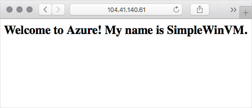

Now that you've defined the template resource for the Custom Script Extension that configures IIS on your VM, let's add it to the existing VM template and run it.

## Build the template

Here you'll download the template and modify it.

1. From Cloud Shell, run `curl` to download the template you used previously from GitHub.

    ```bash
    curl https://raw.githubusercontent.com/Azure/azure-quickstart-templates/master/101-vm-simple-windows/azuredeploy.json > azuredeploy.json
    ```

1. Open **azuredeploy.json** through the Cloud Shell editor.

    ```bash
    code azuredeploy.json
    ```

1. In the file, locate the `resources` section. Add the Custom Script Extension resource you built in the previous part to the top of this section.

    Here's the code as a refresher.

    ```json
    {
      "name": "[concat(parameters('vmName'),'/', 'ConfigureIIS')]",
      "type": "Microsoft.Compute/virtualMachines/extensions",
      "apiVersion": "2018-06-01",
      "location": "[parameters('location')]",
      "properties": {
        "publisher": "Microsoft.Compute",
        "type": "CustomScriptExtension",
        "typeHandlerVersion": "1.9",
        "autoUpgradeMinorVersion": true,
        "settings": {
          "fileUris": [
            "https://raw.githubusercontent.com/MicrosoftDocs/mslearn-welcome-to-azure/master/configure-iis.ps1"
          ]
        },
        "protectedSettings": {
           "commandToExecute": "powershell -ExecutionPolicy Unrestricted -File configure-iis.ps1"
        }
      },
      "dependsOn": [
        "[resourceId('Microsoft.Compute/virtualMachines/', parameters('vmName'))]"
      ]
    },
    ```

    Note the comma `,` character at the end, which is needed to separate resources. The order you define resources doesn't matter, but here you add it to the top for simplicity.
1. In the file, locate the `securityRules` under the`resources` section. Add in a section to open port 80.

    ```json
          {
            "name": "allow_80",
            "properties": {
              "priority": 101,
              "access": "Allow",
              "direction": "Inbound",
              "destinationPortRange": "80",
              "protocol": "Tcp",
              "sourcePortRange": "*",
              "sourceAddressPrefix": "Internet",
              "destinationAddressPrefix": "*"
            }
          }    
    ```    
1. If you get stuck or want to compare your work, you can download the resulting file from GitHub.

    ```bash
    curl https://raw.githubusercontent.com/MicrosoftDocs/mslearn-build-azure-vm-templates/master/windows/azuredeploy.json > azuredeploy.json
    ```

1. You're all done editing files. Select the ellipses in the corner and **Save**.
1. To close the editor, click the ellipses in the corner and then select **Close Editor**.

## Verify the template

Here you'll validate the template from the CLI.

In practice, you might run lint tests or run your template through the Azure Resource Manager Visualizer before you run a test deployment.

Similar to what you did previously, run `az deployment group validate` to validate your template.

```azurecli
az deployment group validate \
  --resource-group $RESOURCEGROUP \
  --template-file azuredeploy.json \
  --parameters adminUsername=$USERNAME \
  --parameters adminPassword=$PASSWORD \
  --parameters dnsLabelPrefix=$DNS_LABEL_PREFIX
```

Notice that this time you use the `--template-file` argument, and not `--template-uri`, because you are referencing a local file.

If you see errors, refer back to the previous part or compare your code to the [reference implementation](https://raw.githubusercontent.com/MicrosoftDocs/mslearn-build-azure-vm-templates/master/windows/azuredeploy.json?azure-portal=true).

## Deploy the template

Here you'll run a command that's similar to the one you ran earlier to deploy the template. Because you haven't modified any existing resources &ndash; the VM, its network settings, or the storage account &ndash; Resource Manager won't take any action on those resources. It will only apply the resource you just added that runs the Custom Script Extension that installs IIS on your VM.

Run `az deployment group create` to update your deployment.

```azurecli
az deployment group create \
  --name MyDeployment \
  --resource-group $RESOURCEGROUP \
  --template-file azuredeploy.json \
  --parameters adminUsername=$USERNAME \
  --parameters adminPassword=$PASSWORD \
  --parameters dnsLabelPrefix=$DNS_LABEL_PREFIX
```

Again, notice that this time you use the `--template-file` argument because you are referencing a local file.

The command takes a couple minutes to complete. You see a large block of JSON as output, which describes the deployment.

## Verify the deployment

The deployment succeeded, so let's see the resulting configuration in action.

1. Run `az vm show` to get the VM's IP address and store the result in a Bash variable.

    ```azurecli
    IPADDRESS=$(az vm show \
      --name simple-vm \
      --resource-group $RESOURCEGROUP \
      --show-details \
      --query [publicIps] \
      --output tsv)
    ```

1. Run `curl` to access your web server.

    ```bash
    curl $IPADDRESS
    ```

    You see this.

    ```html
    <html><body><h2>Welcome to Azure! My name is simple-vm.</h2></body></html>
    ```

1. From a separate browser tab, navigate to your web site.

    First, print the IP address.

    ```bash
    echo $IPADDRESS
    ```

    Navigate to the IP address you see from a separate browser tab. You see this.

    

Great work! With the Custom Script Extension resource in place, you're able to extend your deployment to do more.
