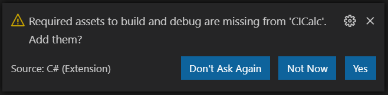
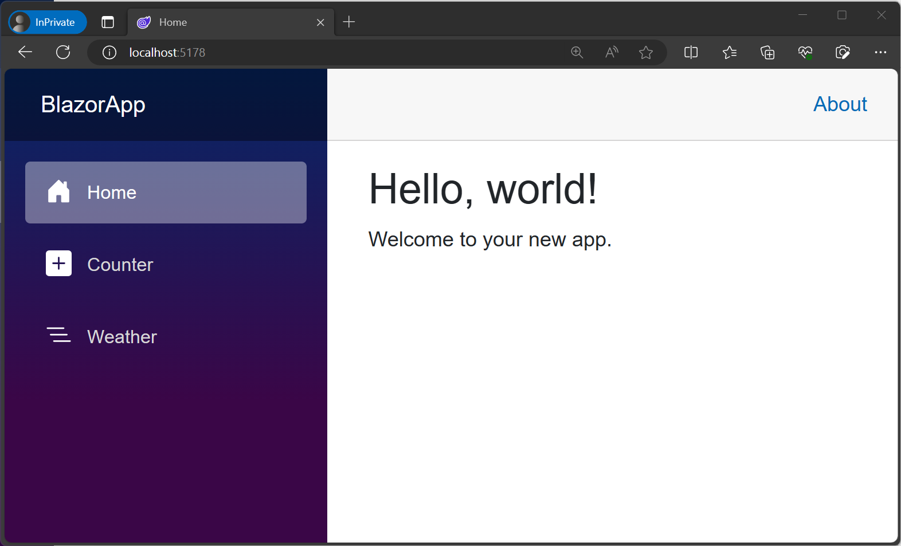
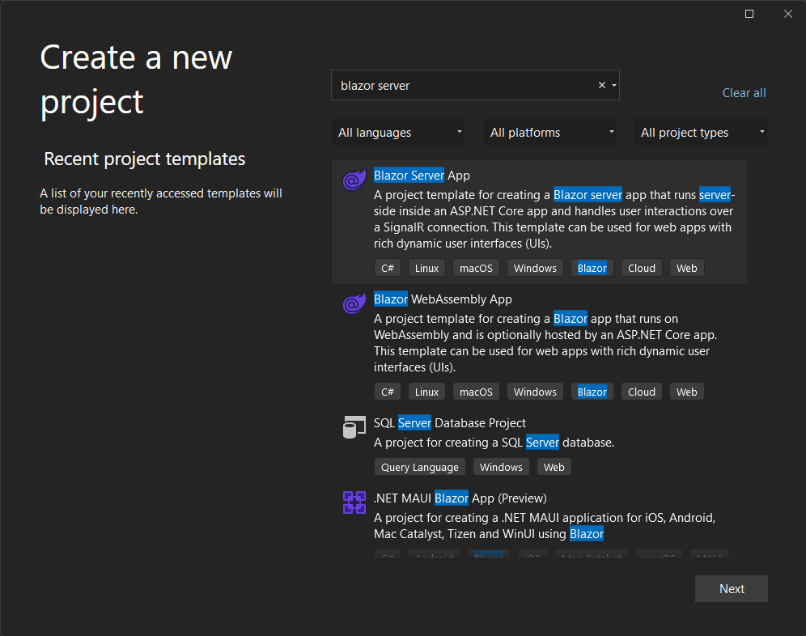
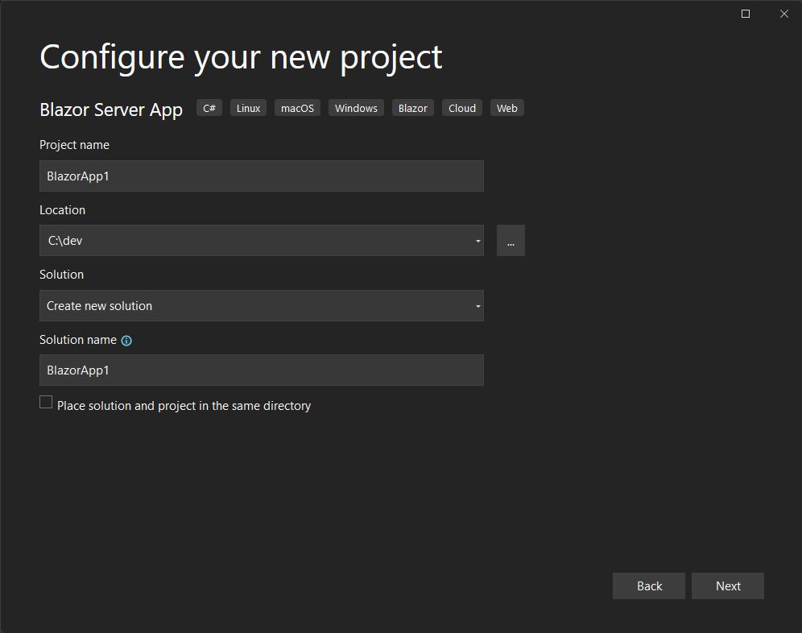
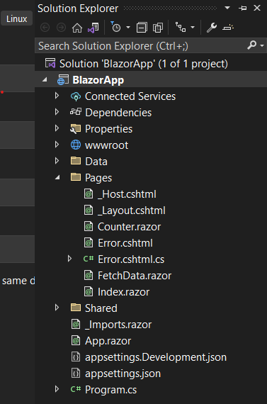

Let's start by creating our first Blazor web app.

This module uses the [.NET CLI (Command Line Interface)](/dotnet/core/tools/), [Visual Studio Code](https://code.visualstudio.com), and [Visual Studio 2022](https://visualstudio.com) for local development. After you complete this module, you can apply its concepts using a development environment like Visual Studio for Mac (macOS), or continue development using Visual Studio Code (Windows, Linux, & macOS) or Visual Studio.

::: zone pivot="vscode"

[!include[](../../../includes/dotnet6-sdk-version.md)]

## Create a new Blazor app

To set up a Blazor project to work with, we use Visual Studio Code. Visual Studio Code includes an integrated terminal, which makes creating a new project easy. If you don't want to use another code editor, you can run the commands in this module in a terminal.

1. In Visual Studio Code, select **File** > **Open Folder**.

1. Create a new folder named **BlazorApp** in the location of your choice, then choose **Select Folder**.

1. Open the integrated terminal from Visual Studio Code by selecting **View** > **Terminal** from the main menu.

1. In the terminal window, copy and paste the following command.

    ```dotnetcli
    dotnet new blazorserver -f net6.0
    ```

    This command creates a basic Blazor server project with all required files and pages, along with a C# project file named **BlazorApp.csproj**.

    You should now have access to these files.

    ```bash
    -| bin
    -| Data
    -| obj
    -| Pages
      -| _Host.cshtml
      -| Counter.razor
      -| Error.cshtml
      -| Error.cshtml.cs
      -| FetchData.razor
      -| Index.razor
    -| Properties
    -| Shared
      -| MainLayout.razor
      -| MainLayout.razor.css
      -| NavMenu.razor
      -| NavMenu.razor.css
      -| SurveyPrompt.razor
    -| wwwroot
    -| _Imports.razor
    -| App.razor
    -| appsettings.Development.json
    -| appsettings.json
    -| BlazorApp.csproj
    -| Program.cs
    ```

1. If Visual Studio Code prompts you to install required assets, select **Yes**.

    

## Run the app

1. In the terminal window, copy and paste the following command to run the app in **watch mode**:

    ```dotnetcli
    dotnet watch run
    ```

    This command builds and starts the app, then rebuilds and restarts the app whenever you make code changes. The app should automatically open in your default browser. Your browser might warn you that the site isn't secure; it's safe to proceed.

    

::: zone-end

::: zone pivot="vstudio"

## Create a new Blazor app

To set up a Blazor project to work with, we use Visual Studio 2022. Visual Studio Code includes integrated templates and compiler, which makes creating and building a new project easy.

1. In Visual Studio 2022, select **File** > **New Project**.

1. In the search box at the top of the "Create a new project" dialog, key in "Blazor Server", select **Blazor Server App**, and select **Next**.

   

1. On the subsequent screen, name your project "BlazorApp", specify a location on disk with settings like the following, then select **Next**:

     

1. On the *Additional Information* screen, select **.NET 6.0 (Long-term support)** in the Framework combo box. Leave the other settings as default and select **Create**.

1. This command creates a basic Blazor server project with all required files and pages.

  You should now have access to these files. Your Solution Explorer in Visual Studio 2022 looks similar to the following screenshot:

  

## Run the app

1. In Visual Studio, select **Debug** > **Start Debugging**

    This command builds and starts the app, then rebuilds and restarts the app whenever you make code changes. The app should automatically open in your default browser. Your browser might warn you that the site isn't secure; it's safe to proceed.

    

::: zone-end

Use this Blazor app in the following exercises.
