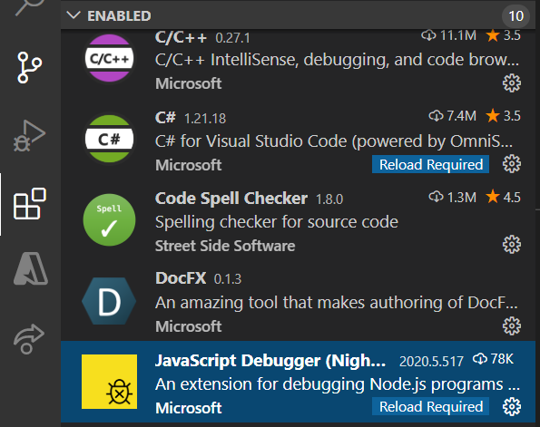

In this exercise, you'll install the tools and components needed to build a Blazor WebAssembly client app locally using **Visual Studio Code** application.

This exercise assumes you've already installed Visual Studio Code. You can download Visual Studio Code for free for Windows, macOS, or Linux from https://code.visualstudio.com/.

## Install tools and templates

Start by downloading the Microsoft .NET Core 3.1 SDK. It includes the .NET Core SDK, the .NET Core runtime, and the ASP.NET Core runtime.

Install .NET Core 3.1 by downloading the latest version for your operating system from https://dotnet.microsoft.com/download/dotnet-core/3.1.

## Install Visual Studio Code extensions

To develop Blazor WebAssembly apps, install two Visual Studio Code extensions: the Microsoft C# extension and the JavaScript debugger extension.

### Install the C# for Visual Studio Code extension

1. Open Visual Studio Code on your local machine.

1. Open the extensions browser by selecting the **Extensions** symbol on the leftmost pane. Or in Windows, select Ctrl+Shift+X.

1. Search for "C# for Visual Studio Code".

1. Install the **C# for Visual Studio Code (powered by OmniSharp)** extension by selecting **Install**.

### Install the JavaScript debugger extension

The JavaScript debugger extension is currently in preview. Here you'll install the latest build.

1. Open the extensions browser in Visual Studio Code by selecting the **Extensions** symbol on the leftmost pane. Or in Windows, select Ctrl+Shift+X.

1. Search for "JavaScript debugger".

1. Install the **JavaScript Debugger (Nightly)** extension by selecting the **Install** button.

### Configure the JavaScript debugger extension

1. Open the extensions browser in Visual Studio Code by selecting the **Extensions** symbol on the leftmost pane. Or in Windows, select Ctrl+Shift+X.

1. From the list of enabled extensions, select **JavaScript Debugger (Nightly)**.

    

1. To open the extensions settings, select and hold (or right-click) **JavaScript Debugger (Nightly)** and select **Extension Settings**.

1. Scroll to the **Debug > JavaScript Use Preview** setting.

1. Select **Use the new in-preview JavaScript debugger for Node.js and Chrome**.

    

## Create a new Blazor WebAssembly app

To validate your setup, make a new Blazor WebAssembly client web app that uses the installed template.

1. Open a terminal or Command Prompt window on your local development machine.

1. At the command prompt, enter **dotnet new blazorwasm -o CICalc**.

1. Go to the CICalc subfolder.

## Run the app

1. At the command prompt, enter **dotnet run** to run the app.

1. In a web browser, go to https://localhost:5001.

    

1. Return to the terminal in Visual Studio code and select Ctrl+C to stop the app.

You'll use this Blazor app in the following exercises.
