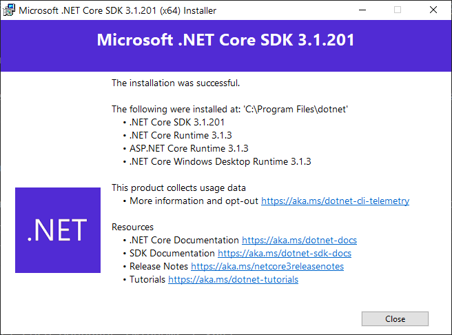

In this exercise, we're going to install of the tools and components needed to build a Blazor WebAssembly client app locally using Visual Studio Code. This exercise assumes you already have Visual Studio Code installed, you can download Visual Studio Code for free for Windows, macOS, or Linux from https://code.visualstudio.com/.

## Install tools and templates

We'll start by downloading the .NET Core 3.1 SDK, it includes the .NET Core SDK, the .NET Core Runtime, and the ASP.NET Core runtime. We'll then install the Blazor WebAssembly template.

1. Install **.NET Core 3.1** by downloading the latest version from https://dotnet.microsoft.com/download/dotnet-core/3.1 for your operating system

    

1. Open a terminal or command prompt on your local development machine 

1. Execute dotnet new -i Microsoft.AspNetCore.Components.WebAssembly.Templates::3.2.0-rc1.20223.4

## Install Visual Studio Code extensions

We need to install two Visual Studio Code extensions to develop Blazor WebAssembly applications: the Microsoft C# extension and the JavaScript debugger extension.

### Install the C# for Visual Studio Code extension

1. Open Visual Studio Code on your local machine

1. Open the Extension browser by clicking on the Extension left navigation button (or press ctrl-shift-X on Windows)

1. Search for **C# for Visual Studio Code**

1. Install the **C# for Visual Studio Code (powered by OmniSharp)** extension by pressing the **install** button

### Install the JavaScript debugger extension

The JavaScript debugger extension is currently in preview, we'll install the latest build.

1. Open the Extension browser in Visual Studio Code by clicking on the Extension left navigation button (or press ctrl-shift-X on Windows)

1. Search for **JavaScript debugger**

1. Install the **JavaScript Debugger (Nightly)** extension by pressing the **install** button

### Configure the JavaScript debugger extension

1. Open the Extension browser in Visual Studio Code by clicking on the Extension left navigation button (or press ctrl-shift-X on Windows)

1. Find the **JavaScript Debugger (Nightly)** in the list of **Enabled** extensions

    

1. Open the extensions settings by right-clicking on **JavaScript Debugger (Nightly)** and select **Extension Settings**

1. Scroll and find the **Debug > JavaScript Use Preview** setting

1. Check **Use the new in-preview JavaScript debugger for Node.js and Chrome.**

    

## Create a new Blazor WebAssembly app 

To validate our setup, we'll make a new Blazor WebAssembly client web app using the installed template.

1. Open a terminal or command prompt on your local development machine 

1. Create and navigate to a temporary folder for your test application named **CICalc**

1. In the command prompt or terminal `dotnet new blazorwasm -o CICalc`

1. Navigate to the **CICalc** sub folder

1. In the command prompt or terminal `dotnet publish –c Release`

### Optional - run the app

1. From the command prompt or terminal `dotnet run` to launch the app

1. Open a web browser to **http://localhost:5000**   

    

We'll use this Blazor app in the following exercises.
