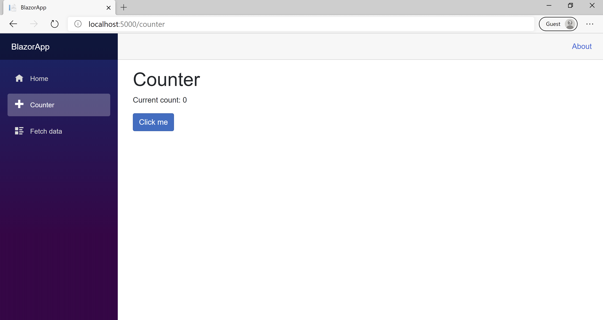

Now that you have your development environment set up, explore the structure of a Blazor project and learn how to add new pages.

## What is Razor?

Razor is a markup syntax that uses HTML and C# for writing UI components of Blazor web apps.

Razor is based on ASP.NET and designed for creating web apps.

## What are Razor components?

A Razor file defines components that make up a portion of the app UI. Components in Blazor are analogous to user controls in ASP.NET Web Forms.

If you explore the project, you can see that most files are .razor files.

At compile time, each Razor component is built into a .NET class. The class includes common UI elements like state, rendering logic, lifecycle methods, and event handlers.

## Try the Counter

In the running app, navigate to the Counter page by clicking the Counter tab in the sidebar on the left. The following page should display:



Select the **Click me** button to increment the count without a page refresh. Incrementing a counter in a webpage normally requires writing JavaScript, but with Blazor, you can use C#.

You can find the implementation of the Counter component at `Pages/Counter.razor`.

```razor
@page "/counter"

<h1>Counter</h1>

<p role="status">Current count: @currentCount</p>

<button class="btn btn-primary" @onclick="IncrementCount">Click me</button>

@code {
    private int currentCount = 0;

    private void IncrementCount()
    {
        currentCount++;
    }
}
```

A request for `/counter` in the browser, as specified by the `@page` directive at the top, causes the `Counter` component to render its content.

Each time you select the **Click me** button:

- The `onclick` event is fired.
- The IncrementCount method is called.
- The currentCount is incremented.
- The component is rendered to show the updated count.
