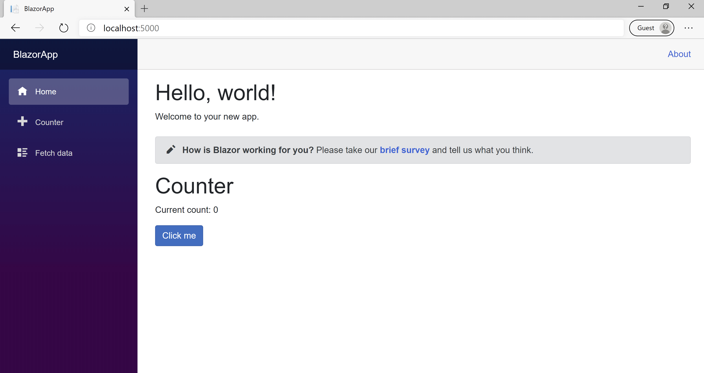

In this exercise, you add a Razor component to the home page of your application.

Within Visual Studio Code, open the folder that contains the BlazorApp project you created in module 3.

## Add the Counter component to the Home page

1. Expand the folders in the Visual Studio Code project explorer.

1. Select **Pages** to view the existing Razor pages.

1. Select the **Index.razor** file to open it.

1. Add a `Counter` component to the page by adding a `<Counter />` element at the end of the `Index.razor` file.

   ```razor
   @page "/"

   <h1>Hello, world!</h1>

   Welcome to your new app.

   <SurveyPrompt Title="How is Blazor working for you?" />

   <Counter />
   ```

Save the file. In Visual Studio Code, run the `dotnet watch run` command you executed in the previous module; this command restarts the app and refreshes it in the browser so that the `Counter` component shows up on the Home page. In Visual Studio, you can select the **Hot Reload** button to restart the app.



## Modify a component

Component parameters are specified using attributes or child content, which allow you to set properties on the child component. Define a parameter on the Counter component to specify how much it increments with every button click:

- Add a public property for `IncrementAmount` with a `[Parameter]` attribute.
- Change the `IncrementCount` method to use the `IncrementAmount` when incrementing the value of `currentCount`.

Add the following code to the **Counter.razor** file:

```razor
@page "/counter"

<h1>Counter</h1>

<p role="status">Current count: @currentCount</p>

<button class="btn btn-primary" @onclick="IncrementCount">Click me</button>

@code {
    private int currentCount = 0;

    [Parameter]
    public int IncrementAmount { get; set; } = 1;

    private void IncrementCount()
    {
        currentCount += IncrementAmount;
    }
}
```

In `Index.razor`, update the `<Counter>` element to add an `IncrementAmount` attribute that changes the increment amount to 10, as shown by the last line in the following code:

```razor
@page "/"

<h1>Hello, world!</h1>

Welcome to your new app.

<SurveyPrompt Title="How is Blazor working for you?" />

<Counter IncrementAmount="10" />
```

The `Index` component now has its own counter that increments by 10 each time the **Click me** button is selected, as shown in the following image. The `Counter` component (`Counter.razor`) at `/counter` continues to increment by one.


