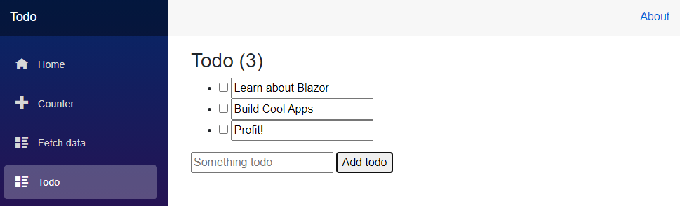

In this exercise, you'll create a basic to do list component inside our Blazor app.

## Create the ToDo page

1. Create the ToDo page with the following command:

    ```dotnetcli
    dotnet new razorcomponent -n Todo -o Pages
    ```

    The `-n|--name` option in the preceding command specifies the name of the new Razor component. The new component is created in the project's `Pages` folder with the `-o|--output` option.

    > [!IMPORTANT]
    > Razor component file names require a capitalized first letter. Open the `Pages` folder and confirm that the `Todo` component file name starts with a capital letter `T`. The file name should be `Todo.razor`.

1. Open the `Todo` component and add an `@page` Razor directive to the top of the file with a relative URL of `/todo`.

    ```cshtml
    @page "/todo"

    <h3>Todo</h3>

    @code {
    
    }
    ```

1. Save the `Pages/Todo.razor` file

## Add the Todo component to the navigation bar

The `NavMenu` component is used in the app's layout. Layouts are components that allow you to avoid duplication of content in an app. The `NavLink` component provides a cue in the app's UI when the component URL is loaded by the app.

In the `<nav>...</nav>` section of the NavMenu component, add the following new `<div>...</div>` and `NavLink` component for the `Todo` component.

In `Shared/NavMenu.razor`:

```razor
<div class="@NavMenuCssClass" @onclick="ToggleNavMenu">
    <nav class="flex-column">

        ...

        <div class="nav-item px-3">
            <NavLink class="nav-link" href="todo">
                <span class="oi oi-list-rich" aria-hidden="true"></span> Todo
            </NavLink>
        </div>
    </nav>
</div>
```

Save the `Shared/NavMenu.razor` file. The browser should refresh automatically and now have the Todo entry on the navigation bar:


## Create a Todo Item

Create a new file in the root of the project (the `BlazorApp` folder) named `TodoItem.cs` to hold a C# class that represents a todo item.

Use the following C# code for the `TodoItem` class. Declare the `Title` as a nullable string by using `?`.

```csharp
public class TodoItem
{
    public string? Title { get; set; }
    public bool IsDone { get; set; }
}
```

You may need to stop and restart the `dotnet watch run` process if it does not detect the new `TodoItem` file and rebuild your project.

## Bind a list of TodoItems

You're now ready to bind a collection of `TodoItem` objects to HTML in Blazor. We'll accomplish this by making the following changes in the `Pages/Todo.razor` file.

- Add a field for the todo items in the `@code` block. The `Todo` component uses this field to maintain the state of the todo list.
- Add unordered list markup and a `foreach` loop to render each todo item as a list item (`<li>`).

```cshtml
@page "/todo"

<h3>Todo</h3>

<ul>
    @foreach (var todo in todos)
    {
        <li>@todo.Title</li>
    }
</ul>

@code {
    private List<TodoItem> todos = new();
}
```

## Add Form Elements to Create Todos

1. The app requires UI elements for adding todo items to the list. Add a text input (`<input>`) and a button (`<button>`) below the unordered list (`<ul>...</ul>`):

    ```razor
    @page "/todo"
    
    <h3>Todo</h3>
    
    <ul>
        @foreach (var todo in todos)
        {
            <li>@todo.Title</li>
        }
    </ul>
    
    <input placeholder="Something todo" />
    <button>Add todo</button>
    
    @code {
        private List<TodoItem> todos = new();
    }
    ```

1. When the `Add todo` button is selected, nothing happens because an event handler isn't attached to the button.

    Add an `AddTodo` method to the `Todo` component and register the method for the button using the `@onclick` attribute. The `AddTodo` C# method is called when the button is selected:

    ```razor
    <input placeholder="Something todo" />
    <button @onclick="AddTodo">Add todo</button>
    
    @code {
        private List<TodoItem> todos = new();
    
        private void AddTodo()
        {
            // Todo: Add the todo
        }
    }
    ```

1. To get the title of the new todo item, add a `newTodo` string field at the top of the `@code` block:

    ```razor
    @code {
        private List<TodoItem> todos = new();
        private string? newTodo;
    
        // ... code continues ...
        }
    ```

    Modify the `<input>` element to bind `newTodo` with the `@bind` attribute:

    ```razor
    <input placeholder="Something todo" @bind="newTodo" />
    ```

1. Update the `AddTodo` method to add the `TodoItem` with the specified title to the list. Clear the value of the text input by setting `newTodo` to an empty string:

    ```razor
    @page "/todo"
    
    <h3>Todo</h3>
    
    <ul>
        @foreach (var todo in todos)
        {
            <li>@todo.Title</li>
        }
    </ul>
    
    <input placeholder="Something todo" @bind="newTodo" />
    <button @onclick="AddTodo">Add todo</button>
    
    @code {
        private List<TodoItem> todos = new();
        private string? newTodo;
    
        private void AddTodo()
        {
            if (!string.IsNullOrWhiteSpace(newTodo))
            {
                todos.Add(new TodoItem { Title = newTodo });
                newTodo = string.Empty;
            }
        }
    }
    ```

1. Save the `Pages/Todo.razor` file. The app is automatically rebuilt in the command shell. The page reloads in the browser after the browser reconnects to the app.

1. The title text for each todo item can be made editable, and a checkbox can help the user keep track of completed items. Add a checkbox input for each todo item and bind its value to the `IsDone` property. Change `@todo.Title` to an `<input>` element bound to `todo.Title` with `@bind`:

    ```razor
    <ul>
        @foreach (var todo in todos)
        {
            <li>
                <input type="checkbox" @bind="todo.IsDone" />
                <input @bind="todo.Title" />
            </li>
        }
    </ul>    
    ```

1. Update the `<h3>` header to show a count of the number of todo items that aren't complete (`IsDone` is `false`).

    ```razor
    <h3>Todo (@todos.Count(todo => !todo.IsDone))</h3>
    ```

1. Save the `Pages/Todo.razor` file. The app is automatically rebuilt in the command shell. The page reloads in the browser after the browser reconnects to the app.

1. Add items, edit items, and mark todo items done to test the component.

   
