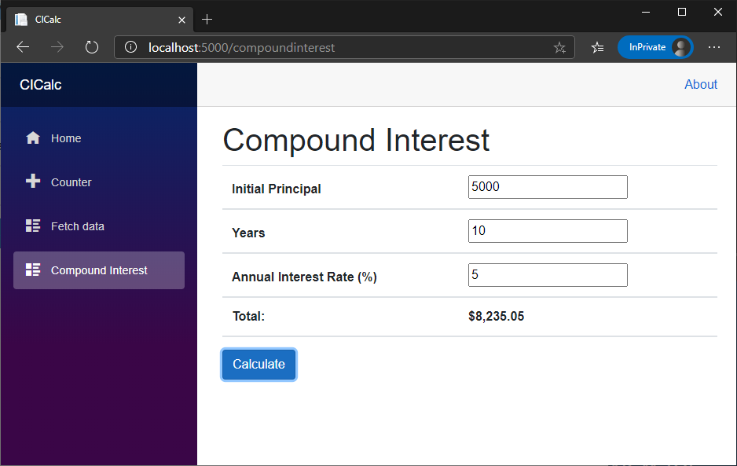

In this exercise, you'll add your C# logic to your compound interest Razor component. Open the folder for the compound interest project you created in the previous exercise.

## Add code markup to a Razor page

1. Open CompoundInterest.razor.

1. Below the table definition, add `@code` markup with braces.

    ```cshtml
    @code
    {
  
    }
    ```

## Add member variables for compound interest calculation

Add several C# variables to store input values from a user.

1. Add the following code within the `@code` markup.

    ```cshtml
    @code
    {
        private double Principal { get; set; } = 5000;
        private double InterestRate { get; set; } = 5;
        private int Years { get; set; } = 10;
        private double total { get; set; } = 0;
        private string Total { get; set; }
    }
    ```

## Add calculation logic

1. Within the `@code` markup, add the following method to calculate compound interest:

    ```cshtml
    private void Calculate()
    {
        var total = Principal * Math.Pow(1 + InterestRate / (1200.0), Years * 12);
        Total = total.ToString("C");
    }
    ```

## Add binding to the input fields

You're now ready to bind the variables you defined in the `@code` markup to your HTML input fields.

1. Use `@bind` markup on each input field to bind the appropriate variable.

    ```cshtml
    <tr>
        <th>Initial Principal</th>
        <th><input @bind="Principal" /></th>
    </tr>
    <tr>
        <th>Years</th>
        <th><input @bind="Years" /></th>
    </tr>
    <tr>
        <th>Annual Interest Rate (%)</th>
        <th><input @bind="InterestRate" /></th>
    </tr>
    <tr>
        <th>Total:</th>
        <th>@Total</th>
    </tr>
    ```

1. Finally, bind the **Calculate** button using the `@onclick` event handler.

    ```cshtml
    <button class="btn btn-primary" @onclick="Calculate">Calculate</button>
    ```

## Run the app

1. In the Visual Studio Code terminal, enter **dotnet run** to run the app.

1. In a web browser, go to https://localhost:5000.

1. Use the calculator by changing the input parameters and selecting **Calculate**.

Congratulations on successfully creating a Razor component with HTML, C# logic, binding, and an event.


