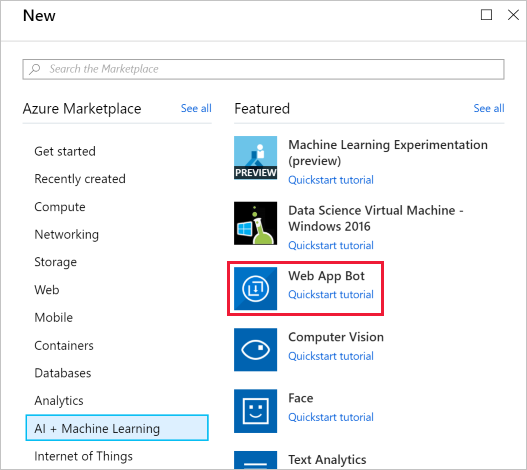
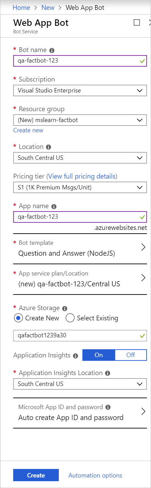
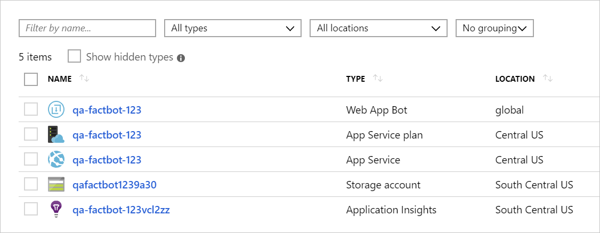

The first step in creating a bot is to provide a location for the bot to be hosted in Azure. The Web Apps feature of Azure App Service is perfect for hosting bot applications, and the Azure Bot Service is designed to provision them for you. In this unit, you'll use the Azure portal to provision an Azure web app bot.

1. Sign into the [Azure portal](https://portal.azure.com/?azure-portal=true).

1. Select **+ Create a resource**, followed by **AI + Machine Learning**, then **Web App Bot**.

    

1. On the **New Web App Bot** page, enter the following settings for the new Web App Bot.

    Setting|Value|Description
    ---|---|---
    Bot name|*choose a unique name*|This name must be unique within Azure, so make sure a green check mark appears next to it.
    Subscription|*Select your subscription*|Select your Azure subscription.
    Resource Group|Select *Create new* and use the name **mslearn-factbot**|Select an existing or create a new resource group to hold the resources for this exercise.
    Location|*Select the region closest to you from the drop-down*|Select the location where the bot should be located.
    Pricing tier|F0| A basic free tier for this app.
    App name|*Leave default*|The default value is populated based on your bot name. You can change this if you'd like a different name for the web app, or leave the default value.

1. Then, select **Bot template**. Select **SDK v3** as the version, **Node.js** as the SDK language, and **Question and Answer** as the template type. Then, click **OK** at the bottom of the view.

    

1. Now, select **App service plan/Location**, followed by **Create New**, then create an App Service plan named "qa-factbot-service-plan" or something similar in the same region that you selected in the prior step. Click **OK** to close the view.

1. Leave the other options as their default values. You can compare your settings to the below screenshot if necessary.

    

1. Click **Create** at the bottom of the "Web App Bot" panel to start the deployment.

    > [!NOTE]
    > Deployment generally requires two minutes or less. You can watch the progress in the Notifications panel (bell icon) available at the top of the portal.

1. After your deployment completes, select **Resource groups** in the left-hand sidebar.

1. Select the resource group you created (**mslearn-factbot**) open the resource group where we deployed the Azure web app bot.

You should now see several resources created for your Azure web app bot.

Behind the scenes, a lot happened when the Azure Web App Bot was deployed.

- A bot was created and registered in Azure.
- An Azure Web App was created to host the bot.
- The bot was configured to work with **Microsoft QnA Maker**.

The next step is to use QnA Maker to create a knowledge base of questions and answers to infuse the bot with intelligence.