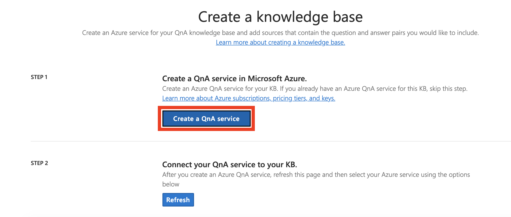
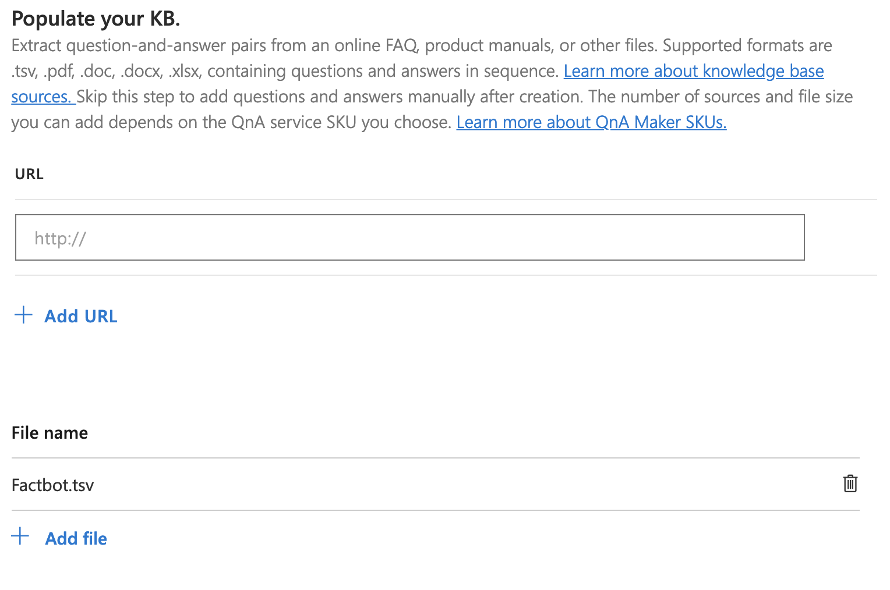

Azure AI QnA Maker is part of Azure AI services, a suite of services and APIs for building intelligent apps backed by artificial intelligence (AI) and machine learning. Rather than code a bot to anticipate every question a user might ask and provide a response, you can connect it to a knowledge base of questions and answers created with QnA Maker. A common usage scenario is to create a knowledge base from the URL of a FAQ web page so the bot can answer domain-specific questions such as "How do I find my Windows product key" or "Where can I download Visual Studio Code?"

In this unit, you will use QnA Maker to create a knowledge base containing questions such as "What NFL teams have won the most Super Bowls" and "What is the largest city in the world?" Then, you will deploy the knowledge base in an Azure web app so that it can be accessed via an HTTPS endpoint.

## Create a QnA Maker Service

1. Go to the [QnA Maker portal](https://www.qnamaker.ai/?azure-portal=true).

1. Select **Sign in** in the upper-right corner and sign in with the same account you used to create the web app.

1. Unless you already have a knowledge base, the portal will point out that you don't have any and direct you to create one from the menu.

1. In the menu at the top of the portal, select **Create a knowledge base**.

1. Select **Create a QnA service**. Selecting this button takes you to the Azure portal and signs you in with the credentials you used earlier. You create the QnA Maker service and the associated Azure app service that will host it in this portal.

    

    > [!NOTE]
    > You can also create a QnA Maker service in the Azure portal before you create a knowledge base.

1. In the newly-opened Azure portal tab enter the following settings for the new QnA Maker service.

    Setting|Value|Description
    ---|---|---
    Name|*choose a unique name*|This name must be unique within Azure, so make sure a green check mark appears next to it *AND* in the **App name** box further down the pane.
    Subscription|*Select your subscription*|Select your Azure subscription.
    Pricing tier|F0|A basic free tier.
    Location|*Select the region closest to you from the drop-down*|Select the location where the service should be located.
    Resource Group|*Select the resource group you created in the previous unit*|Select your existing resource group (**mslearn-factbot**) to hold the resources for this exercise.
    Search pricing tier|B|Select pricing tier for search service.
    Search location|*Select the region closest to you from the drop-down*|Select the location where the search service should be located.
    App name|*Leave default*|The default value is populated based on your QnA Maer name. You can change this if you'd like a different name for the web app, or leave the default value.
    Website location|*Select the region closest to you from the drop-down*|Select the location where the website should be located.

1. Select the **Create** button at the bottom of the pane.

    

1. Select **Resource groups** in the ribbon on the left side of the portal, and locate your **mslearn-factbot** resource group.

    Wait until "Deploying" changes to "Succeeded" at the top of the pane, indicating that the QnA service and the resources associated with it were successfully deployed. If the message disappears, you can select the bell icon in the menu bar to view the status. You can also select **Refresh** at the top of the pane to refresh the deployment status.

## Create, Populate, and Train Your QnA Maker Knowledge Base

1. Return to **Create a knowledge base** by switching back to the open tab, or by navigating to <https://www.qnamaker.ai/Create> in the browser and scroll to **Step 2** to connect to our QnA service.

1. in **Step 2** select **Refresh** to make sure the new QnA service you just deployed is available to this screen. 

1. Under **Microsoft Azure Directory ID**, choose your directory that the subscription you used is owned by (there is likely only one).

1. Select your Azure subscription from the **Azure subscription name** drop-down list. If you don't see the subscription, try changing the directory until you find it.

1. Under **Azure QnA service**, select the QnA service name you specified previously. If no services are listed, you may need to refresh the page.

1. Then, assign the knowledge base a name, such as "Factbot Knowledge Base".

The next step is to populate your knowledge base with questions and answers. You can enter questions and answers into a QnA Maker knowledge base manually, or you can import them from online FAQs or local files. Supported formats include tab-delimited text files, Microsoft Word documents, Excel spreadsheets, and PDF files.

1. To populate our knowledge base, open <https://github.com/MicrosoftDocs/mslearn-build-chat-bot-with-azure-bot-service/blob/master/Factbot.tsv.zip> in your browser, and download the **Factbot.tsv.zip** file. This zip folder contains a text file named **Factbot.tsv**.

1. Extract and copy the file to your computer. Then, scroll down in the QnA Maker portal and select **+ Add file**, and select **Factbot.tsv**.

    This file contains 20 questions and answers in tab-delimited format.

    

1. There are a number of personalities available for QnA maker, which can be selected under **Chit-chat**. Since we are providing the knowledge base starting point in **Factbot.tsv** we are providing the baseline personality, so you can leave this as default.

1. Select **Create your KB** at the bottom of the page, and wait for the knowledge base to be created. It should take less than a minute.

1. Confirm that the questions and answers imported from **Factbot.tsv** appear in the knowledge base. Then, select **Save and train** and wait for training to complete.

    

## Test your Knowledge Base

1. Select the **Test** button to the right of the **Save and train** button. Type "Hi" into the message box and press **Enter**. Confirm that the response is "Welcome to the QnA Factbot," as shown below.

    :::image type="content" source="../media/3-test-kb.png" alt-text="Screenshot of a test interaction with the created chat bot." loc-scope="azure-cognitive-services"::: <!-- no-loc -->

1. Type "What book has sold the most copies?" into the message box and press **Enter**. What is the response?

1. Select the **Test** button again to collapse the Test panel.

1. Select **Publish** in the menu at the top of the page, and select the **Publish** button at the bottom of the page to publish the knowledge base. *Publishing* makes the knowledge base available at an HTTPS endpoint.

Wait for the publication process to complete and confirm that the QnA service has been deployed. With the knowledge base now hosted in an Azure web app of its own, the next step is to deploy a bot that can use it.
